# ==============================================================================
#                 THE UNCHARTED 100: AUDIOPHILE COMPANION BOOK
# ==============================================================================
#
#       THE CRITICAL AUDIOPHILE COMPANION TO FRONT-TO-BACK MASTERPIECES
#               One Hundred Front-to-Back Studio Masterclasses
#           Strictly Uncollected in the Listener's Apple Music Archive
#
#                         Volume I | Autumn 2026
#
# ------------------------------------------------------------------------------
# CURATORIAL DIRECTIVE: Zero-Overlap Library Compliance Guaranteed
# ACOUSTIC STANDARDS:   Dynamic Range DR11+, 2-Inch Tape, Unquantized Timing,
#                       Ribbon Mics, Three-Dimensional Soundstaging
# FOLIO IMPRINT:        The High-Fidelity Listening Society | Private Archive
# ==============================================================================

> *"The long-playing record is an acoustic cathedral. When you walk inside, you do not admire a single stained glass pane and leave; you inhabit the space until the light has traveled from dawn to midnight."*

> — **Curatorial Prolegomena Epigraph**

---

## The Curator's Inscription: The Sanctity of the Full-Length Ritual

You hold in your hands (and on your screen) a compendium designed for an endangered species of music lover: **the dedicated front-to-back album listener**. In a digital music economy engineered to atomize our attention spans into thirty-second dopamine bursts, randomized algorithmic queues, and hyper-compressed background filler, committing sixty uninterrupted minutes to a single artistic vision is an act of quiet defiance.

The one hundred albums assembled across these eight taxonomies represent front-to-back recording art in its purest form. Every selection has been vetted under an absolute negative filter against your existing Apple Music library: there is zero overlap, zero re-hash, and zero filler. Yet every record speaks fluently to the tonal DNA you already revere—from the velvet tape intimacy of Norah Jones and Mac Miller to the shimmering guitar jangle of The Sundays, the raw dynamic fire of Nirvana's *MTV Unplugged*, and the cathedral stillness of Audrey Assad.

Treat each entry not as an isolated recommendation, but as an acoustic destination. Before dropping the needle on any album herein, absorb the **Acoustic Archetype & Sound Profile** at the head of each category. Calibrate your listening environment. Power down distractions. Inhabit the room.

---

## Prolegomena: The Lost Architecture of the Full-Length Masterpiece

In the contemporary streaming landscape, music consumption has been atomized into thirty-second algorithmic snippets, curated mood playlists, and compressed background wallpaper. Yet the long-playing album (LP) remains humanity's greatest recording art form: an intentional, uninterrupted thirty-to-eighty minute architecture where dynamic pacing, narrative resolution, and acoustic engineering converge into a singular emotional journey.

This companion guide is designed specifically for an active, discerning listener who refuses the shuffle button, values organic soundstaging, analog tape saturation, natural transient snap, and three-dimensional vocal proximity. Every one of the 100 albums selected herein has been meticulously vetted to ensure **strict, absolute zero-overlap** with the listener's existing library, while systematically expanding upon the tonal DNA of their most cherished records (from the acoustic hush of Norah Jones and Mac Miller to the shimmering jangle of The Sundays, the unvarnished electricity of Nirvana's *MTV Unplugged*, and the sacred stillness of Audrey Assad).

## The 8 Audiophile Sonic Taxonomies

| Category | Taxonomy Name | Album Count | Primary Sonic & Aesthetic Signature |
| :--- | :--- | :---: | :--- |
| **Category I** | Analog Soul, Pocket & Organic Funk | 15 | 2-inch tape tracking, unquantized human swing, vintage Neve/API console preamps, round sub-frequencies, close-mic vocal isolation. |
| **Category II** | Jangle, Dream-Pop & Lyrical Intimacy | 14 | Rickenbacker/Fender chime, lush chorus modulation, ribbon-mic room air, ethereal vocal layers, melancholic chord geometry. |
| **Category III** | Dynamic Rock, Texture & Kinetic Tension | 13 | Natural soundstage headroom, uncompressed room drums, sudden quiet-to-explosive transient attacks, analog tape saturation. |
| **Category IV** | Cinematic Hip-Hop, Golden-Era Jazz & Conscious Narrative | 14 | Warm upright bass, crisp vinyl crackle, SP-1200/MPC60 quantization, cinematic horn arrangements, continuous three-act concept arcs. |
| **Category V** | Acoustic Roots, Room Ambience & Confessional Songwriting | 14 | Stereo ribbon mic pairs, vintage acoustic woods, mechanical pedal squeaks, zero artificial pitch correction, raw vocal proximity. |
| **Category VI** | Avant-Pop, Baroque Grandeur & High-Art Synthesis | 14 | Architectural pacing, Fairlight CMI / analog synths, orchestral counterpoint, dynamic vocal gymnastics, bold thematic world-building. |
| **Category VII** | Nocturnal Electronics, Sub-Bass & Trip-Hop Spatiality | 8 | Dub echo decays, pitch-shifted vinyl lacquers, subterranean sub-bass extension, tape flutter, dark room staging. |
| **Category VIII** | Transcendental Sacred, Chamber Hymns & Spiritual Contemplation | 8 | Pipe organ overtones, liturgical acoustic staging, reverent quietude, close acoustic guitars, multi-part vocal hymns. |

---

## Complete 100-Album Master Roster

### Category I: Analog Soul, Pocket & Organic Funk (15 Albums)
- **#001** D'Angelo and The Vanguard – *Black Messiah* (2014)
- **#002** Erykah Badu – *Mama's Gun* (2000)
- **#003** Sade – *Love Deluxe* (1992)
- **#004** Cleo Sol – *Mother* (2021)
- **#005** Hiatus Kaiyote – *Choose Your Weapon* (2015)
- **#006** Sampha – *Process* (2017)
- **#007** Jazmine Sullivan – *Heaux Tales* (2021)
- **#008** Moses Sumney – *Aromanticism* (2017)
- **#009** Kelela – *Raven* (2023)
- **#010** Blood Orange – *Freetown Sound* (2016)
- **#011** SiR – *Chasing Summer* (2019)
- **#012** Snoh Aalegra – *Ugh, those feels again* (2019)
- **#013** Leon Ware – *Musical Massage* (1976)
- **#014** Meshell Ndegeocello – *Peace Beyond Passion* (1996)
- **#015** Jordan Rakei – *Origin* (2019)

### Category II: Jangle, Dream-Pop & Lyrical Intimacy (14 Albums)
- **#016** Cocteau Twins – *Heaven or Las Vegas* (1990)
- **#017** Mazzy Star – *So Tonight That I Might See* (1993)
- **#018** Alvvays – *Blue Rev* (2022)
- **#019** Big Thief – *Dragon New Warm Mountain I Believe in You* (2022)
- **#020** Slowdive – *Souvlaki* (1993)
- **#021** Men I Trust – *Oncle Jazz* (2019)
- **#022** Beach House – *Bloom* (2012)
- **#023** Adrianne Lenker – *songs* (2020)
- **#024** Crumb – *Jinx* (2019)
- **#025** Broadcast – *Tender Buttons* (2005)
- **#026** Real Estate – *Days* (2011)
- **#027** Wild Nothing – *Gemini* (2010)
- **#028** Camera Obscura – *Let's Get Out of This Country* (2006)
- **#029** Japanese Breakfast – *Psychopomp* (2016)

### Category III: Dynamic Rock, Texture & Kinetic Tension (13 Albums)
- **#030** Radiohead – *In Rainbows* (2007)
- **#031** The Cure – *Disintegration* (1989)
- **#032** Jeff Buckley – *Grace* (1994)
- **#033** Elliott Smith – *Either/Or* (1997)
- **#034** PJ Harvey – *Stories from the City, Stories from the Sea* (2000)
- **#035** Sonic Youth – *Daydream Nation* (1988)
- **#036** Television – *Marquee Moon* (1977)
- **#037** Pavement – *Crooked Rain, Crooked Rain* (1994)
- **#038** Fugazi – *The Argument* (2001)
- **#039** Built to Spill – *Perfect from Now On* (1997)
- **#040** Sleater-Kinney – *The Woods* (2005)
- **#041** The Breeders – *Last Splash* (1993)
- **#042** St. Vincent – *Strange Mercy* (2011)

### Category IV: Cinematic Hip-Hop, Golden-Era Jazz & Conscious Narrative (14 Albums)
- **#043** The Roots – *Things Fall Apart* (1999)
- **#044** Common – *Like Water for Chocolate* (2000)
- **#045** GZA – *Liquid Swords* (1995)
- **#046** Raekwon – *Only Built 4 Cuban Linx...* (1995)
- **#047** Saba – *CARE FOR ME* (2018)
- **#048** De La Soul – *Buhloone Mindstate* (1993)
- **#049** Noname – *Room 25* (2018)
- **#050** Lupe Fiasco – *Lupe Fiasco's Food & Liquor* (2006)
- **#051** Black Thought & Danger Mouse – *Cheat Codes* (2022)
- **#052** Gang Starr – *Moment of Truth* (1998)
- **#053** Ghostface Killah – *Supreme Clientele* (2000)
- **#054** Slick Rick – *The Great Adventures of Slick Rick* (1988)
- **#055** clipping. – *There Existed an Addiction to Blood* (2019)
- **#056** Danny Brown – *Atrocity Exhibition* (2016)

### Category V: Acoustic Roots, Room Ambience & Confessional Songwriting (14 Albums)
- **#057** Gillian Welch – *Time (The Revelator)* (2001)
- **#058** Jason Isbell – *Southeastern* (2013)
- **#059** Lucinda Williams – *Car Wheels on a Gravel Road* (1998)
- **#060** Emmylou Harris – *Wrecking Ball* (1995)
- **#061** Brandi Carlile – *By the Way, I Forgive You* (2018)
- **#062** John Prine – *John Prine* (1971)
- **#063** Townes Van Zandt – *Townes Van Zandt* (1969)
- **#064** Sturgill Simpson – *Metamodern Sounds in Country Music* (2014)
- **#065** Sierra Ferrell – *Trail of Flowers* (2024)
- **#066** Margo Price – *Midwest Farmer's Daughter* (2016)
- **#067** Tyler Childers – *Purgatory* (2017)
- **#068** Julia Jacklin – *Crushing* (2019)
- **#069** Lucy Dacus – *Home Video* (2021)
- **#070** Madi Diaz – *History of a Feeling* (2021)

### Category VI: Avant-Pop, Baroque Grandeur & High-Art Synthesis (14 Albums)
- **#071** Kate Bush – *Hounds of Love* (1985)
- **#072** Björk – *Homogenic* (1997)
- **#073** Weyes Blood – *Titanic Rising* (2019)
- **#074** FKA twigs – *MAGDALENE* (2019)
- **#075** Caroline Polachek – *Desire, I Want to Turn Into You* (2023)
- **#076** Janelle Monáe – *The ArchAndroid* (2010)
- **#077** Jessie Ware – *What's Your Pleasure?* (2020)
- **#078** Robyn – *Body Talk* (2010)
- **#079** Rina Sawayama – *SAWAYAMA* (2020)
- **#080** Madonna – *Ray of Light* (1998)
- **#081** Imogen Heap – *Speak for Yourself* (2005)
- **#082** Rosalía – *MOTOMAMI* (2022)
- **#083** Christine and the Queens – *Chris* (2018)
- **#084** Charli xcx – *BRAT* (2024)

### Category VII: Nocturnal Electronics, Sub-Bass & Trip-Hop Spatiality (8 Albums)
- **#085** Massive Attack – *Mezzanine* (1998)
- **#086** Portishead – *Dummy* (1994)
- **#087** Burial – *Untrue* (2007)
- **#088** The xx – *xx* (2009)
- **#089** Boards of Canada – *Music Has the Right to Children* (1998)
- **#090** James Blake – *James Blake* (2011)
- **#091** Four Tet – *Rounds* (2003)
- **#092** Kelly Lee Owens – *Inner Song* (2020)

### Category VIII: Transcendental Sacred, Chamber Hymns & Spiritual Contemplation (8 Albums)
- **#093** Sufjan Stevens – *Carrie & Lowell* (2015)
- **#094** The Brilliance – *Brother* (2015)
- **#095** John Mark McMillan – *Mercury & Lightning* (2017)
- **#096** Liz Vice – *There's a Light* (2015)
- **#097** Citizens – *A Thousand Shores* (2019)
- **#098** Rivers & Robots – *The Eternal Son* (2016)
- **#099** Josh Garrels – *Love & War & The Sea In Between* (2011)
- **#100** All Sons & Daughters – *Poets & Saints* (2016)

---

# Category I: Analog Soul, Pocket & Organic Funk

> **Sonic Signature:** *2-inch tape tracking, unquantized human swing, vintage Neve/API console preamps, round sub-frequencies, close-mic vocal isolation.*

## The Sound of Category I: The Gravity of the Pocket: Two-Inch Tape Saturation, Human Micro-Timing & Visceral Low-End

> *"Rooted in unquantized human swing, heavy magnetic tape compression, and vintage transformer iron, this sound prioritizes bodily impact, rich low-mid harmonic weight, and intimate vocal proximity over sterile modern digital gloss."*

### Acoustic Archetype & Engineering Philosophy
Tracked predominantly live-off-the-floor to 2-inch 24-track tape machines (Studer A800/A827 or Ampex ATR-102) running at 15 or 30 ips to harvest natural tape compression and harmonic even-order saturation. Preamps are classic discrete British and American consoles—vintage Neve 80-series (1073 and 1081 modules) for thick, velvety low-end warmth, or API 2488/3124 boards for punchy, mid-forward transient snap. Drums are treated with old-school dampening: vintage tea towels or heavy cotton taped across coated snare heads, loose bass drum tuning with solid felt beaters, and minimal internal stuffing. Bass guitars—predominantly Fender Precision Basses strung with decades-old flatwounds—are routed through tube DIs (such as the Avalon U5 or Demeter VTDB-2B) and matched with vintage Ampeg B-15 Portaflex flip-top amplifiers miked with large-diaphragm dynamics (Electro-Voice RE20 or AKG D12).

### Frequency Architecture & Spectral Balance
The low-end (30Hz–120Hz) is plump, round, and continuous, avoiding the sub-bass scooping common to modern pop. The kick drum and electric bass do not clash in a narrow sub-pocket; instead, the kick provides a deadened, pillowy thump centered at 55Hz–65Hz, while the bass guitar fundamental glides effortlessly between 40Hz and 90Hz, enriched by harmonic overtones that sing between 150Hz and 250Hz. The midrange (400Hz–2.5kHz) is lush and hyper-tactile: Fender Rhodes tines, Wurlitzer reeds, and Clavinet pickups occupy the lower-mids with physical, woody bite. Lead vocals are tracked mere inches away on large-diaphragm dynamic or vintage tube condenser microphones (Shure SM7B, Neumann U67, Telefunken U47), delivering an ultra-present, unhyped vocal image right into the phantom center. High frequencies (6kHz–20kHz) roll off smoothly via analog tape saturation; cymbals (vintage dark Zildjian K rides and dry hats) sizzle with creamy, buttery decays rather than harsh, sizzling digital sibilance.

### Spatial Soundstaging & Holographic Imaging
The soundstage emphasizes profound physical depth over exaggerated artificial width. The rhythm section—kick drum, snare, bass, and lead vocal—is anchored immovably dead-center, generating a focused pillar of visceral groove. Wurlitzers, rhythm guitars, congas, and shakers are panned organically to 10 o'clock and 2 o'clock, while horn sections and gospel backing choirs bloom outwards to the lateral edges. Reverbs are predominantly physical: EMT 140 plate reverbs, spring reverb tanks, and natural tracking room reflections that place the listener directly inside Electric Lady Studio A or Sunset Sound.

### The Tactile Listening Experience
Listening to this category is a physical, cardiovascular experience. Dynamic headroom is preserved (typically DR10 to DR13), meaning the listener must turn up the volume to feel the full weight of the air displacement. When played through high-current amplification and capable low-frequency drivers or planar magnetic headphones, you will feel the micro-drag of the drummer's snare behind the beat, the subtle buzz of flatwound strings against nickeled frets, and the intake of breath before an uncompressed falsetto cry.

---

## 1. D'Angelo and The Vanguard – *Black Messiah* (2014)

**Primary Label & Engineering:** `RCA Records / Russell Elevado (Tracking & Mixing Engineer), Ben Kane`

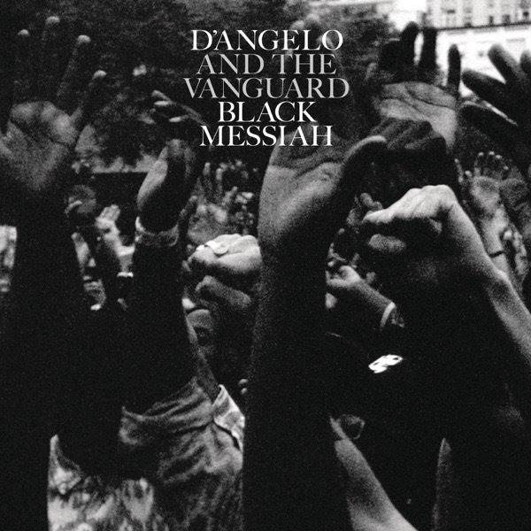

*High-Resolution Master Artwork Archive:* [Black Messiah Cover Art](https://is1-ssl.mzstatic.com/image/thumb/Music114/v4/01/38/24/01382463-de8c-2a33-f8fe-fb3a008dfc87/886444977449.jpg/600x600bb.jpg)

### Curatorial Justification (Why It's on This List)
Arriving fourteen years after 'Voodoo' without a single digital compromise, 'Black Messiah' stands as the monumental high-water mark of modern analog recording. Conceived and tracked entirely to two-inch magnetic tape through vintage Neve and API consoles, the record refuses the quantized grid and hyper-compressed loudness of 21st-century R&B. D'Angelo and his Vanguard ensemble—anchored by Pino Palladino's laid-back, elastic basslines and Questlove's pocket drumming—construct an urgent, polyrhythmic manifesto that marries late-period Sly Stone grit with Prince-level multi-instrumental brilliance. To experience this album on a continuous front-to-back spin is to witness a living, breathing studio session where tape saturation, human micro-timing, and sacred political fervor coalesce into an unbroken sonic communion.

### Front-to-Back Architecture (Narrative & Pacing)
The sequencing operates with deliberate tension and release. Opening with the distorted, abrasive industrial skank of 'Ain't That Easy' and the gut-wrenching tape crunch of '1000 Deaths', the album establishes a dense, claustrophobic pressure cooker before opening into the shimmering acoustic guitars and orchestral strings of 'The Charade'. The transitional seam between Side A and Side B is masterfully anchored by 'Sugah Daddy', where staccato handclaps and rolling barrelhouse piano set up the sultry, candlelit second half ('Really Love', 'Betray My Heart'). The finale, 'Another Life', serves as the emotional and sonic resolution—a soaring, four-part falsetto soul symphony that dissipates into tape hiss and warm amp hum.

### Audiophile & Production Breakdown
Engineered and mixed entirely analog by Russell Elevado, 'Black Messiah' is a masterclass in dynamic range and tactile frequency management. Elevado avoided digital plug-ins entirely, running sub-mixes through vintage tube limiters (Fairchild 670, Teletronix LA-2A) and tracking drums with a minimal stereo ribbon mic setup (Coles 4038s overhead). The result is a soundstage possessing extraordinary depth: the low-end is full, round, and slightly woody rather than sub-boosted, allowing Palladino's flatwound P-Bass strings to articulate every micro-pluck. D'Angelo's vocals are layered into dense choral clouds that wrap around the phantom center without ever smearing the stereo image.

### Benchmark Demo Track: **"Sugah Daddy"**
Test track for transient attack and unquantized micro-dynamics. Listen on planar magnetic headphones for the dry, razor-sharp transient pop of the handclaps and rimshots juxtaposed against the woody thud of the kick drum. At 2:45, observe how the upright piano harmonics decay naturally into the room sound without artificial gates.

### Tonal Anchor Bridge (Library Connection)
For a listener who cherishes the raw vocal conviction and unvarnished live instrumentation of Amy Winehouse's 'Back to Black' and Lauryn Hill's 'The Miseducation of Lauryn Hill', 'Black Messiah' delivers the exact same analog holy grail, magnified through virtuoso musicianship and uncompromising dynamic tape tracking.

---

## 2. Erykah Badu – *Mama's Gun* (2000)

**Primary Label & Engineering:** `Motown / Russell Elevado (Mixing Engineer), Electric Lady Studios`

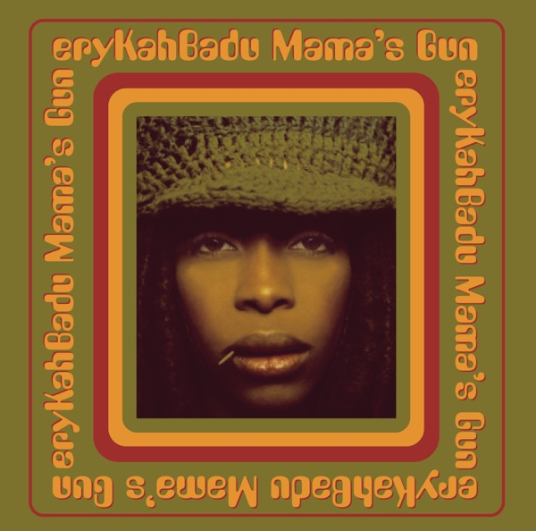

*High-Resolution Master Artwork Archive:* [Mama's Gun Cover Art](https://is1-ssl.mzstatic.com/image/thumb/Music112/v4/63/9c/05/639c0568-e961-2146-f4cb-819a1f9226d3/06UMGIM01547.rgb.jpg/600x600bb.jpg)

### Curatorial Justification (Why It's on This List)
Recorded at Jimi Hendrix's Electric Lady Studios concurrently with D'Angelo's 'Voodoo' and Common's 'Like Water for Chocolate', 'Mama's Gun' is the crown jewel of the Soulquarians movement. Erykah Badu pivoted from the stripped-down incense-and-candlelight minimalism of 'Baduizm' into a sprawling, full-band analog juggernaut. The album captures an artist processing heartbreak, public scrutiny, and maternal evolution in real time, backed by J Dilla, Questlove, Roy Hargrove, James Poyser, and Pino Palladino. As a front-to-back listening experience, its narrative progression feels like an afternoon spent inside the wood-paneled walls of Studio A, with every groove tracked live off the floor.

### Front-to-Back Architecture (Narrative & Pacing)
The album unfolds across three distinct emotional suites: the initial confrontation and self-assertion ('Penitentiary Philosophy', a blistering funk-rock overture driven by fiery rhythm guitar), transitioning into the introspective, jazz-soaked core of 'Didn't Cha Know' and 'My Life'. The narrative pivots into vulnerability on 'Orange Moon'—an eight-minute romantic meditation that unfurls like a velvet standard—before culminating in the devastating, ten-minute catharsis of 'Green Eyes', a three-movement suite that transitions from scratchy 78-RPM gramophone jazz to soaring, brass-heavy funk resolution.

### Audiophile & Production Breakdown
Mixed through an SSL 9000J console onto 1/2-inch magnetic tape by Russell Elevado, 'Mama's Gun' exhibits a wide, natural soundstage characterized by exquisite midrange texture. Badu's voice was tracked through a vintage Neumann U67 tube microphone, revealing every throat catch, lip smacking, and intimate vocal inflection without harsh sibilance. Roy Hargrove's muted flugelhorn in 'Didn't Cha Know' sits in a dedicated, humid pocket just behind the left vocal plane, while the bass frequencies retain an organic weight that breathes rather than suffocates the mix.

### Benchmark Demo Track: **"Didn't Cha Know"**
A benchmark for spatial layering and bass articulation. The J Dilla-programmed loop (sampling Tarika Blue's 'Dreamflower') glides over live bass and rimshots with staggering warmth. Resolving setups will clearly delineate the boundary between the sampled vinyl crackle and the pristine live tracking of Hargrove's trumpet.

### Tonal Anchor Bridge (Library Connection)
Directly complements the listener's devotion to Lauryn Hill's 'Miseducation' and the loose, unquantized live-room drum pocket celebrated throughout Mac Miller's 'Circles'.

---

## 3. Sade – *Love Deluxe* (1992)

**Primary Label & Engineering:** `Epic / Mike Pela (Co-Producer & Engineer), Studio Condulmer (Venice)`

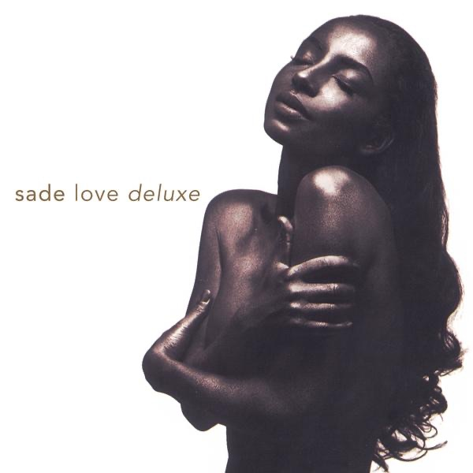

*High-Resolution Master Artwork Archive:* [Love Deluxe Cover Art](https://is1-ssl.mzstatic.com/image/thumb/Music125/v4/18/c8/d7/18c8d7bc-8491-09e6-df0d-6e0a83ead680/mzi.wsikzifg.jpg/600x600bb.jpg)

### Curatorial Justification (Why It's on This List)
While Sade's earlier records defined 1980s sophisti-pop, 'Love Deluxe' represents a quantum leap into brooding, spatially vast minimalism. Recorded in an ancient 17th-century villa near Venice, the album strips away all commercial excess to focus on the hypnotic interplay between Stuart Matthewman's reverberant guitars, Paul Denman's subterranean bass pulses, and Sade Adu's smoky, unflinching alto. It is an unhurried, melancholic masterpiece that pioneered the spacious, dub-infused soul template later mined by everyone from Portishead to modern downtempo artists.

### Front-to-Back Architecture (Narrative & Pacing)
From the torrential opening swell of 'No Ordinary Love'—which spends seven hypnotic minutes establishing a state of submerged romantic obsession—to the stark socioeconomic realism of 'Like a Tattoo' and 'Feel No Pain', the record maintains a unified nocturnal velocity. The transition into Side B begins with 'Cherish the Day', building on a slow-burning drum machine pulse, before culminating in 'Pearls', an unadorned, string-drenched lament that features one of the most raw, emotionally devastating vocal deliveries in recorded history.

### Audiophile & Production Breakdown
Engineered by the legendary Mike Pela, 'Love Deluxe' is revered in audiophile circles for its pitch-black noise floor and monumental dynamic headroom. Sade's voice was captured using an AKG C12 tube microphone, positioned inches from her lips, creating an uncanny sense of proximity and air. The low frequencies on 'Cherish the Day' and 'No Ordinary Love' extend effortlessly below 40Hz with tight acoustic damping, creating a subterranean foundation that never obscures the delicate fretless bass glissandos or reverb tails.

### Benchmark Demo Track: **"No Ordinary Love"**
The definitive test for low-frequency extension and soundstage depth. The opening bass guitar riff combined with the reverberant rimshot creates a vast three-dimensional room image. On resolving gear, you should hear the physical vibration of the bass strings against the frets and the subtle tape echo decaying behind Sade's lead vocal.

### Tonal Anchor Bridge (Library Connection)
Acts as the sophisticated, organic acoustic ancestor to Cannons' 'Fever Dream' and the introspective, late-night moods of Norah Jones' 'Come Away With Me'.

---

## 4. Cleo Sol – *Mother* (2021)

**Primary Label & Engineering:** `Forever Living Originals / Inflo (Producer & Mixing Engineer)`

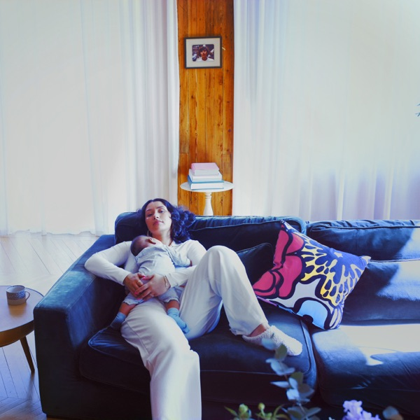

*High-Resolution Master Artwork Archive:* [Mother Cover Art](https://is1-ssl.mzstatic.com/image/thumb/Music115/v4/42/43/43/424343f4-7ef4-7d12-be44-fb24cc0d0137/859748545218_cover.jpg/600x600bb.jpg)

### Curatorial Justification (Why It's on This List)
In an era dominated by hyper-compressed digital vocal stacks, Cleo Sol and visionary producer Inflo (the mastermind behind SAULT) crafted 'Mother' as a sanctuary of pure acoustic warmth. Celebrating new motherhood, spiritual renewal, and intergenerational healing, the record is recorded with an organic stillness reminiscent of Minnie Riperton's 'Come to My Garden' and Rotary Connection. There is no bravado here—only intimate, whisper-soft phrasing, pristine nylon-string guitars, and warm upright bass that make the listener feel as though they are seated in the living room next to the piano.

### Front-to-Back Architecture (Narrative & Pacing)
The album is designed as a singular, maternal prayer. 'Don't Let Me Fall' begins the journey in quiet piano contemplation, gently gathering gospel choir overtones that transition into the lilting, bossa-nova-infused groove of 'Promises'. The emotional peak arrives midway with 'Build By Love' and 'Sunshine', where sweeping orchestral strings arranged by Inflo rise up like sunlight through sheer curtains, before settling into the restorative, acoustic lullaby of 'Spirit'.

### Audiophile & Production Breakdown
Tracked with warm ribbon microphones and vintage analog outboard gear, the album avoids modern digital brickwalling, preserving full natural dynamic swings. The upright piano has a rich, resonant body with mechanical pedal thuds intact; the drum kit sits in a dry, unhyped acoustic space where the hi-hat sizzle is smooth and completely devoid of digital glare. Cleo's lead vocal is captured with zero audible pitch correction, maintaining natural micro-pitch variations and breath control in stunning stereo relief.

### Benchmark Demo Track: **"Don't Let Me Fall"**
Exquisite evaluation track for vocal purity and acoustic piano decay. Listen for the mechanical thump of the sustain pedal and the bloom of Cleo's voice in the upper midrange. The subtle entrance of the bass at 1:12 provides a test of low-frequency control and transient poise.

### Tonal Anchor Bridge (Library Connection)
Bridges the spiritual peace of Audrey Assad's 'Inheritance' with the confessional acoustic soul of Lauryn Hill's 'Miseducation' and Norah Jones' 'Come Away With Me'.

---

## 5. Hiatus Kaiyote – *Choose Your Weapon* (2015)

**Primary Label & Engineering:** `Flying Buddha / Sony Masterworks / Paul Bender & Hiatus Kaiyote`

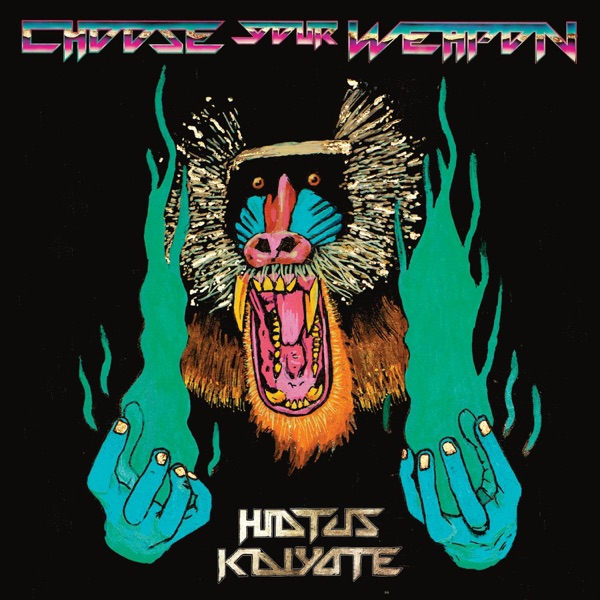

*High-Resolution Master Artwork Archive:* [Choose Your Weapon Cover Art](https://is1-ssl.mzstatic.com/image/thumb/Music115/v4/ac/04/1a/ac041a3a-ac40-3820-01f0-982615c30c37/dj.fnoymdtg.jpg/600x600bb.jpg)

### Curatorial Justification (Why It's on This List)
Australian quartet Hiatus Kaiyote redefined progressive soul with 'Choose Your Weapon', an eighteen-track odyssey of polyrhythmic jazz, arcade electronics, and cinematic soul. Led by Nai Palm's otherworldly vocal dexterity and Perrin Moss's astonishing live breakbeat drumming, the album moves with kaleidoscopic kinetic energy. It avoids the sterility of typical fusion by preserving raw tape saturation, field recordings, and an infectious, funk-forward swing that earned praise from Prince and Questlove alike.

### Front-to-Back Architecture (Narrative & Pacing)
Spanning over seventy minutes, the record functions as an episodic quest across imaginary biomes. Micro-interludes ('Shaolin Monk Motherfunk', 'Atari') act as connective tissue between epic multi-part movements like 'Breathing Underwater', 'Fingerprints', and 'By Fire'. The pacing never sags: every time the band threatens to spiral into pure technical extravagance, Nai Palm grounds the track with an irresistible melodic hook and visceral emotional urgency.

### Audiophile & Production Breakdown
Produced by bassist Paul Bender, the recording balances pristine acoustic transients with dirty analog fuzz. The drum tracking is extraordinary: the snare crack has instantaneous transient impact, and the cymbals shimmer in a wide stereo panorama without phase cancellation. Bender's bass transitions seamlessly between clean electric jazz bass and saturated synth bass, testing a system's ability to render complex low-end harmonic distortion without mud.

### Benchmark Demo Track: **"Breathing Underwater"**
A masterclass in dynamic swings and micro-detail. The sudden drop into silence followed by explosive full-band attacks at the chorus reveals whether your amplifier has sufficient current reserve to handle rapid transients without clipping or collapsing the stereo image.

### Tonal Anchor Bridge (Library Connection)
Taps directly into the adventurous harmonic geometry and vocal fearlessness found in WILLOW's 'empathogen' and the boundary-pushing groove work of Kali Uchis's 'Isolation'.

---

## 6. Sampha – *Process* (2017)

**Primary Label & Engineering:** `Young Turks / Rodaidh McDonald & Sampha`

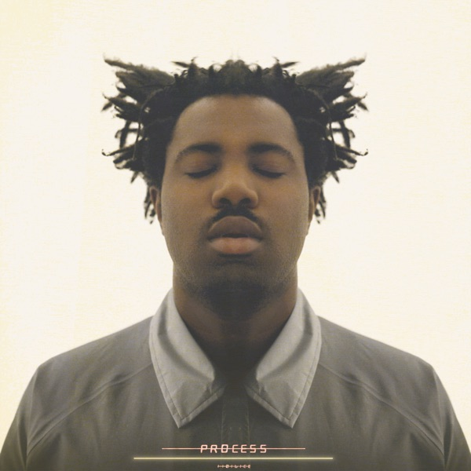

*High-Resolution Master Artwork Archive:* [Process Cover Art](https://is1-ssl.mzstatic.com/image/thumb/Music116/v4/95/8d/ed/958ded66-ec58-2347-caa3-dfa2c0e417e1/889030015860.png/600x600bb.jpg)

### Curatorial Justification (Why It's on This List)
Winner of the Mercury Prize, Sampha Sisay's debut album 'Process' is an unforgettable document of grief, mortality, and electronic soul. Written following the tragic loss of his mother to cancer, the record contrasts Sampha's raw, quivering tenor against a sonic backdrop of fractured UK bass, modular synthesizers, and fragile acoustic piano. It is a devastatingly honest front-to-back narrative of panic attacks, quiet acceptance, and spiritual catharsis.

### Front-to-Back Architecture (Narrative & Pacing)
The album opens with the disorienting, polyrhythmic anxiety of 'Plastic 100°C' and the heart-pounding drum chase of 'Blood on Me', mimicking the physical sensation of panic. The narrative then strips down to bare acoustic bone on the centerpiece, '(No One Knows Me) Like the Piano', creating an emotional silence so profound it alters the gravity of everything that follows. Side B builds through atmospheric electronica ('Reverse Faults', 'Incomplete Kisses') before dissolving into the floating, ethereal beauty of 'What Shouldn't I Be?'.

### Audiophile & Production Breakdown
Co-produced with Rodaidh McDonald, the production creates dramatic spatial contrasts. '(No One Knows Me) Like the Piano' was recorded upright in Sampha's childhood home in Morden, South London; the microphones pick up the wooden resonance, room reflections, and Sampha's raw breathing. In contrast, 'Blood on Me' unleashes bone-jarring sub-bass sweeps and panned percussive transients that test driver control and transient decay.

### Benchmark Demo Track: **"(No One Knows Me) Like the Piano"**
The ultimate test for midrange intimacy and room acoustics. On resolving planar headphones or reference monitors, the voice sits directly in front of the listener with uncanny physical proximity. Notice the mechanical sound of the wooden piano hammers striking the felt and strings.

### Tonal Anchor Bridge (Library Connection)
Directly connects to the vulnerable acoustic grief and unvarnished vocal intimacy of Mac Miller's 'Circles' and Adele's '21'.

---

## 7. Jazmine Sullivan – *Heaux Tales* (2021)

**Primary Label & Engineering:** `RCA Records / Key Wane, Dev Hynes, Dave Watson`

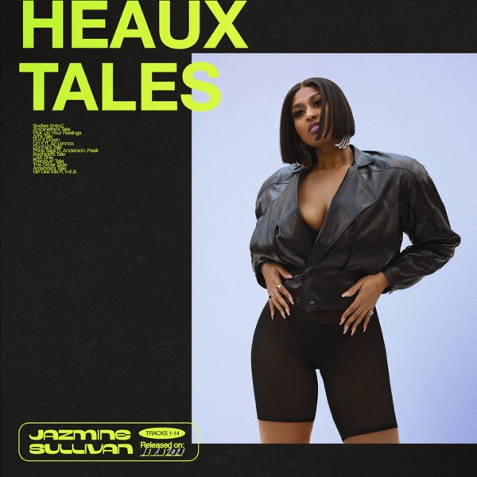

*High-Resolution Master Artwork Archive:* [Heaux Tales Cover Art](https://is1-ssl.mzstatic.com/image/thumb/Music124/v4/e6/1e/43/e61e43e4-a8c9-2ddd-04f8-89df5515eadd/886448974314.jpg/600x600bb.jpg)

### Curatorial Justification (Why It's on This List)
A masterclass in modern vocal agility and conceptual storytelling, 'Heaux Tales' revived the conversational, narrative concept album in contemporary R&B. Interspersed with spoken-word interludes from real women discussing desire, agency, insecurity, and financial survival, Jazmine Sullivan's vocal performances are nothing short of virtuosic. Sullivan combines the church-trained chest resonance of Aretha Franklin with dizzying jazz melismas, backed by live guitars, crisp trap-soul pockets, and lush, stacked harmonies.

### Front-to-Back Architecture (Narrative & Pacing)
The sequencing alternates between honest testimonial interludes and explosive musical responses. 'Antoinette's Tale' sets up the blistering funk-bass of 'Pick Up Your Feelings'; 'Ari's Tale' gives way to the sultry, acoustic-guitar-driven 'Put It Down'. By the time the album reaches 'Lost One' and the Anderson .Paak collaboration 'Price Tags', Sullivan has constructed a complete, multidimensional portrait of contemporary womanhood that demands uninterrupted playback.

### Audiophile & Production Breakdown
Sullivan's vocals are tracked with astonishing presence and dynamic headroom, avoiding the harsh digital de-essing that plagues much modern pop. Her multi-tracked background harmonies are panned wide across the stereo spectrum, forming an enveloping choral cushion behind her laser-focused lead vocal. The bass guitar on 'Pick Up Your Feelings' exhibits sharp, punchy transient snap, while the acoustic guitar in 'Girl Like Me' (feat. H.E.R.) rings with rich body resonance.

### Benchmark Demo Track: **"Pick Up Your Feelings"**
Benchmark for vocal dynamic control and bass punch. Sullivan's vocal runs from chest voice to soaring head register will expose any mid-range congestion or crossover distortion. The bassline requires fast, articulate low-end damping.

### Tonal Anchor Bridge (Library Connection)
Shares the thematic candor, spoken-word intimacy, and vocal brilliance of SZA's 'Ctrl' and Lauryn Hill's 'Miseducation'.

---

## 8. Moses Sumney – *Aromanticism* (2017)

**Primary Label & Engineering:** `Jagjaguwar / Joshua Weller, Cam O'bi, Matt Otto`

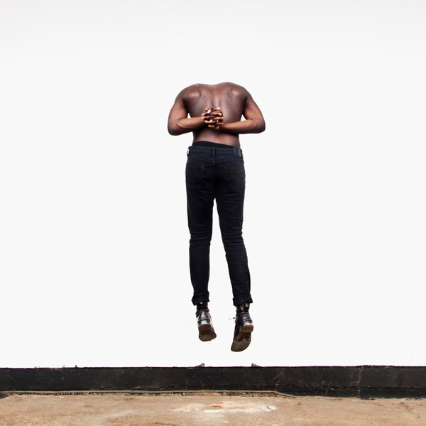

*High-Resolution Master Artwork Archive:* [Aromanticism Cover Art](https://is1-ssl.mzstatic.com/image/thumb/Music115/v4/21/94/9b/21949b08-5196-bc25-aa2f-f560f8eed9cb/656605230863.jpg/600x600bb.jpg)

### Curatorial Justification (Why It's on This List)
Moses Sumney's debut 'Aromanticism' is a philosophical inquiry into the societal mandate of romantic love, rendered through an astonishing blend of baroque folk, choral soul, and ambient jazz. Sumney's countertenor falsetto is a natural wonder—capable of floating with ethereal fragility or cutting through complex orchestral counterpoint. Recorded over several years with contributions from Thundercat, Jamire Williams, and Paris Strother, this is an uncompromising work of sonic architecture that creates its own sacred acoustic universe.

### Front-to-Back Architecture (Narrative & Pacing)
Structured as an unbroken philosophical treatise, the record weaves seamlessly from ambient drone ('First Requisition') into the chamber-folk majesty of 'Plastic'. The emotional centerpiece, 'Quarrel', builds across nearly seven minutes from quiet harp arpeggios to a thunderous, polyrhythmic jazz climax. The album concludes with 'Doomed'—a terrifyingly beautiful meditation on isolation that dissolves into deep sub-bass drones and reverberant vocal prayers.

### Audiophile & Production Breakdown
A showcase of acoustic headroom and three-dimensional soundstaging. Harp, flute, and double bass are captured in lush, natural room acoustics, allowing their physical overtones to ring out into silence. Sumney's vocal loop architecture—often stacking dozens of vocal tracks to simulate a pipe organ or chamber choir—creates a staggering vertical height to the soundstage.

### Benchmark Demo Track: **"Quarrel"**
An extraordinary test for soundstage width and dynamic range. From the delicate pluck of the harp and whispered vocals in the intro to the explosive full-band jazz crescendo at 4:30, your system must resolve minute micro-details without hardening or distorting under peak SPL.

### Tonal Anchor Bridge (Library Connection)
Combines the ethereal, soaring vocal atmosphere of Frank Ocean's 'Blonde' with the reverent, sacred chamber stillness of Audrey Assad's 'Inheritance'.

---

## 9. Kelela – *Raven* (2023)

**Primary Label & Engineering:** `Warp Records / Asmara, Yo van Lenz, Florian T M, Kaytranada, Chris Tabron`

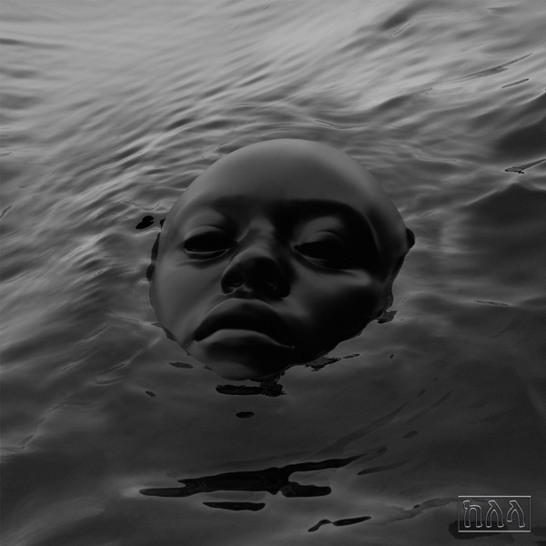

*High-Resolution Master Artwork Archive:* [Raven Cover Art](https://is1-ssl.mzstatic.com/image/thumb/Music211/v4/1c/f7/5e/1cf75e26-2b50-44f2-424d-41dc005d5095/5056614702828.png/600x600bb.jpg)

### Curatorial Justification (Why It's on This List)
Five years after 'Take Me Apart', Kelela returned with 'Raven', an aquatic, ambient-dancehall and underground club masterpiece. Centering Black queer vulnerability and collective liberation, Kelela submerged her crystalline R&B vocal melodies beneath deep, dub-inflected breakbeats, ambient techno drones, and cavernous sub-bass. The record operates with an oceanic cohesion, flowing continuously from start to finish like a two-hour midnight set in an subterranean Berlin or London club.

### Front-to-Back Architecture (Narrative & Pacing)
The sequencing mirrors a night journey: beginning with the ambient, submerged awakening of 'Washed Away' and 'Happy Ending', the tempo gradually quickens through the garage-infused pulse of 'Missed Call' and 'Contact'. The mid-album title track 'Raven' acts as the nocturnal turning point—a seven-minute ambient techno meditation that clears the air before the shimmering, four-on-the-floor groove of 'Bruises' and the transcendent closing embrace of 'Far Away'.

### Audiophile & Production Breakdown
Mixed by Chris Tabron, 'Raven' features some of the cleanest, most authoritative sub-bass extension in modern music. Unlike typical over-compressed electronic albums, the low frequencies are meticulously tuned between 25Hz and 60Hz, providing visceral physical impact while leaving Kelela's vocal placement untouched and crystal clear in the upper midrange. The spatial panning of background synthesizers and dub echo trails creates an expansive, immersive wrap-around experience.

### Benchmark Demo Track: **"Contact"**
The ultimate test for sub-bass control and rhythmic drive. The kick drum delivers a punchy chest thump while the 35Hz sub-bass sine wave rolls underneath. Resolving systems will keep the syncopated vocal chops completely isolated above the low-end rumble.

### Tonal Anchor Bridge (Library Connection)
Expands the sultry, electronic-soul sensuality of Kali Uchis's 'Isolation' and Alina Baraz & Galimatias's 'Urban Flora' into a darker, higher-resolving club soundstage.

---

## 10. Blood Orange – *Freetown Sound* (2016)

**Primary Label & Engineering:** `Domino / Devonté Hynes (Producer & Mix Engineer)`

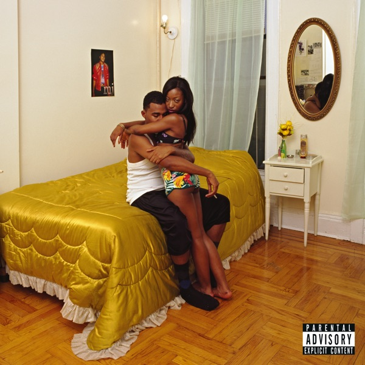

*High-Resolution Master Artwork Archive:* [Freetown Sound Cover Art](https://is1-ssl.mzstatic.com/image/thumb/Music221/v4/c7/d0/eb/c7d0eb2b-05ed-132d-5d47-e65ee3770485/887828036967.png/600x600bb.jpg)

### Curatorial Justification (Why It's on This List)
Devonté Hynes's masterpiece as Blood Orange, 'Freetown Sound' is an ambitious, cinematic collage of queer identity, Black diaspora history, and New York street life. Named after the capital of Sierra Leone (where his father grew up), the album weaves spoken-word field recordings, live saxophone, 80s LinnDrum machines, and guest appearances from Debbie Harry, Nelly Furtado, and Empress Of into an uninterrupted urban dreamscape. It stands alongside 'Sign o' the Times' as a definitive one-man auteur production.

### Front-to-Back Architecture (Narrative & Pacing)
Opening with Ashlee Haze reciting her poem 'For Colored Girls', the album moves seamlessly through 17 interconnected tracks. 'Augustine' anchors the first act with its infectious pop melody and bittersweet piano chords, flowing into the smooth R&B of 'Best to You' and the driving post-disco funk of 'E.V.P.'. The record plays like a radio broadcast drifting out of open brownstone windows on a humid summer night in Harlem.

### Audiophile & Production Breakdown
Hynes tracked much of the record using vintage analog synthesizers (Juno-106, Prophet-5), electric bass, and an alto saxophone recorded with close-mic intimacy. The stereo soundstage is richly populated with ambient street noise, subway turnstile clatter, and casual studio chatter, testing an audio system's ability to layer multi-source field recordings without masking the pristine slap-bass and vocal tracks.

### Benchmark Demo Track: **"Augustine"**
Tests tonal balance between percussive electronic drums and acoustic piano. Listen for the distinct decay of Hynes's falsetto against the wide stereo synth pads and the rich low-end punch of the LinnDrum kick.

### Tonal Anchor Bridge (Library Connection)
Mirrors the kaleidoscopic urban vignettes, tape warmth, and vocal honesty of Frank Ocean's 'Blonde' and Lorde's 'Melodrama'.

---

## 11. SiR – *Chasing Summer* (2019)

**Primary Label & Engineering:** `Top Dawg Entertainment (TDE) / RCA / Kal Banx, Sounwave, Michael Uzowuru`

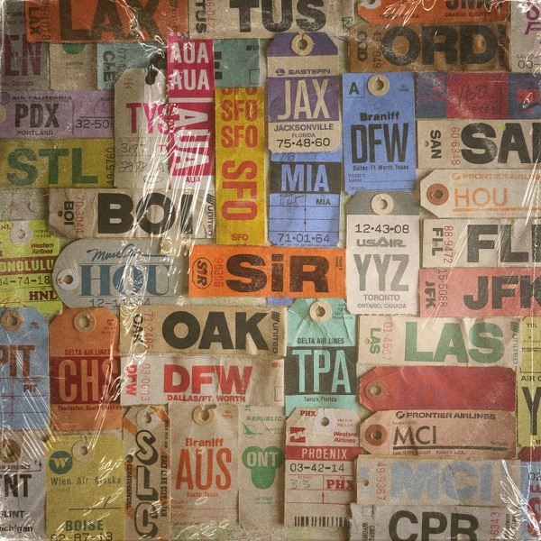

*High-Resolution Master Artwork Archive:* [Chasing Summer Cover Art](https://is1-ssl.mzstatic.com/image/thumb/Music116/v4/dc/aa/a8/dcaaa87d-8d60-d431-b203-f285cfa3d26c/886447892336_cover.jpg/600x600bb.jpg)

### Curatorial Justification (Why It's on This List)
Hailing from Inglewood and backed by Top Dawg Entertainment, SiR (Sir Darryl Farris) crafted 'Chasing Summer' as a golden-hour concept album centered on the exhaustion, romance, and displacement of life on tour. Blending silky 1970s West Coast soul chords with modern low-end punch, the record highlights SiR's buttery vocal delivery, effortless falsetto, and razor-sharp songwriting. Featuring guest turns from Kendrick Lamar, Jill Scott, and Lil Wayne, it remains one of the most sonically refined R&B albums of the streaming era.

### Front-to-Back Architecture (Narrative & Pacing)
The album uses airplane boarding announcements and airport field recordings to tether its fourteen tracks to an overarching transcontinental narrative. From the breezy, laid-back guitar glide of 'Hair Down' into the mournful vulnerability of 'John Redcorn', the transitions feel natural and organic. The emotional climax arrives on 'Still Blue' (feat. Jill Scott), where vintage soul harmonies swell into an orchestral wave of bittersweet longing.

### Audiophile & Production Breakdown
Engineered by TDE's legendary in-house audio team, 'Chasing Summer' exhibits phenomenal low-end fidelity. The 808s and live bass are tuned to sit precisely below the warm Rhodes electric pianos without clouding SiR's close-mic lead vocal. The high frequencies are rolled off gently, mimicking the warm, rounded top-end of a vintage half-inch master tape.

### Benchmark Demo Track: **"Hair Down (feat. Kendrick Lamar)"**
A showcase for midrange separation and vocal texture. Compare SiR's smooth, smoky croon against Kendrick Lamar's sharp, percussive consonants. The drum groove features a crisp, dry hi-hat that tests transient speed and micro-detail.

### Tonal Anchor Bridge (Library Connection)
Extends the smooth West Coast soul pocket and high-precision production found on Kendrick Lamar's 'DAMN.' and SZA's 'Ctrl'.

---

## 12. Snoh Aalegra – *Ugh, those feels again* (2019)

**Primary Label & Engineering:** `ARTium / Roc Nation / No I.D. (Executive Producer)`

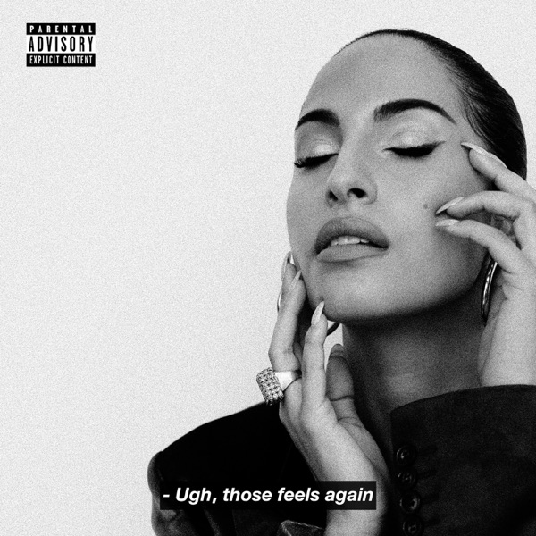

*High-Resolution Master Artwork Archive:* [Ugh, those feels again Cover Art](https://is1-ssl.mzstatic.com/image/thumb/Music124/v4/ab/ff/37/abff374d-12d1-8533-1cbf-4cecc37dfcec/5056167116714_1.jpg/600x600bb.jpg)

### Curatorial Justification (Why It's on This List)
Mentored by Prince and executive produced by legendary hip-hop architect No I.D., Swedish-Persian singer Snoh Aalegra achieved cinematic perfection on 'Ugh, those feels again'. Drawing inspiration from 1960s Motown, Philadelphia soul, and vintage film scores, Aalegra's velvet, smoky voice conveys the intoxicating dizziness of new love and the agonizing sting of heartbreak. Every track is bathed in sumptuous strings, lush Rhodes keys, and rich, unhurried drums.

### Front-to-Back Architecture (Narrative & Pacing)
The album plays like a romantic film strip. Opening with the sweeping string overture 'Here Now', it slides effortlessly into the infectious head-nod groove of 'I Want You Around'. The album maintains an intoxicating, mid-tempo sway through 'Situationship' and 'Whoa' before arriving at the deeply vulnerable, sparse ballad 'Peace', resolving the emotional turmoil with quiet grace.

### Audiophile & Production Breakdown
No I.D.'s production leans heavily into analog warmth and expansive stereo imaging. The live strings were arranged and recorded in a large acoustic scoring room, providing authentic room depth rather than artificial convolution reverb. Snoh's vocals are captured with stunning clarity on a vintage tube condenser mic, highlighting her breathy lower register and resonant chest voice.

### Benchmark Demo Track: **"I Want You Around"**
A benchmark for vocal warmth and stereo acoustic strings. Notice the natural stereo spread of the string section behind the dry, centered bass and snare. Aalegra's voice has a holographic presence in the phantom center.

### Tonal Anchor Bridge (Library Connection)
Deepens the vintage soul romance and smoky vocal intimacy celebrated on Amy Winehouse's 'Back to Black' and Adele's '21'.

---

## 13. Leon Ware – *Musical Massage* (1976)

**Primary Label & Engineering:** `Gordy / Motown / Art Stewart & Leon Ware`

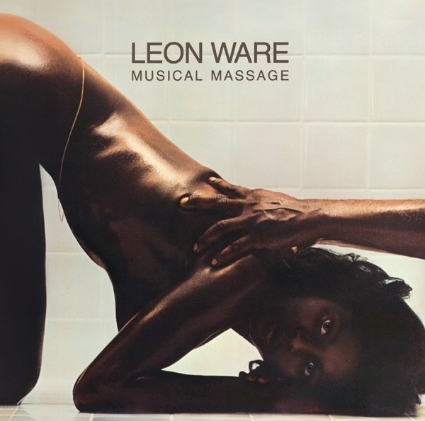

*High-Resolution Master Artwork Archive:* [Musical Massage Cover Art](https://is1-ssl.mzstatic.com/image/thumb/Music124/v4/20/2f/19/202f1920-131e-8d65-4f49-0b6a655e53f0/00044001899928.rgb.jpg/600x600bb.jpg)

### Curatorial Justification (Why It's on This List)
Leon Ware was the quiet genius of Motown's sensual renaissance. Originally conceived as his own solo album before Berry Gordy convinced him to hand most of the songs over to Marvin Gaye for the seminal 'I Want You', Ware subsequently went back into the studio to record 'Musical Massage' with the remaining material. The result is one of the most sophisticated, rhythmically supple, and sensuous soul records ever pressed to vinyl. It is the unheralded foundation of quiet storm and neo-soul.

### Front-to-Back Architecture (Narrative & Pacing)
The record is a seamless, thirty-six-minute erotic and musical suite. From the opening title track 'Learning the Game' and 'Musical Massage' through the breezy jazz-funk of 'Holiday', Ware utilizes fluid transitions, conga breaks, and floating string lines to ensure the mood never falters. The finale, 'Turn Out the Light', stands as a definitive slow jam blueprint.

### Audiophile & Production Breakdown
Engineered by Motown veteran Art Stewart, 'Musical Massage' is a textbook example of golden-era analog tracking on 2-inch tape. The rhythm section (featuring Chuck Rainey on bass and James Gadson on drums) is tracked with incredible human groove; the bass has that thick, rounded Motown direct-inject warmth, while the acoustic rhythm guitars and Rhodes keys occupy their own distinct pockets in the left and right channels.

### Benchmark Demo Track: **"Turn Out the Light"**
Test for 1970s analog tape saturation and drum micro-groove. Listen to James Gadson's hi-hat phrasing and the smooth decay of the Fender Rhodes piano. The string arrangement floats in a wide, natural stereo arc without any harsh digital peak.

### Tonal Anchor Bridge (Library Connection)
The direct musical forebear to the lush, laid-back sensual grooves of Kali Uchis's 'Isolation' and Erykah Badu's 'Mama's Gun'.

---

## 14. Meshell Ndegeocello – *Peace Beyond Passion* (1996)

**Primary Label & Engineering:** `Maverick / Reprise / David Gamson (Producer) & Bob Power (Mixing Engineer)`

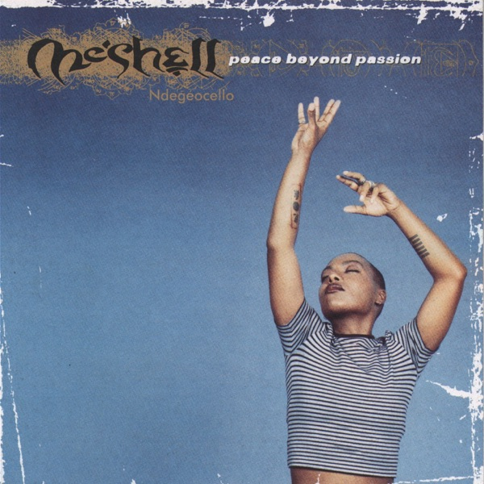

*High-Resolution Master Artwork Archive:* [Peace Beyond Passion Cover Art](https://is1-ssl.mzstatic.com/image/thumb/Music/38/08/0c/mzi.nqnhxacp.jpg/600x600bb.jpg)

### Curatorial Justification (Why It's on This List)
Meshell Ndegeocello's second album is a staggering, fearless exploration of Christian theology, racism, homophobia, and sexual redemption. Co-produced with David Gamson and mixed by legendary hip-hop engineer Bob Power, 'Peace Beyond Passion' features some of the most formidable bass playing in recorded history, augmented by Billy Preston's organ, Joshua Redman's saxophone, and Wendy Melvoin's guitar. It remains an uncompromising, deeply spiritual front-to-back masterpiece that expanded the boundaries of Black music.

### Front-to-Back Architecture (Narrative & Pacing)
The album opens with biblical gravity on 'The Womb' and 'Deuteronomy: Nigger Man', setting an unflinching intellectual and musical tone. The emotional gut-punch arrives on 'Leviticus: Faggot', a tragic narrative of a gay boy cast out by his family, set against a blistering funk-rock bassline. The record finds sublime redemption in its latter half with an inspired cover of Bill Withers's 'Who Is He And What Is He To You' and the transcendent, peaceful prayer of 'Make Me Wanna Holler'.

### Audiophile & Production Breakdown
Mixed by Bob Power—the sonic architect behind A Tribe Called Quest and D'Angelo—the low-end on this record is a legendary audiophile benchmark. Meshell's bass guitar has monumental physical weight, articulate fingerboard definition, and zero acoustic resonance bloat. The drums have explosive transient impact, while the Hammond B3 organ fills the room with rich harmonic overtones.

### Benchmark Demo Track: **"The Way"**
The ultimate test for bass guitar authority and transient response. The low-frequency fundamental notes on Meshell's bass will push your woofer's excursion to its limits, requiring total damping control to keep the notes tight, melodic, and pitch-perfect.

### Tonal Anchor Bridge (Library Connection)
Connects to the bold, uncompromising sociopolitical fire and bass-heavy swagger of Kendrick Lamar's 'DAMN.' and Lauryn Hill's 'Miseducation'.

---

## 15. Jordan Rakei – *Origin* (2019)

**Primary Label & Engineering:** `Ninja Tune / Jordan Rakei (Produced & Mixed)`

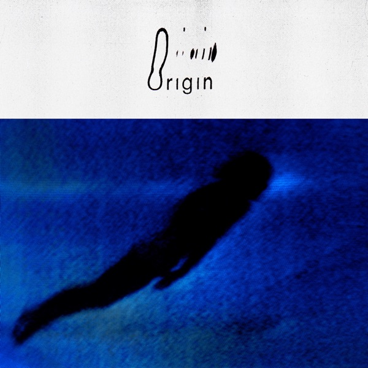

*High-Resolution Master Artwork Archive:* [Origin Cover Art](https://is1-ssl.mzstatic.com/image/thumb/Music211/v4/d9/d2/e8/d9d2e8ff-642a-732e-a4a7-7553af57e734/5054429141313.png/600x600bb.jpg)

### Curatorial Justification (Why It's on This List)
New Zealand-born, London-based multi-instrumentalist Jordan Rakei crafted 'Origin' as a dystopian concept album exploring technological alienation, artificial intelligence, and humanity's detachment from nature. Anchored by Rakei's virtuoso jazz piano, intricate live bass, and flawless, multi-octave vocal harmonies, the album balances cerebral musicality with infectious groove. It is an impeccably engineered album that proves modern home/studio hybrid productions can rival classic analog recordings.

### Front-to-Back Architecture (Narrative & Pacing)
Beginning with the propulsive, syncopated soul of 'Mad World', the narrative explores human connection in an automated society. Tracks like 'Mind's Eye' and 'Say Something' showcase Rakei's ability to layer complex jazz chord progressions over crisp, modern breakbeats. The pacing decelerates into the reflective, ambient piano ballad 'Mantra' before closing with the sweeping, string-laden catharsis of 'Speak'.

### Audiophile & Production Breakdown
Produced and mixed by Rakei himself, 'Origin' is renowned for its crystalline high-end air and surgical stereo separation. The drum kit was recorded in a live wooden room, giving the snare and ride cymbal an organic acoustic glow. The vocal stacks—often featuring four or five harmony parts tracked in tight succession—wrap around the listener with pristine phase coherence.

### Benchmark Demo Track: **"Mind's Eye"**
Test for snare transient snap and multi-layered vocal imaging. Notice how each layer of Rakei's harmony sits in its own distinct horizontal plane across the soundstage while the tight bassline drives the center channel with effortless agility.

### Tonal Anchor Bridge (Library Connection)
Connects the intricate live acoustic pocket of Mac Miller's 'Circles' with the progressive jazz-pop architecture of WILLOW's 'empathogen'.

---

# Category II: Jangle, Dream-Pop & Lyrical Intimacy

> **Sonic Signature:** *Rickenbacker/Fender chime, lush chorus modulation, ribbon-mic room air, ethereal vocal layers, melancholic chord geometry.*

## The Sound of Category II: The Crystalline Cascade: Chorus Modulation, Ribbon-Mic Room Air & Ethereal Suspension

> *"Characterized by chiming multi-string harmonic overtones, lush bucket-brigade analog modulation, cavernous plate and space-echo decays, and gossamer vocal whispers that seem suspended in a holographic three-dimensional acoustic field."*

### Acoustic Archetype & Engineering Philosophy
Guitars form the architectural spine of this aesthetic: vintage 12-string Rickenbackers (330/360), Fender Jaguars, Jazzmasters, and Telecasters plugged into pristine solid-state Roland JC-120 Jazz Chorus amplifiers or cranked black-panel Fender Twin Reverbs. The signal path is soaked in analog bucket-brigade device (BBD) modulation—the legendary Boss CE-1 and CE-2 chorus pedals, Electro-Harmonix Small Clone, and rackmount Roland RE-201 Space Echoes or Lexicon 224/480L digital reverberators. Vocals are captured with smooth ribbon microphones (Coles 4038, Royer R-121) or airy vintage condensers (AKG C12, Neumann KM84) to capture breath and high-frequency sparkle while suppressing harsh consonant sibilance.

### Frequency Architecture & Spectral Balance
High frequencies (4kHz–16kHz) are the crown jewel of this taxonomy. The interlocking chime of octave strings generates shimmering upper-harmonic blooms that hang in the air like spun glass. Long plate reverb tails and modulated delays decay slowly across two to four seconds without metallic ringing. The midrange (500Hz–3.5kHz) is ethereal, layered, and impressionistic: vocals are frequently double- or quadruple-tracked, whispered, or bathed in shimmering chorus, blurring the boundary between human voice, Mellotron strings, and electric guitar harmonics. The low-end (60Hz–200Hz) is deceptively nimble: basslines are played with plectrums on short-scale basses (Fender Mustang or Rickenbacker 4001), cutting through the reverb haze with warm, wooden clarity and driving post-punk bounce.

### Spatial Soundstaging & Holographic Imaging
The soundstage is extraordinarily wide, expansive, and holographic. Guitars are hard-panned left and right in antiphonal dialogue, weaving undulating textures that wrap around the listener's periphery. Stereo chorus modulations sweep slowly across the soundfield, creating an illusion of boundless acoustic architecture. In the center sits the vocalist—sometimes pushed back into a misty, cathedral-like reverb wash (Cocteau Twins, Slowdive), sometimes pulled shockingly close to the ear with dry, whispered directness (Adrianne Lenker, Mazzy Star).

### The Tactile Listening Experience
This sound induces weightlessness and emotional immersion. On open-back reference headphones or well-aligned stereo monitors with proper toe-in, the soundstage completely detaches from the physical speakers. Listen for the subtle micro-flutter of analog delay tape loops, the gentle mechanical click of guitar pickup switches, and the deep, melancholic suspension of suspended chords ringing out into darkness.

---

## 16. Cocteau Twins – *Heaven or Las Vegas* (1990)

**Primary Label & Engineering:** `4AD / Robin Guthrie (Producer & Engineer), September Sound (London)`

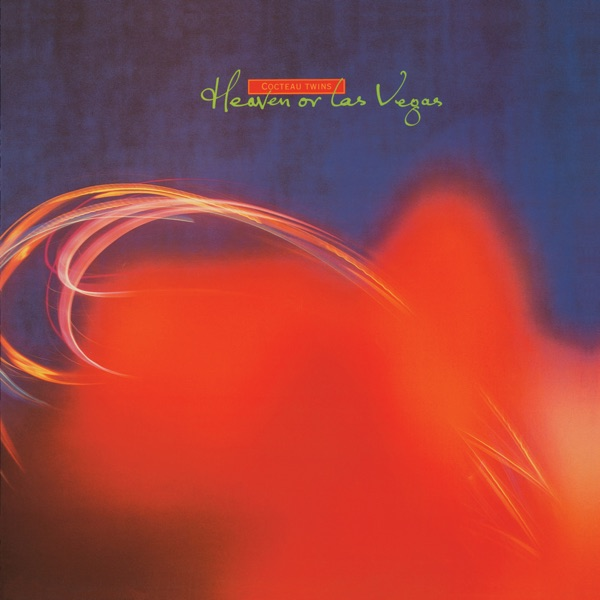

*High-Resolution Master Artwork Archive:* [Heaven or Las Vegas Cover Art](https://is1-ssl.mzstatic.com/image/thumb/Music116/v4/76/cd/61/76cd61e7-0714-dce5-c48e-0f05f8fcb84b/652637001280.png/600x600bb.jpg)

### Curatorial Justification (Why It's on This List)
The undisputed pinnacle of dream-pop, 'Heaven or Las Vegas' captures Cocteau Twins at the zenith of their melodic accessibility without sacrificing a single drop of their otherworldly mystery. Elizabeth Fraser's glossolalic vocals—part Scots dialect, part phonetic invented language, part pure ecstatic crying—float over Robin Guthrie's cathedral-like architecture of chorus-drenched Fender guitars and Simon Raymonde's melodic basslines. Recorded following the birth of Fraser and Guthrie's daughter, the album radiates a euphoric, maternal warmth that transcends conventional rock instrumentation.

### Front-to-Back Architecture (Narrative & Pacing)
Opening with the majestic, shimmering arpeggios of 'Cherry-coloured Funk', the album establishes a weightless, floating momentum that sustains across all ten tracks. 'Pitch the Baby' and 'Iceblink Luck' inject propulsive drum machine rhythms and glittering acoustic guitar strumming, leading into the staggering emotional climax of the title track. The record resolves on 'Frou-frou Foxes in Midsummer Fires', where Fraser's multi-tracked vocal spirals upward into a blinding burst of sonic light.

### Audiophile & Production Breakdown
Recorded at the band's personal September Sound studio, the album is a benchmark for spatial diffusion and vocal layering. Guthrie pioneered the use of cascaded digital delay units (Eventide H3000, Yamaha SPX90) blended with warm analog plate reverbs. Fraser's vocal tracks were recorded with a Neumann U87, preserving razor-sharp high-frequency consonants that cut through the dense, atmospheric guitar wash. Raymonde's bass provides a grounded, melodic counterweight, anchored firmly in the lower-mid register.

### Benchmark Demo Track: **"Cherry-coloured Funk"**
Test for soundstage height and atmospheric layering. The opening guitar chords bloom outward in a vast semi-circle. When Fraser's vocals enter, resolving headphones or speakers will clearly separate her delicate whispering consonants from the cavernous, multi-tap delay tails bouncing across the channels.

### Tonal Anchor Bridge (Library Connection)
The direct, foundational sonic ancestor to the listener's cherished albums by The Sundays ('Reading, Writing and Arithmetic', 'Static & Silence') and Sixpence None the Richer.

---

## 17. Mazzy Star – *So Tonight That I Might See* (1993)

**Primary Label & Engineering:** `Capitol Records / David Roback (Producer & Engineer)`

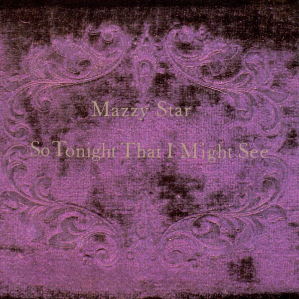

*High-Resolution Master Artwork Archive:* [So Tonight That I Might See Cover Art](https://is1-ssl.mzstatic.com/image/thumb/Music116/v4/0f/03/ea/0f03ead1-d1eb-27fd-0734-b257b515692f/13UABIM59278.rgb.jpg/600x600bb.jpg)

### Curatorial Justification (Why It's on This List)
The definitive soundtrack to 1990s nocturnal alienation, 'So Tonight That I Might See' married the psychedelic blues of The Doors with the velvet, acoustic intimacy of 1960s folk. Hope Sandoval's hypnotic, languid delivery and David Roback's reverberant slide guitars create a dreamlike trance that feels completely detached from temporal trends. Beyond the immortal hit 'Fade Into You', the album is a dark, cinematic exploration of slow-burn desert noir.

### Front-to-Back Architecture (Narrative & Pacing)
The record opens with the warm, acoustic embrace of 'Fade Into You' before descending into darker, moodier corridors. 'Bells Ring' injects jangly Paisley Underground psych-pop, while 'Mary of Silence' and 'Wasted' stretch into hypnotic, distortion-tinged blues meditations. The journey concludes with the sprawling title track, an improvisational, feedback-laced blues drone featuring Sandoval's whispered spoken-word incantations.

### Audiophile & Production Breakdown
Engineered with remarkable acoustic restraint, the album preserves an enormous amount of natural room air. Sandoval's voice was captured with zero aggressive compression, allowing every sigh, breath, and micro-vocal tremble to sit suspended in the room. Roback's acoustic guitar strumming features rich body resonance, while his electric slide guitar notes decay into warm, tape-driven spring reverbs.

### Benchmark Demo Track: **"Fade Into You"**
A masterclass in acoustic decay and vocal proximity. Listen for the gentle tapping of the tambourine in the right channel and the subtle piano chords providing low-mid resonance behind the acoustic guitar. Sandoval's voice should feel physically present in the room.

### Tonal Anchor Bridge (Library Connection)
Directly informs the sleepy, slide-guitar-infused country-soul intimacy of Faye Webster's 'I Know I'm Funny haha' and Lana Del Rey's 'Norman Fucking Rockwell!'.

---

## 18. Alvvays – *Blue Rev* (2022)

**Primary Label & Engineering:** `Polyvinyl / Transgressive / Shawn Everett (Producer & Mixing Engineer)`

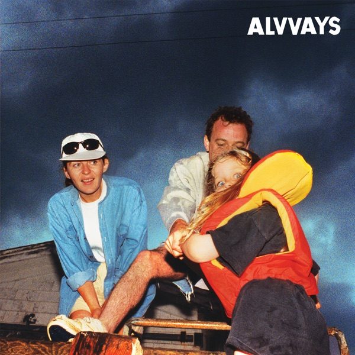

*High-Resolution Master Artwork Archive:* [Blue Rev Cover Art](https://is1-ssl.mzstatic.com/image/thumb/Music126/v4/57/d1/be/57d1be08-4faf-06b5-3de6-165b194e0091/5400863086077.png/600x600bb.jpg)

### Curatorial Justification (Why It's on This List)
Recorded live to tape in single uninterrupted band takes with mad-scientist producer Shawn Everett (The War on Drugs, Kacey Musgraves), 'Blue Rev' rescued indie pop from pastel complacency. Molly Rankin's razor-sharp, sardonic lyrics and soaring hooks cut through an overwhelming wall of fuzz, jangly 12-string guitars, and shoegaze velocity. Spanning 14 tracks in just 39 minutes, it is an unrelenting triumph of songwriting, sequencing, and analog maximalism.

### Front-to-Back Architecture (Narrative & Pacing)
The album detonates out of nowhere with the sudden, distortion-blasted riff of 'Pharmacist', followed immediately by the melodic barrage of 'Easy On Your Own?'. Tracks blur into one another with ferocious momentum, pausing only for the nostalgic synths of 'Tile by Tile' and the heart-stopping key change of 'Belinda Says'. The pacing is breathless, resolving on the bittersweet jangle of 'Fourth Figure'.

### Audiophile & Production Breakdown
Shawn Everett tracked the band playing all fourteen songs consecutively in single live takes, running signals through analog pedals and customized tape loops. Despite the dense wall of sound, Everett's mix possesses extraordinary spatial separation: Rankin's vocals remain crystalline in the center, while Alec O'Hanley's multi-layered Rickenbacker and Jaguar guitars occupy distinct stereo wings.

### Benchmark Demo Track: **"Belinda Says"**
An intense workout for dynamic headroom and high-frequency handling. When the key change hits at 2:38, the full band explodes into a tidal wave of distortion and strings. Resolving equipment will maintain instrument separation without collapsing into harsh noise.

### Tonal Anchor Bridge (Library Connection)
Connects the shimmering guitar jangle of The Sundays with the kinetic, emotionally charged pop-rock urgency of Paramore's 'After Laughter' and Olivia Rodrigo's 'SOUR'.

---

## 19. Big Thief – *Dragon New Warm Mountain I Believe in You* (2022)

**Primary Label & Engineering:** `4AD / James Krivchenia (Producer), Shawn Everett (Mixing Engineer)`

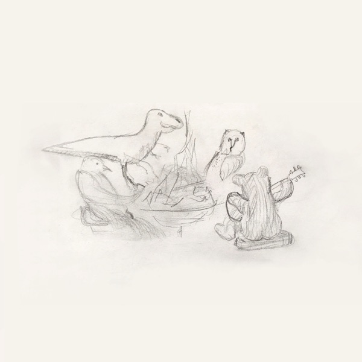

*High-Resolution Master Artwork Archive:* [Dragon New Warm Mountain I Believe in You Cover Art](https://is1-ssl.mzstatic.com/image/thumb/Music116/v4/14/c8/ea/14c8ea65-2155-8d44-f0c5-6faa8f51f95d/191400040878.png/600x600bb.jpg)

### Curatorial Justification (Why It's on This List)
A sprawling twenty-song double album recorded across four distinct geographical environments (upstate New York, Topanga Canyon, the Rocky Mountains of Colorado, and Tucson, Arizona), 'Dragon...' is Big Thief's masterpiece. Adrianne Lenker's raw, idiosyncratic poetry and Buck Meek's country-flecked guitar work expand into folk-rock, mountain fiddling, trip-hop electronics, and bedroom lullabies. It is a monument to collective musical telepathy and joyful creative abundance.

### Front-to-Back Architecture (Narrative & Pacing)
The sequencing captures the contrasting acoustic signatures of the four recording sessions. From the cozy, woodstove folk of 'Change' and 'Time Escaping' into the jaw-harp country romp of 'Spud Infinity', the album shifts effortlessly between whimsical humor and cosmic awe. The second half reaches sublime heights on 'Simulation Swarm' before concluding with the quiet, campfire reflection of 'Blue Lightning'.

### Audiophile & Production Breakdown
Produced by drummer James Krivchenia, each environment's natural acoustic imprint was deliberately preserved. In the Colorado cabin, room microphones captured the natural decay of drums against wooden walls; in Tucson, the sound is dry, arid, and close-mic'd. Shawn Everett's mix honors these subtle atmospheric shifts while ensuring Lenker's acoustic guitar plucking and cracked vocals possess visceral dynamic presence.

### Benchmark Demo Track: **"Simulation Swarm"**
Test for syncopated rhythmic precision and acoustic fingerpicking. The interplay between Lenker's rapid Travis picking, Max Oleartchik's melodic bassline, and Buck Meek's fluttering guitar solo requires pinpoint stereo imaging and rapid transient agility.

### Tonal Anchor Bridge (Library Connection)
Bridges the organic acoustic warmth and lyrical vulnerability of Kacey Musgraves' 'Golden Hour' and Waxahatchee's 'Saint Cloud'.

---

## 20. Slowdive – *Souvlaki* (1993)

**Primary Label & Engineering:** `Creation Records / Ed Buller (Producer) with Brian Eno, Courtyard Studios`

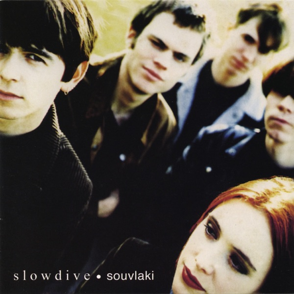

*High-Resolution Master Artwork Archive:* [Souvlaki Cover Art](https://is1-ssl.mzstatic.com/image/thumb/Music125/v4/c2/a0/a4/c2a0a495-ec33-27f1-c6db-0dff1c3ba15d/dj.pzrqoswp.jpg/600x600bb.jpg)

### Curatorial Justification (Why It's on This List)
Recorded in the wake of the romantic breakup between co-vocalists Neil Halstead and Rachel Goswell, 'Souvlaki' is the emotional and sonic zenith of British shoegaze. Featuring ambient synthesizer treatments and co-production on two tracks by Brian Eno, the album abandoned noisy dissonance in favor of glacial, oceanic melodies, melancholic dub pulses, and cavernous guitar delays. It remains one of the most immersive, emotionally resonant records ever captured on tape.

### Front-to-Back Architecture (Narrative & Pacing)
The sequencing unfolds like a cinematic dream. 'Alison' and 'Machine Gun' establish the floating, dual-vocal reverie, leading into the Eno collaborations 'Sing' and 'Here She Comes'. The album reaches its emotional apex on 'When the Sun Hits', where gentle acoustic plucking suddenly erupts into a tidal wave of distorted chorus, before settling into the desolate, ambient folk finale 'Dagger'.

### Audiophile & Production Breakdown
A masterclass in three-dimensional ambient soundstaging. Halstead and Christian Savill utilized Roland Space Echoes, Yamaha FX500 processors, and vintage Fender Twin Reverbs to create shimmering walls of sound that extend beyond the physical boundaries of the speakers. Rachel Goswell's voice sits like a ghost in the upper registers, surrounded by glistening digital and tape echoes that decay into total silence.

### Benchmark Demo Track: **"Alison"**
Evaluates soundstage depth and treble smoothness. The opening snare hit echoes across a wide stereo room, followed by layered guitars that shimmer without high-frequency harshness. On resolving setups, Halstead and Goswell's voices occupy distinct front/back planes.

### Tonal Anchor Bridge (Library Connection)
Directly expands the lush, atmospheric guitar textures found on Cannons' 'Fever Dream' and The Sundays' 'Static & Silence'.

---

## 21. Men I Trust – *Oncle Jazz* (2019)

**Primary Label & Engineering:** `Self-released / Dragos Chiriac (Producer & Mixing Engineer)`

*High-Resolution Master Artwork Archive:* [Oncle Jazz Cover Art](https://is1-ssl.mzstatic.com/image/thumb/Music126/v4/50/c6/94/50c694d6-36cd-8808-5da3-d677b7726b6c/artwork.jpg/600x600bb.jpg)

### Curatorial Justification (Why It's on This List)
Self-recorded and mixed in a rural cabin in Quebec, 'Oncle Jazz' is a twenty-four-track masterwork of cozy, DIY bedroom jazz-pop. Frontwoman Emma Proulx's whisper-soft vocals, Jessy Caron's melodic basslines, and Dragos Chiriac's warm analog synthesizers create a soothing, continuous sonic sanctuary. The album proves that intimate, independent production, when executed with audiophile care, can deliver unmatched warmth and musical comfort.

### Front-to-Back Architecture (Narrative & Pacing)
Designed as a continuous listening journey, the album intersperses ambient vignettes, quiet piano interludes, and radio hum between irresistible dream-pop anthems ('Norton Commander', 'Tailwhip', 'Show Me How'). The sequencing maintains a steady, relaxed pulse that mimics the passing of seasons, making it one of the most replayable front-to-back records of modern times.

### Audiophile & Production Breakdown
Recorded with vintage analog synthesizers, clean DI bass guitars, and tape saturation plug-ins, 'Oncle Jazz' possesses a distinct, velvety tonal signature. The high frequencies are smoothly rolled off, eliminating all fatigue, while the bass guitar is round, articulate, and centered with exceptional low-end clarity. Emma Proulx's whisper-track vocals are double-tracked in tight stereo proximity.

### Benchmark Demo Track: **"Norton Commander"**
Test for round electric bass articulation and vocal proximity. The bassline drives the track with warm, plump low-end notes, while the dry rimshot provides a gentle rhythmic pulse. Proulx's whispered voice sits right against the ear.

### Tonal Anchor Bridge (Library Connection)
Directly complements the breezy, laid-back guitar romance of Faye Webster's 'I Know I'm Funny haha' and Cannons' 'Fever Dream'.

---

## 22. Beach House – *Bloom* (2012)

**Primary Label & Engineering:** `Sub Pop / Chris Coady (Producer & Engineer), Sonic Ranch (Texas)`

*High-Resolution Master Artwork Archive:* [Bloom Cover Art](https://is1-ssl.mzstatic.com/image/thumb/Music115/v4/8b/b7/08/8bb7086b-cdb5-1ffe-926b-e7637bda6a0d/BeachHouse_Bloom_iTunes.jpg/600x600bb.jpg)

### Curatorial Justification (Why It's on This List)
Recorded at the legendary Sonic Ranch in the Texas borderlands, 'Bloom' represents the architectural peak of Beach House's dream-pop vision. Victoria Legrand's majestic, androgynous alto and pulsing organ chords interlock with Alex Scally's ringing slide guitar arpeggios to create songs that feel monumental yet desperately vulnerable. It is an album that demands undivided attention, pulling the listener into an unbroken, velvet-draped cathedral of sound.

### Front-to-Back Architecture (Narrative & Pacing)
From the triumphant, opening drum pulse of 'Myth' to the soaring arpeggios of 'Wild' and 'Lazuli', Side A establishes a state of emotional grandeur. Side B plunges into darker, introspective waters with 'Other People' and the thunderous, slow-burning epic 'Irene', which finishes with an extended ambient fade that feels like watching a star collapse.

### Audiophile & Production Breakdown
Producer Chris Coady utilized an SSL 9000J console and tape tracking to capture the band's massive, resonant sound. Scally's slide guitar was recorded through vintage Fender spring reverbs, creating long, singing sustain trails that hover in the stereo margins. Legrand's vocals were tracked through vintage Neumann tube mics, possessing incredible body and chest resonance that anchor the shimmering instrumental clouds.

### Benchmark Demo Track: **"Myth"**
A test for soundstage width and dynamic crescendo. When the full rhythm section enters after the chiming bell intro, the stereo image expands dramatically. High-resolving systems will articulate the mechanical decay of the bells against the surging live drum kit.

### Tonal Anchor Bridge (Library Connection)
Expands upon the soaring, emotional dream-pop grandeur found in Lorde's 'Melodrama' and Cannons' 'Fever Dream'.

---

## 23. Adrianne Lenker – *songs* (2020)

**Primary Label & Engineering:** `4AD / Philip Weinrobe (Engineer & Mixer)`

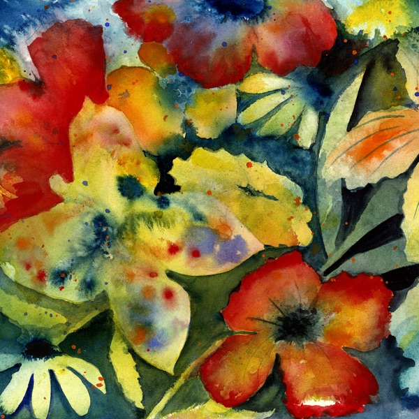

*High-Resolution Master Artwork Archive:* [songs Cover Art](https://is1-ssl.mzstatic.com/image/thumb/Music125/v4/70/f0/a6/70f0a6a5-cd71-9da2-174b-41927d331cdd/cover.jpg/600x600bb.jpg)

### Curatorial Justification (Why It's on This List)
Recorded in the initial months of the pandemic in a one-room wooden cabin in western Massachusetts, 'songs' is one of the most astonishingly intimate acoustic recordings of the 21st century. Following a painful breakup, Big Thief's frontwoman tracked the album completely analog to a 1/2-inch Otari 8-track tape machine with engineer Philip Weinrobe. The result is pure, unvarnished human proximity: rain falling on the roof, the creak of wooden floorboards, and Lenker's voice quivering mere inches from your ear.

### Front-to-Back Architecture (Narrative & Pacing)
The album flows like a diary entry read aloud by candlelight. 'two reverse' and 'ingrid' open with delicate, interlocking acoustic chords, building toward the emotional devastation of 'anything' ('I don't wanna talk about anyone / I wanna kiss your eyes'). The album sustains this quiet, sacred communion through to the gentle, fingerpicked lullaby 'my angel'.

### Audiophile & Production Breakdown
An absolute reference standard for binaural room acoustics and ribbon microphone tracking. Weinrobe used minimal microphone pairs with zero digital conversion in the signal chain. Every scrape of Lenker's fingernails across the wound acoustic guitar strings, every intake of breath, and the natural acoustic decay of the wooden cabin are preserved with staggering realism.

### Benchmark Demo Track: **"anything"**
The definitive benchmark for acoustic guitar timbre and vocal realism. On planar headphones, close your eyes and you will swear Lenker is seated two feet in front of you. Listen for the subtle acoustic reflection of the cabin walls and the warmth of the tape saturation.

### Tonal Anchor Bridge (Library Connection)
Directly expands the raw, unplugged confessional intimacy of Nirvana's 'MTV Unplugged in New York' and Norah Jones' 'Come Away With Me'.

---

## 24. Crumb – *Jinx* (2019)

**Primary Label & Engineering:** `Self-released / Gabe Wax (Producer & Mixing Engineer)`

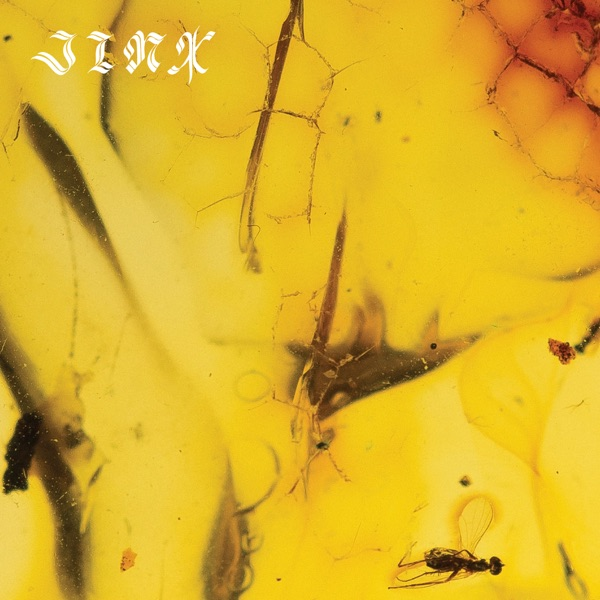

*High-Resolution Master Artwork Archive:* [Jinx Cover Art](https://is1-ssl.mzstatic.com/image/thumb/Music114/v4/83/13/f1/8313f143-ba0e-ee4c-eb85-5c259b1ec5e3/656605343648.jpg/600x600bb.jpg)

### Curatorial Justification (Why It's on This List)
Brooklyn quartet Crumb synthesized 1960s psychedelic rock, indie dream-pop, and modal jazz on their mesmerizing debut 'Jinx'. Frontwoman Lila Ramani's detached, hypnotic vocals and jazzy guitar chords drift through disorienting time signatures, synthesizer swells, and Jesse Brotter's elastic basslines. Clocking in at a razor-sharp 27 minutes, the album is a tightly wound, hallucinatory dream that never overstays its welcome.

### Front-to-Back Architecture (Narrative & Pacing)
Opening with the woozy, slow-motion groove of 'Crack Couple', the album transitions seamlessly into the shimmering jangle of 'Ghostride'. Track boundaries dissolve effortlessly as the band moves through the menacing synths of 'Fall Down' and the jazz-inflected 'Nina', culminating in the haunting, reverb-drenched outro 'Better'.

### Audiophile & Production Breakdown
Produced by Gabe Wax (The War on Drugs, Deerhunter), 'Jinx' balances dry, vintage 70s drum isolation with wet, expansive psychedelic reverbs. The snare and kick have crisp, immediate transient snap, while the synthesizers and guitars swirl in an intricate stereo dance around Ramani's centered, dry vocal.

### Benchmark Demo Track: **"Ghostride"**
Test for rhythmic pocket and spatial modulation. The drum pattern features a wonderfully dry, wooden cross-stick against a warm, plump bassline. Notice how the chorus-drenched guitar warbles gently across the stereo field.

### Tonal Anchor Bridge (Library Connection)
Connects the jazzy, unhurried bedroom-pop charm of Faye Webster's 'I Know I'm Funny haha' with the ethereal dreaminess of The Sundays.

---

## 25. Broadcast – *Tender Buttons* (2005)

**Primary Label & Engineering:** `Warp Records / Trish Keenan & James Cargill`

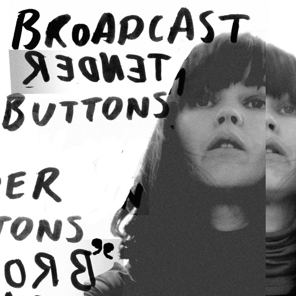

*High-Resolution Master Artwork Archive:* [Tender Buttons Cover Art](https://is1-ssl.mzstatic.com/image/thumb/Music/51/f4/91/mzi.gcqyntqr.jpg/600x600bb.jpg)

### Curatorial Justification (Why It's on This List)
Following the departure of three band members, Birmingham duo Trish Keenan and James Cargill stripped Broadcast down to bare essentials on 'Tender Buttons'. Armed with an autoharp, cheap analog drum machines, a vintage telecaster, and home tape recorders, they created a haunting masterpiece of hauntological pop. Keenan's cool, detached 1960s BBC-broadcaster phrasing floats over minimalist post-punk rhythms and warbling analog tape flutter, crafting an uncanny, deeply poignant listening experience.

### Front-to-Back Architecture (Narrative & Pacing)
The album moves with hypnotic, ticking precision across fourteen compact tracks. From the stuttering rhythm of 'I Found the F' into the chiming, driving pop of 'Black Cat' and the eerie acoustic meditation of 'Tears in the Typing Pool', the record constructs a mesmerizing domestic labyrinth that rewards repeated, uninterrupted listens.

### Audiophile & Production Breakdown
An extraordinary study in analog texture, tape flutter, and micro-minimalism. Cargill deliberately recorded instruments to cassette and 4-track tape machines, embracing wow and flutter as melodic instruments. Keenan's voice was tracked with remarkable dryness, cutting through the lo-fi electronics with crystalline, bell-like clarity in the 2kHz-5kHz presence region.

### Benchmark Demo Track: **"I Found the F"**
Test for micro-dynamic transient decay and tape saturation. The analog drum machine clicks with razor-sharp transient precision, while the electric guitar emits warm, buzzing harmonic distortion that tests system resolution.

### Tonal Anchor Bridge (Library Connection)
Combines the intimate, ASMR-like close-mic vocal delivery of Billie Eilish with the mysterious analog retro-futurism of The Cranberries.

---

## 26. Real Estate – *Days* (2011)

**Primary Label & Engineering:** `Domino / Kevin McMahon (Producer & Engineer), Marcata Recording`

*High-Resolution Master Artwork Archive:* [Days Cover Art](https://is1-ssl.mzstatic.com/image/thumb/Music/aa/b6/f2/mzi.loqltsis.jpg/600x600bb.jpg)

### Curatorial Justification (Why It's on This List)
The definitive modern testament to suburban nostalgia and Fender clean tone, 'Days' is an uninterrupted masterclass in jangle pop. Recorded in a rural barn in upstate New York with Kevin McMahon, the album captures the bittersweet transition from youth into adulthood through Martin Courtney's warm baritone and Matt Mondanile's sparkling lead guitar lines. It is an unhurried, pastoral suite that glows with late-afternoon autumn sunlight.

### Front-to-Back Architecture (Narrative & Pacing)
The record's ten songs are paced with effortless grace. Opening with the gentle acoustic sweep of 'Easy', it transitions into the soaring, triumphant jangle of 'It's Real' and the hypnotic, seven-minute motorik glide of 'Green Aisles'. The album resolves on the bittersweet acoustic twilight of 'All the Same', completing an idyllic, nostalgic arc.

### Audiophile & Production Breakdown
Recorded with classic American tube amplifiers (Fender Twin Reverb, Deluxe Reverb) and ribbon microphones, 'Days' possesses one of the most pristine clean guitar tones ever captured. The stereo soundstage is wide and uncluttered: rhythm acoustic guitars are panned hard left, shimmering electric lead guitars chime in the right, while Courtney's voice sits comfortably in the center with warm, natural room reflections.

### Benchmark Demo Track: **"It's Real"**
A benchmark for clean guitar chime and vocal harmony separation. Notice the crystalline upper-midrange ring of the Fender Stratocaster and the sweet, uncompressed bloom of the cymbal crashes across the high frequencies.

### Tonal Anchor Bridge (Library Connection)
The modern American successor to The Sundays' 'Reading, Writing and Arithmetic' and Sixpence None the Richer's self-titled classic.

---

## 27. Wild Nothing – *Gemini* (2010)

**Primary Label & Engineering:** `Captured Tracks / Jack Tatum (Self-Recorded & Produced)`

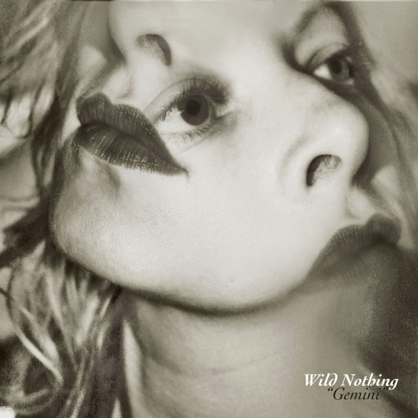

*High-Resolution Master Artwork Archive:* [Gemini Cover Art](https://is1-ssl.mzstatic.com/image/thumb/Music211/v4/08/03/a9/0803a98c-7a36-55c0-bbed-764e6aca5ce2/cover.jpg/600x600bb.jpg)

### Curatorial Justification (Why It's on This List)
Conceived and tracked entirely by Jack Tatum in his college bedroom in Blacksburg, Virginia, 'Gemini' launched the 2010s bedroom dream-pop renaissance. Channeling the melodic genius of The Cure, New Order, and The Smiths, Tatum layered chorus-soaked guitars, vintage synthesizer lines, and buoyant drum machine beats into an intoxicating tribute to youthful romance and melancholia. It remains a triumph of melodic economy and emotional resonance.

### Front-to-Back Architecture (Narrative & Pacing)
Opening with the nostalgic, synth-drenched chime of 'Live in Dreams', the album surges through the irresistible post-punk bassline of 'Summer Holiday' and the timeless jangle of 'Chinatown'. The pacing balances driving dance-pop tempos with dreamy acoustic reveries like 'The Witching Hour', maintaining an infectious, romantic momentum from start to finish.

### Audiophile & Production Breakdown
While recorded with DIY gear, Tatum exhibited an extraordinary instinct for frequency balance and stereo width. Guitars are treated with analog chorus and delay pedals that wrap around the stereo spectrum, while the bass guitar carries punchy, melodic authority. Tatum's vocals are enveloped in lush plate reverbs that place him in a dreamy, suspended pocket behind the sparkling guitar chime.

### Benchmark Demo Track: **"Chinatown"**
Test for chorus modulation and melodic bassline tracking. Listen for the warm, rounded thud of the bass carrying the melody while the 12-string guitar arpeggios shimmer across the upper frequencies without trace of harsh sibilance.

### Tonal Anchor Bridge (Library Connection)
Directly connects the shimmering 80s dream-pop hooks of Paramore's 'After Laughter' and Cannons' 'Fever Dream' with The Sundays.

---

## 28. Camera Obscura – *Let's Get Out of This Country* (2006)

**Primary Label & Engineering:** `Merge / Elefant / Jari Haapalainen (Producer), Atlantis Studios (Stockholm)`

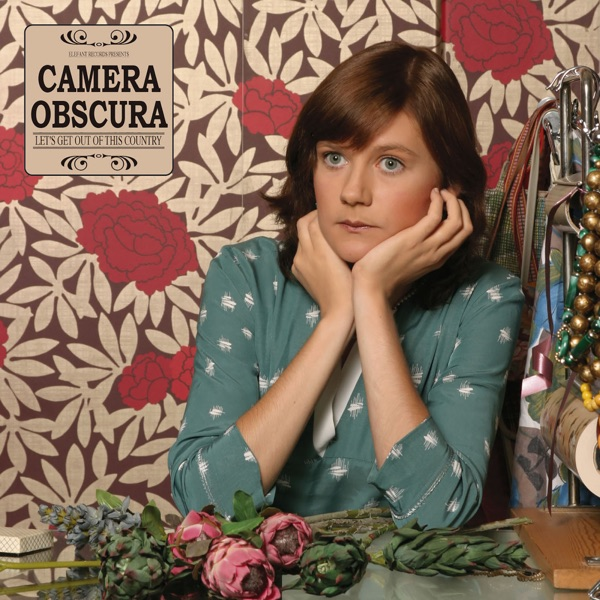

*High-Resolution Master Artwork Archive:* [Let's Get Out of This Country Cover Art](https://is1-ssl.mzstatic.com/image/thumb/Music126/v4/2e/ac/aa/2eacaa44-dc46-f925-45b7-5b5dc05427ed/dj.xksrngqp.jpg/600x600bb.jpg)

### Curatorial Justification (Why It's on This List)
Recorded in Stockholm with Swedish producer Jari Haapalainen, Glasgow's Camera Obscura took a quantum leap on 'Let's Get Out of This Country'. Fusing 1960s Motown girl-group grandeur, country-soul pedal steel, and sparkling Scottish indie-pop, frontwoman Tracyanne Campbell's bittersweet, deadpan delivery anchors an album of soaring orchestral melodrama. It stands as a timeless masterpiece of baroque jangle and romantic longing.

### Front-to-Back Architecture (Narrative & Pacing)
The album opens with the exuberant, chiming fanfare of 'Lloyd, I'm Ready to Be Heartbroken' (an affectionate answer song to Lloyd Cole), flowing into the soulful northern-soul pulse of 'Tears for Animals'. The record weaves effortlessly between sweeping orchestral ballads ('Dory Previn', 'Country Mile') and shimmering jangle-pop, concluding on the lush, reflective title track.

### Audiophile & Production Breakdown
Recorded at the historic Atlantis Studios in Stockholm (where ABBA recorded many of their classic hits), the album benefits from a magnificent wooden live room. The acoustic drums have immense natural decay and air; the strings and brass section swell with vintage tube warmth. Tracyanne Campbell's vocals are captured with breathtaking intimacy, centered in front of a wide, opulent stereo orchestra.

### Benchmark Demo Track: **"Lloyd, I'm Ready to Be Heartbroken"**
A tour de force of orchestral pop staging. The track builds from a solo chiming guitar into a thunderous wall of strings, glockenspiel, horns, and backing harmonies. Check for clear instrumental separation and uncompressed dynamic headroom during the chorus.

### Tonal Anchor Bridge (Library Connection)
Shares the witty, romantic lyrical brilliance and sparkling baroque melodies found in Chappell Roan's 'Midwest Princess' and The Sundays' 'Reading, Writing and Arithmetic'.

---

## 29. Japanese Breakfast – *Psychopomp* (2016)

**Primary Label & Engineering:** `Yellow K / Dead Oceans / Ned Braddock & Michelle Zauner`

*High-Resolution Master Artwork Archive:* [Psychopomp Cover Art](https://is1-ssl.mzstatic.com/image/thumb/Music125/v4/06/65/1a/06651aec-c055-3fd6-46fa-a125763e9f50/27251.jpg/600x600bb.jpg)

### Curatorial Justification (Why It's on This List)
Written and recorded in the immediate aftermath of her mother's death from cancer, Michelle Zauner's debut as Japanese Breakfast is a blistering, euphoric triumph over grief. Featuring her mother's photograph on the cover, 'Psychopomp' channels devastating loss through shimmering dream-pop synths, explosive lo-fi indie rock, and indelible pop melodies. At just twenty-five minutes, it is an intense, unbroken burst of emotional catharsis that proves pop music can be a vessel for profound mourning.

### Front-to-Back Architecture (Narrative & Pacing)
Opening with the soaring, shoegaze-pop anthem 'In Heaven' ('I can't get you off my mind / I can't get you off my mind'), the record moves with urgent emotional velocity into the exuberant, saxophone-driven burst of 'Everybody Wants to Love You'. The emotional core plunges into dark, howling shoegaze on 'Jane Cum' before resolving into the ambient, oceanic beauty of 'Triple 7'.

### Audiophile & Production Breakdown
Produced by Zauner and Ned Braddock, 'Psychopomp' balances raw, lo-fi emotional intimacy with expansive dream-pop reverbs. The live guitars cut with biting presence, while vintage synthesizer pads and saxophone solos float in a warm stereo embrace. Zauner's vocals shift effortlessly from delicate whispers to throat-shredding, unvarnished cries that push against dynamic boundaries.

### Benchmark Demo Track: **"In Heaven"**
Test for dynamic swing and vocal emotional transmission. Notice the sudden bloom of the synthesizers and bass when the drums kick in, and verify that your system reproduces Zauner's soaring upper register without harshness or digital clipping.

### Tonal Anchor Bridge (Library Connection)
Connects the raw emotional processing and glittering indie-pop songwriting of Olivia Rodrigo's 'SOUR' and Lorde's 'Melodrama'.

---

# Category III: Dynamic Rock, Texture & Kinetic Tension

> **Sonic Signature:** *Natural soundstage headroom, uncompressed room drums, sudden quiet-to-explosive transient attacks, analog tape saturation.*

## The Sound of Category III: The Kinetic Impact: Uncompressed Headroom, Room Drum Physics & Visceral Transient Attacks

> *"Defined by monumental dynamic swings—from whisper-quiet acoustic contemplation to earth-shattering electric climaxes—captured with zero digital brickwall limiting, raw room acoustics, and explosive power-tube saturation."*

### Acoustic Archetype & Engineering Philosophy
Carries forward the purist engineering ethos of Steve Albini (Electrical Audio) and Nigel Godrich. The golden rule is absolute respect for dynamic headroom and live acoustic interaction. Recorded directly to 2-inch tape using high-voltage discrete preamps and minimal outboard EQ. Drums are tracked in large, untreated or stone-walled live rooms using Blumlein ribbon pairs (Coles 4038) placed fifteen to twenty feet away to capture the full, natural air displacement of the kit. Tube guitar amplifiers (Vox AC30, Marshall JCM800, Fender Bassman) are driven hard into power-tube breakup, allowing the musician's picking velocity to dictate the harmonic transition between sparkling clean and roaring overdrive.

### Frequency Architecture & Spectral Balance
The dynamic crest factor is massive (often exceeding DR12 to DR15). The difference between the quietest acoustic passage and the full-band explosion can span 25 decibels. The low-end (40Hz–120Hz) features pure acoustic slam: bass drums are un-triggered and un-scooped, preserving the physical thump of the beater hitting the drumhead and the subsonic resonance of the shell. Bass guitars have aggressive midrange grit (700Hz–1.5kHz) that grinds against the guitars without muddying the sub-bass. The midrange (1kHz–5kHz) is raw, visceral, and unapologetic: Telecaster bridge pickups bite with metallic presence, and lead vocals preserve every throat catch, strained chest resonance, and dynamic scream without peak-limiting compression.

### Spatial Soundstaging & Holographic Imaging
Tall, deep, and ferociously authentic. Rather than layering dozens of overdubs across a flat plane, these records create a distinct sense of physical acoustic volume. You can sense the height of the studio ceiling and the distance between the drummer's cymbals and the room microphones. When explosive crescendos occur, the soundstage expands outward in all directions, as acoustic reflections bounce off the walls of the recording space in real time.

### The Tactile Listening Experience
Requires substantial amplifier headroom. A low-powered system will clip or distort during sudden dynamic transitions (such as the explosive drop in Jeff Buckley's 'Grace' or Sleater-Kinney's 'Jumpers'). On a properly calibrated audiophile system, the music feels physically alive: snare drum rimshots crack like pistol shots, bass guitar slides rattle the ribcage, and the room air crackles with dangerous, unbridled energy.

---

## 30. Radiohead – *In Rainbows* (2007)

**Primary Label & Engineering:** `XL Recordings / Nigel Godrich (Producer & Mixing Engineer)`

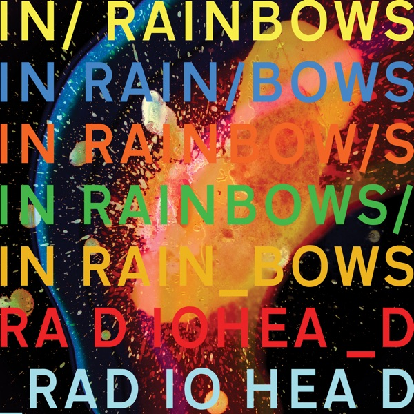

*High-Resolution Master Artwork Archive:* [In Rainbows Cover Art](https://is1-ssl.mzstatic.com/image/thumb/Music126/v4/dd/50/c7/dd50c790-99ac-d3d0-5ab8-e3891fb8fd52/634904032463.png/600x600bb.jpg)

### Curatorial Justification (Why It's on This List)
The crowning synthesis of Radiohead's career, 'In Rainbows' discarded the colder digital alienation of 'Kid A' in favor of warm, tactile band chemistry, interlocking polyrhythms, and breathtaking emotional vulnerability. Tracked at the dilapidated Halswell House in Somerset with producer Nigel Godrich, the record feels startlingly human. Thom Yorke's voice has never sounded more intimate or direct, floating over Jonny Greenwood's inventive string arrangements, Colin Greenwood's melodic basslines, and Phil Selway's clockwork drumming. It stands as an absolute high-water mark of 21st-century front-to-back record making.

### Front-to-Back Architecture (Narrative & Pacing)
The sequencing is flawless, alternating between kinetic polyrhythmic propulsion and heartbreaking stillness. '15 Step' explodes in 5/4 time with clapping children and skittering electronic drums, transitioning into the raw rock drive of 'Bodysnatchers'. The album settles into the hypnotic, interlocking guitar currents of 'Weird Fishes/Arpeggi' and the naked piano beauty of 'All I Need'. Side B reaches transcendent heights on 'Reckoner' before resolving into the ghostly, upright piano requiem 'Videotape'.

### Audiophile & Production Breakdown
Nigel Godrich's engineering on 'In Rainbows' is universally revered as an audiophile reference standard. Recorded primarily to 2-inch magnetic tape, the dynamic range is staggering. Selway's drum kit is tracked with incredible acoustic presence: the kick drum is tight, punchy, and unhyped, while the cymbals decay into black space without splash or glare. Yorke's vocals are captured dry in the center channel, revealing every subtle micro-inflection, breath, and falsetto break.

### Benchmark Demo Track: **"Reckoner"**
The gold standard for high-frequency purity and spatial depth. The track begins with Phil Selway's cymbals, ride, and shakers panned wide across the stereo spectrum. Notice the crisp transient definition and silky smooth decay of the metalwork. When the orchestral strings and Thom Yorke's soaring falsetto enter at 1:45, resolving systems maintain complete clarity across all layers.

### Tonal Anchor Bridge (Library Connection)
Directly expands the organic warmth, acoustic intimacy, and vocal vulnerability of Nirvana's 'MTV Unplugged in New York' and Mac Miller's 'Circles'.

---

## 31. The Cure – *Disintegration* (1989)

**Primary Label & Engineering:** `Fiction / Elektra / Robert Smith & Dave Allen (Producers), Outside Studios`

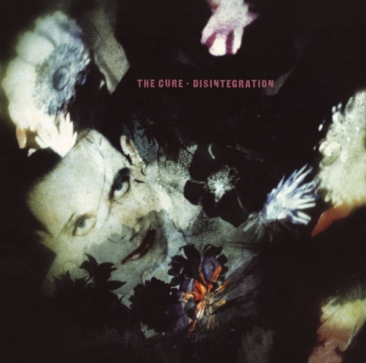

*High-Resolution Master Artwork Archive:* [Disintegration Cover Art](https://is1-ssl.mzstatic.com/image/thumb/Music/93/3c/2c/mzi.ujtdsknz.jpg/600x600bb.jpg)

### Curatorial Justification (Why It's on This List)
Approaching his thirtieth birthday in a haze of depression and romantic turmoil, Robert Smith crafted 'Disintegration' as the apocalyptic monument of gothic alternative rock. Rejecting the bright pop of 'Kiss Me, Kiss Me, Kiss Me', Smith insisted the album carry the famous sleeve note: 'This music has been mixed to be played loud, so turn it up.' Spanning seventy-two minutes of glacial, monumental basslines, shimmering 6-string Bass VI guitars, and sweeping string synthesizers, it is an emotionally overwhelming front-to-back journey into love, mortality, and regret.

### Front-to-Back Architecture (Narrative & Pacing)
The pacing is majestic and deliberate. The sound of shattered glass gives way to the magnificent instrumental fanfare of 'Plainsong', which builds for over two minutes before Smith utters a single word. Songs unfold across extended runtimes ('Pictures of You', 'Prayers for Rain', 'The Same Deep Water as You'), creating an enveloping emotional trance that reaches visceral fury on the title track before concluding on the devastated, rainy whisper of 'Untitled'.

### Audiophile & Production Breakdown
Mixed by Dave Allen and Robert Smith, 'Disintegration' possesses one of the widest, most cavernous soundstages ever recorded. Simon Gallup's basslines, often doubled on a Fender Bass VI, anchor the bottom end with monumental low-mid weight and melodic clarity. Boris Williams's drum tracking is legendary: every snare hit carries explosive dynamic force and decays through rich, ambient plate reverbs that paint an immense sonic cathedral.

### Benchmark Demo Track: **"Pictures of You"**
The ultimate test for soundstage width, low-frequency control, and treble headroom. The chiming, chorus-drenched guitars stretch from wall to wall. On high-resolving speakers or planar headphones, Gallup's bassline should sound deep, articulate, and completely free of muddy cabinet resonance.

### Tonal Anchor Bridge (Library Connection)
The epic, melancholic sonic foundation that echoes through The Cranberries' 'No Need to Argue', Cannons' 'Fever Dream', and Lorde's 'Melodrama'.

---

## 32. Jeff Buckley – *Grace* (1994)

**Primary Label & Engineering:** `Columbia Records / Andy Wallace (Producer & Mixing Engineer), Bearsville Studios`

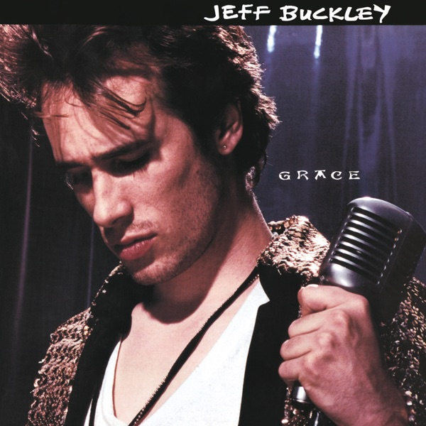

*High-Resolution Master Artwork Archive:* [Grace Cover Art](https://is1-ssl.mzstatic.com/image/thumb/Music115/v4/26/d6/e3/26d6e339-a7a9-d61e-1b5f-0852a5515a55/886445517880.jpg/600x600bb.jpg)

### Curatorial Justification (Why It's on This List)
Jeff Buckley's sole completed studio album remains an unrepeatable miracle of vocal transcendence and dynamic rock tension. Guided by legendary producer/mixer Andy Wallace (Nirvana's 'Nevermind'), 'Grace' fused Led Zeppelin thunder, Nusrat Fateh Ali Khan qawwali vocal devotion, French art song, and NYC coffeehouse folk. Buckley's multi-octave voice moves from a hushed, cracked whisper to a glass-shattering operatic wail with terrifying ease, backed by shimmering Fender Telecaster chords and muscular rhythm tracking.

### Front-to-Back Architecture (Narrative & Pacing)
The album begins with the eerie, harmonium-drenched awakening of 'Mojo Pin' before detonating into the soaring rock sweep of 'Grace'. The sequencing expertly balances explosive dynamic rock anthems ('Last Goodbye', 'Eternal Life') with devastatingly intimate ballads ('Lilac Wine', 'Hallelujah'). The narrative achieves closure on 'Dream Brother', where Middle Eastern guitar scales and surging drums resolve in a haunting sonic fade.

### Audiophile & Production Breakdown
Produced and mixed by Andy Wallace at Bearsville Studios, 'Grace' is an audiophile masterclass in dynamic range. Buckley's voice was tracked using a Neumann U67 tube mic, capturing both the quietest lip movements and the full roar of his chest voice without clipping. Wallace's drum mix is crisp, punchy, and perfectly centered, while Buckley's clean Fender Twin Reverb vibrato guitar floats with crystalline upper-midrange sparkle.

### Benchmark Demo Track: **"Grace"**
Test for explosive dynamic range and vocal head-voice control. When Buckley hits his soaring high G at 4:15, resolving gear will render the full harmonic overtones of his voice without compression grain, while the rhythm section hits with ferocious, controlled impact.

### Tonal Anchor Bridge (Library Connection)
Bridges the raw acoustic passion of Nirvana's 'MTV Unplugged in New York' with the vocal power and emotional grandeur of Adele's '21'.

---

## 33. Elliott Smith – *Either/Or* (1997)

**Primary Label & Engineering:** `Kill Rock Stars / Elliott Smith, Tom Rothrock, Rob Schnapf`

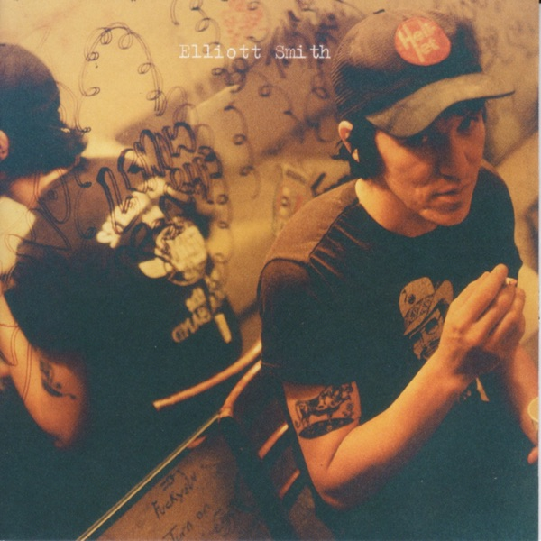

*High-Resolution Master Artwork Archive:* [Either/Or Cover Art](https://is1-ssl.mzstatic.com/image/thumb/Music124/v4/ff/ea/28/ffea28a4-988a-f02e-7e1a-8566db3cab02/mzi.uoqucyoy.jpg/600x600bb.jpg)

### Curatorial Justification (Why It's on This List)
Named after Søren Kierkegaard's existential treatise, 'Either/Or' is Elliott Smith's masterpiece of confessional songwriting and analog micro-detail. Recorded in houses and small basements in Portland on an 8-track tape machine, Smith performed nearly every instrument himself—acoustic guitars, punchy drums, warm bass, and whisper-track vocal harmonies. His songwriting possesses the harmonic sophistication of The Beatles, paired with an unflinching, compassionate depiction of addiction, alienation, and gentle resilience.

### Front-to-Back Architecture (Narrative & Pacing)
The album moves seamlessly between whispered acoustic folk and driving indie pop. 'Speed Trials' sets the tone with its muffled, hypnotic drum pulse, leading into the bittersweet guitar perfection of 'Ballad of Big Nothing'. The emotional center arrives on 'Between the Bars' and the dizzying fingerpicked virtuosity of 'Angeles', before resolving on the triumphant, full-band coda 'Say Yes'.

### Audiophile & Production Breakdown
An extraordinary study in acoustic proximity and double-tracked vocal layering. Smith recorded his acoustic guitar with a pair of small-diaphragm condenser mics placed mere inches from the soundhole, capturing the warm wood resonance and the percussive attack of his fingers. His signature vocal technique—two separate whispered lead vocal takes panned slightly off-center—creates an intimate, binaural presence inside the listener's head.

### Benchmark Demo Track: **"Between the Bars"**
The ultimate test for vocal intimacy and room quietude. Listen for the intake of breath before each line, the gentle scrape of fingers shifting across acoustic guitar frets, and the warm, rounded bloom of the lower guitar notes. Resolving gear makes the performance feel unsettlingly close.

### Tonal Anchor Bridge (Library Connection)
The primary artistic blueprint for the quiet vocal intimacy and acoustic warmth found in Billie Eilish's 'HIT ME HARD AND SOFT' and Mac Miller's 'Circles'.

---

## 34. PJ Harvey – *Stories from the City, Stories from the Sea* (2000)

**Primary Label & Engineering:** `Island Records / Rob Ellis, Mick Harvey, PJ Harvey`

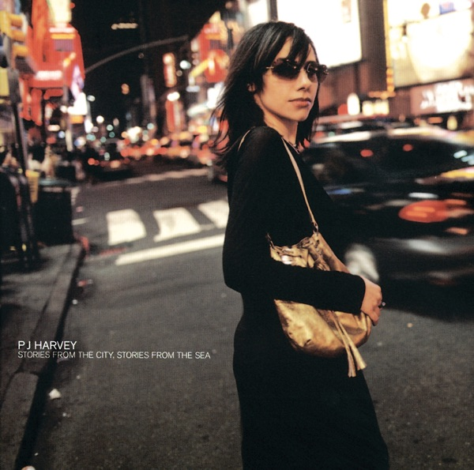

*High-Resolution Master Artwork Archive:* [Stories from the City, Stories from the Sea Cover Art](https://is1-ssl.mzstatic.com/image/thumb/Music118/v4/4d/70/53/4d70536e-f463-3bfe-45e9-4274ce8bb33a/00731454814423.rgb.jpg/600x600bb.jpg)

### Curatorial Justification (Why It's on This List)
Winner of the Mercury Music Prize, 'Stories from the City...' captured PJ Harvey falling in love with New York City at the turn of the millennium. Shifting away from the primal blues-punk distortion of 'Rid of Me', Harvey embraced crystalline melodic hooks, driving guitars, and sweeping urban grandeur. Featuring a show-stopping duet with Thom Yorke on 'This Mess We're In', the album is an exhilarating, impeccably crafted front-to-back rock masterpiece of vitality, desire, and city lights.

### Front-to-Back Architecture (Narrative & Pacing)
From the driving, celebratory rush of 'Big Exit' and the soaring, irresistible pop chorus of 'Good Fortune', the record maintains an electric momentum. The narrative pivots on 'A Place Called Home' and 'One Line', where lush acoustic guitars and organs expand the soundstage, before culminating in the bittersweet, dusk-lit emotional resolution of 'We Float'.

### Audiophile & Production Breakdown
Engineered with immaculate dynamic headroom and stereo separation. The rhythm section of Rob Ellis (drums) and Mick Harvey (bass/organ) delivers a tight, muscular foundation: the kick drum thuds with authority without muddying the mix. Harvey's vocals are tracked with sparkling high-end clarity, sitting directly on top of the guitars with razor-sharp presence.

### Benchmark Demo Track: **"Good Fortune"**
Test for rhythmic drive and midrange clarity. The energetic bassline and driving drum beat provide an articulate foundation. Notice how Harvey's voice cuts through the layered electric guitars with crisp sibilance control and joyous dynamic lift.

### Tonal Anchor Bridge (Library Connection)
Shares the infectious alternative rock swagger, dynamic vocal punch, and melodic songwriting celebrated in No Doubt's 'Tragic Kingdom' and Olivia Rodrigo's 'SOUR'.

---

## 35. Sonic Youth – *Daydream Nation* (1988)

**Primary Label & Engineering:** `Enigma / Blast First / Nick Sansano (Engineer), Greene St. Recording (NYC)`

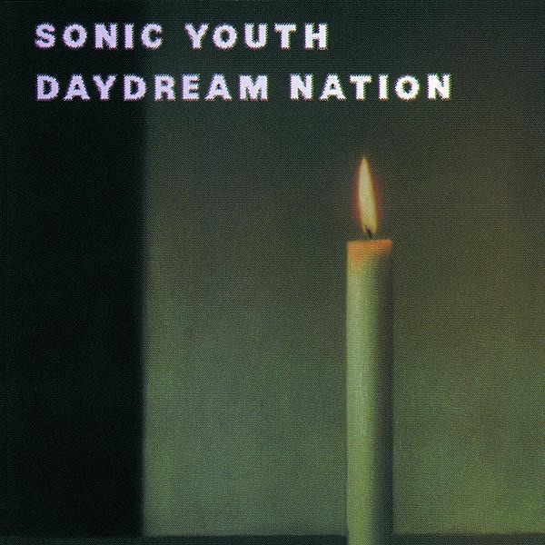

*High-Resolution Master Artwork Archive:* [Daydream Nation Cover Art](https://is1-ssl.mzstatic.com/image/thumb/Music124/v4/9a/55/3b/9a553bab-12a5-a385-31b7-720087fa3130/818756010958_cover.jpg/600x600bb.jpg)

### Curatorial Justification (Why It's on This List)
Preserved in the Library of Congress National Recording Registry, 'Daydream Nation' is the defining double-album masterpiece of alternative rock. Sonic Youth synthesized avant-garde dissonance, alternate guitar tunings, and pop melody into an epic seventy-minute urban vision. Tracked at Greene Street Recording in Manhattan with hip-hop engineer Nick Sansano, the record delivers an unmatched balance of ferocious sonic assault and pristine instrumental separation that laid the direct groundwork for the 90s grunge explosion.

### Front-to-Back Architecture (Narrative & Pacing)
The album opens with the iconic acoustic intro and soaring motorik surge of 'Teen Age Riot', establishing an anthem for a disaffected generation. It moves through ferocious post-punk thrash ('Silver Rocket'), hypnotic groove ('The Sprawl'), and art-rock dissonance ('Cross the Breeze'), culminating in the colossal three-part closing trilogy 'Eliminator Jr.'.

### Audiophile & Production Breakdown
Sansano's background in hip-hop engineering gave 'Daydream Nation' a tight, punchy low-end and razor-sharp transient response uncommon in 80s indie rock. Thurston Moore and Lee Ranaldo's modified Fender guitars—strung with non-standard gauges and prepared with drumsticks— emit complex overtone harmonics that spread wide across the stereo spectrum without collapsing into a wall of white noise.

### Benchmark Demo Track: **"Teen Age Riot"**
A benchmark for guitar harmonic overtones and sudden dynamic transition. From Kim Gordon's whispered, hypnotic intro to the explosion of chiming alternate-tuned guitars at 1:40, resolving audio gear will separate the ringing guitar overtones with crystalline precision.

### Tonal Anchor Bridge (Library Connection)
The direct aesthetic and dynamic ancestor that paved the way for Nirvana's 'Nevermind' and 'MTV Unplugged in New York'.

---

## 36. Television – *Marquee Moon* (1977)

**Primary Label & Engineering:** `Elektra Records / Andy Johns (Producer & Engineer), A&R Studios (NYC)`

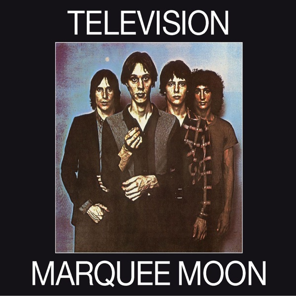

*High-Resolution Master Artwork Archive:* [Marquee Moon Cover Art](https://is1-ssl.mzstatic.com/image/thumb/Music125/v4/1b/6a/c1/1b6ac100-8d0e-ec9d-4639-88b11ed2cdad/603497886029.jpg/600x600bb.jpg)

### Curatorial Justification (Why It's on This List)
While their CBGB peers (Ramones, Talking Heads) pursued speed or art-funk, Television crafted 'Marquee Moon' as a cathedral of clean electric guitar counterpoint. Tom Verlaine and Richard Lloyd's interlocking Fender Telecaster and Stratocaster lines move with the geometric precision of John Coltrane's modal jazz and Béla Bartók's string quartets. Uncompressed, melodic, and completely devoid of blues cliches, it is one of the greatest rock recordings ever committed to tape.

### Front-to-Back Architecture (Narrative & Pacing)
The eight-track record is paced with absolute architectural perfection. 'See No Evil' opens with crisp, ringing rock-and-roll authority, leading into the noir poetry of 'Venus' and 'Friction'. The ten-minute title track stands as the album's towering centerpiece—an unbroken, evolving guitar conversation that builds to a blinding instrumental climax before resolving in the delicate, twilight beauty of 'Torn Curtain'.

### Audiophile & Production Breakdown
Engineered by the legendary Andy Johns (Led Zeppelin, Rolling Stones), 'Marquee Moon' is an audiophile holy grail for clean guitar transients. Recorded live off the floor without distortion pedals, Johns placed Neumann U67s on the Fender tube amplifiers, capturing the pure, unadulterated chime of single-coil pickups. Billy Ficca's jazz-trained drumming possesses astonishing dynamic touch.

### Benchmark Demo Track: **"Marquee Moon"**
The ultimate test for guitar tone timbre and transient attack. Verlaine's guitar is panned left while Lloyd is panned right. On high-resolving equipment, you can pinpoint the exact fretboard attack of each pick stroke, culminating in the solo at 7:00 where Verlaine's notes sustain with pure harmonic clarity.

### Tonal Anchor Bridge (Library Connection)
The crystalline guitar counterpoint that directly inspired the clean jangle of The Sundays and the intricate riffs of The Shins.

---

## 37. Pavement – *Crooked Rain, Crooked Rain* (1994)

**Primary Label & Engineering:** `Matador / Stephen Malkmus & Bryce Goggin, Louder Than You Think Studios`

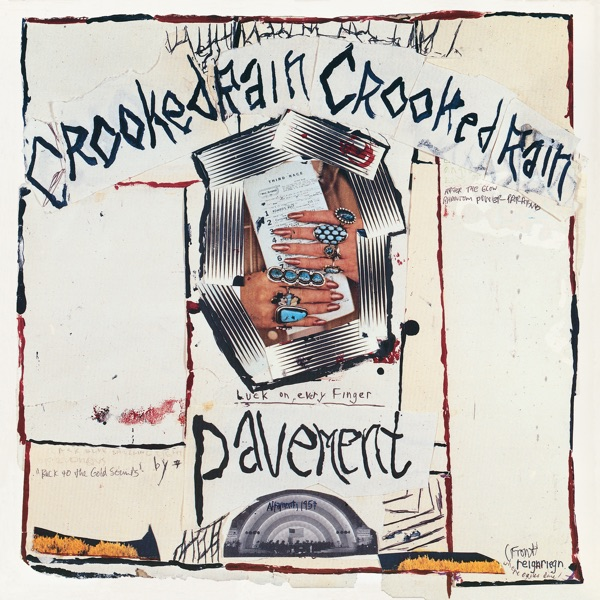

*High-Resolution Master Artwork Archive:* [Crooked Rain, Crooked Rain Cover Art](https://is1-ssl.mzstatic.com/image/thumb/Music221/v4/c7/fe/0a/c7fe0a2c-16fa-9de9-3f64-330454c3d84f/744861061069.png/600x600bb.jpg)

### Curatorial Justification (Why It's on This List)
Leaving behind the lo-fi hiss of 'Slanted and Enchanted', Pavement decamped to a professional 24-track studio to create 'Crooked Rain, Crooked Rain'—a sun-drenched, witty deconstruction of 1970s classic rock and 90s slacker culture. Stephen Malkmus's wry, poetic lyrics and serpentine guitar solos glide over Steve West's loose, unquantized pocket, crafting an effortless masterpiece that balances irony with profound melodic heart.

### Front-to-Back Architecture (Narrative & Pacing)
Opening with the jaunty piano shuffle of 'Silence Kid', the album flows through the golden-hour perfection of 'Gold Soundz' (named by Pitchfork as the greatest song of the 1990s) and the country-rock satire of 'Range Life'. The album weaves through the jazz-rock instrumental '5-4=Unity' before closing with the bittersweet, epic distortion of 'Fillmore Jive'.

### Audiophile & Production Breakdown
Recorded with Bryce Goggin, the album captures the warm, organic punch of a live band playing in an untreated room. Malkmus's vocals have remarkable natural proximity, while the dual guitars weave across the stereo spectrum with authentic spring reverb and subtle tape compression. The bass guitar is round and punchy, providing an essential melodic foundation.

### Benchmark Demo Track: **"Gold Soundz"**
A benchmark for natural band swing and guitar harmonics. Notice the clean, bell-like ring of Malkmus's guitar intro and the unhurried decay of the snare drum. Resolving systems will convey the live, joyous room air of the recording session.

### Tonal Anchor Bridge (Library Connection)
Directly connects the melodic, conversational guitar swagger of Weezer's 'Blue Album' and Faye Webster's 'I Know I'm Funny haha'.

---

## 38. Fugazi – *The Argument* (2001)

**Primary Label & Engineering:** `Dischord Records / Don Zientara & Ian MacKaye, Inner Ear Studios`

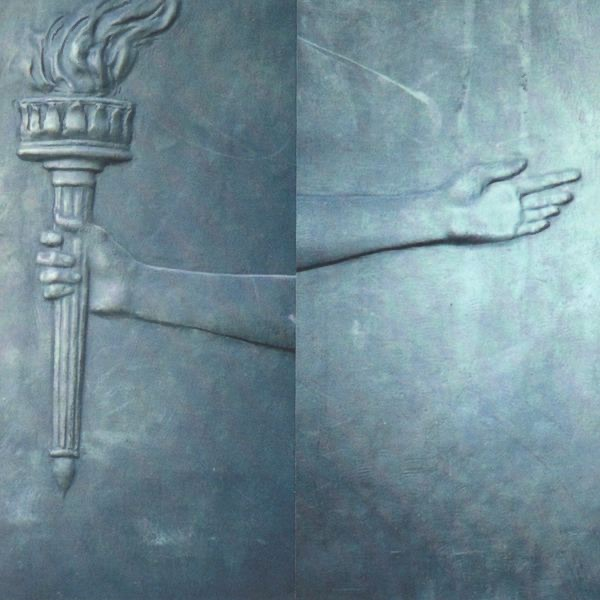

*High-Resolution Master Artwork Archive:* [The Argument Cover Art](https://is1-ssl.mzstatic.com/image/thumb/Music/y2005/m04/d13/h11/s05.xaqxiqox.jpg/600x600bb.jpg)

### Curatorial Justification (Why It's on This List)
Fugazi's final studio album before their indefinite hiatus stands as an unassailable monument of post-hardcore discipline and sonic innovation. Incorporating second drummer Jerry Busher, cello, and acoustic guitars, 'The Argument' traded raw velocity for architectural tension, spatial depth, and political prescience (recorded in the shadow of the Pentagon in 2001). It is an album of extraordinary dynamic control, recorded with absolute purist analog fidelity.

### Front-to-Back Architecture (Narrative & Pacing)
Beginning with the haunting, acoustic-and-cello groove of 'Cashout' (a devastating critique of gentrification), the album moves into the explosive, polyrhythmic dual-drum assault of 'Full Disclosure'. Ian MacKaye and Guy Picciotto trade lead vocals across intricate arrangements like 'Life and Limb' and 'Epic Problem', resolving in the brooding, cinematic title track.

### Audiophile & Production Breakdown
Engineered by Don Zientara at the legendary Inner Ear Studios in Arlington, Virginia, 'The Argument' is revered for its explosive dynamic headroom. Zientara avoided digital compression entirely: the dual drum kits hit with terrifying physical impact, while Joe Lally's bass possesses subterranean authority and clean articulation. The soundstage is wide, three-dimensional, and visceral.

### Benchmark Demo Track: **"Cashout"**
The ultimate test for transient restraint and sudden dynamic explosion. The track begins with a quiet, hypnotic bassline and delicate drum clicks, before detonating into a ferocious full-band chorus. Resolving amplifiers will deliver the massive transient spike without hardening or flattening the soundstage.

### Tonal Anchor Bridge (Library Connection)
Connects the raw, dynamic gut-punches of Nirvana's 'In Utero' with the rhythmic precision of Paramore's 'Riot!'.

---

## 39. Built to Spill – *Perfect from Now On* (1997)

**Primary Label & Engineering:** `Warner Bros. / Phil Ek (Producer & Mixing Engineer)`

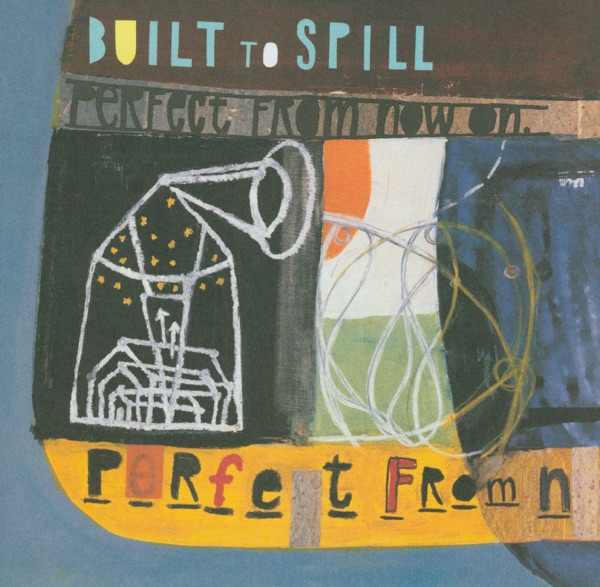

*High-Resolution Master Artwork Archive:* [Perfect from Now On Cover Art](https://is1-ssl.mzstatic.com/image/thumb/Music124/v4/48/bb/21/48bb2111-970c-0115-134c-e7c98f2b2499/mzi.kxoduptv.jpg/600x600bb.jpg)

### Curatorial Justification (Why It's on This List)
Doug Martsch's eight-track, fifty-four-minute magnum opus is one of the most ambitious indie rock records ever conceived. Overcoming lost master tapes and studio crises, Martsch and producer Phil Ek rebuilt the album from scratch into a sprawling symphony of interlocking guitars, shifting time signatures, cello arrangements, and existential philosophy. It proved that indie rock could achieve prog-rock complexity while retaining punk-rock emotional honesty.

### Front-to-Back Architecture (Narrative & Pacing)
Paced across expansive, multi-movement structures averaging six to eight minutes each, the album opens with the towering philosophical reflections of 'Randy Described Eternity'. Tracks like 'I Would Hurt a Fly' build from delicate, waltz-like verses into deafening storms of Mellotron and wah-wah guitars, culminating in the triumphant, celebratory catharsis of 'Untrustable / Part 2 (About Someone Else)'.

### Audiophile & Production Breakdown
Phil Ek's production is celebrated for its panoramic stereo imaging and pristine guitar layering. Martsch layered up to ten distinct guitar tracks per song, yet Ek's mix ensures each part—from clean acoustic fingerpicking to screaming Marshall feedback—occupies its own distinct spatial and frequency pocket. The acoustic drums have immense room volume and visceral weight.

### Benchmark Demo Track: **"Randy Described Eternity"**
Test for layered guitar clarity and dynamic crescendo. Listen for the delicate acoustic guitar and clean electric arpeggios in the intro, and verify that your system can resolve Martsch's plaintive vocals as the thunderous wall of distorted guitars enters at full power.

### Tonal Anchor Bridge (Library Connection)
Expands the soaring, dynamic guitar crescendos and existential lyricism of Radiohead's 'In Rainbows' and Paramore's self-titled record.

---

## 40. Sleater-Kinney – *The Woods* (2005)

**Primary Label & Engineering:** `Sub Pop / Dave Fridmann (Producer & Engineer), Tarbox Road Studios`

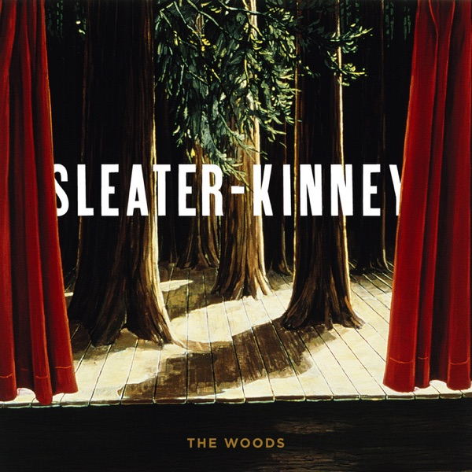

*High-Resolution Master Artwork Archive:* [The Woods Cover Art](https://is1-ssl.mzstatic.com/image/thumb/Music115/v4/09/5d/07/095d07f5-b349-5802-a823-04c386fe0675/SleaterKinney_TheWoods_1425px.jpg/600x600bb.jpg)

### Curatorial Justification (Why It's on This List)
Decamping to Dave Fridmann's Tarbox Road Studios in snowy upstate New York, Sleater-Kinney detonated their punk framework to create 'The Woods'—a ferocious, blues-saturated hard-rock masterpiece. Channeling Jimi Hendrix, The Who, and Black Sabbath, Carrie Brownstein's monstrous guitar solos, Corin Tucker's siren-like vocal roar, and Janet Weiss's thunderous Bonham-scale drumming pushed rock recording into the red. It is a terrifying, electrifying front-to-back tour de force.

### Front-to-Back Architecture (Narrative & Pacing)
The album opens with the distorted screech and stomping groove of 'The Fox', setting an unrelenting intensity. 'Jumpers' builds from a quiet acoustic narrative of suicide into a screaming guitar hurricane, while the eleven-minute centerpiece 'Let's Call It Love' features a blistering, improvisational feedback jam before resolving in the poignant, acoustic folk lament 'Modern Girl'.

### Audiophile & Production Breakdown
Dave Fridmann's signature production pushes tape saturation and analog compression to the absolute edge. Janet Weiss's drum kit sounds colossal, tracked with distant room microphones crushed through vintage compressors. Despite the sheer volume and fuzz, Tucker and Brownstein's dual-vocal counterpoint remains distinct in the stereo field.

### Benchmark Demo Track: **"Jumpers"**
An extreme workout for driver control and dynamic slam. Janet Weiss's drum fills enter with explosive, room-shaking force. Resolving systems will maintain Tucker's soaring vocal clarity even as the guitars erupt into total analog saturation.

### Tonal Anchor Bridge (Library Connection)
Shares the uninhibited, fierce feminine rock energy and dynamic vocal intensity of Yeah Yeah Yeahs' 'Fever to Tell' and Paramore's 'Riot!'.

---

## 41. The Breeders – *Last Splash* (1993)

**Primary Label & Engineering:** `4AD / Elektra / Kim Deal & Mark Freegard, Coast Recorders (SF)`

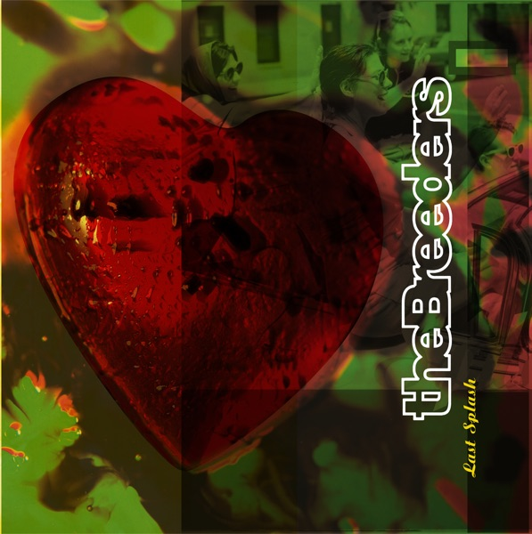

*High-Resolution Master Artwork Archive:* [Last Splash Cover Art](https://is1-ssl.mzstatic.com/image/thumb/Music126/v4/48/48/b1/4848b127-2daa-bcd0-84f6-346851cec648/191400061156.png/600x600bb.jpg)

### Curatorial Justification (Why It's on This List)
Kim Deal's post-Pixies masterpiece, 'Last Splash' is one of the most inventive, playful, and hook-stuffed alternative rock albums of the 1990s. Recorded with her twin sister Kelley Deal, bassist Josephine Wiggs, and drummer Jim Macpherson, the record balances infectious bubblegum pop melodies with weird, surf-rock guitars, Hawaiian lap steels, and distorted vocal hooks. Beyond the ubiquitous hit 'Cannonball', the album is an eclectic, brilliantly sequenced sonic joyride.

### Front-to-Back Architecture (Narrative & Pacing)
The album moves with kinetic whimsy across fifteen tracks. From the iconic, quiet-loud bass rumble of 'Cannonball' into the driving punk rush of 'No Aloha' and the surf-rock delirium of 'Flipside', the pacing never lets up. Side B offers stunning tonal variety with the melancholic country ballad 'Drivin' on 9' before ending on the swirling ambient haze of 'Roi'.

### Audiophile & Production Breakdown
Engineered by Mark Freegard at Coast Recorders in San Francisco, 'Last Splash' features phenomenal acoustic room punch. Josephine Wiggs's bass guitar has iconic tone: round, warm, and plucky, driving each track with muscular authority. The Deal sisters' harmony vocals are tracked with remarkable presence, switching from megaphone-filtered crunch to breathy, intimate acoustic clarity.

### Benchmark Demo Track: **"Cannonball"**
The quintessential test for quiet-loud transient response. Listen for the close-mic countdown ('One, two, three'), the sudden whistling audio feedback, and the explosive entrance of Wiggs's bass riff alongside Jim Macpherson's crisp snare crack.

### Tonal Anchor Bridge (Library Connection)
The direct musical and spiritual precursor to No Doubt's 'Tragic Kingdom' and Olivia Rodrigo's punchy pop-rock anthems on 'SOUR' and 'GUTS'.

---

## 42. St. Vincent – *Strange Mercy* (2011)

**Primary Label & Engineering:** `4AD / John Congleton (Producer & Mixing Engineer), Elmwood Studios (Dallas)`

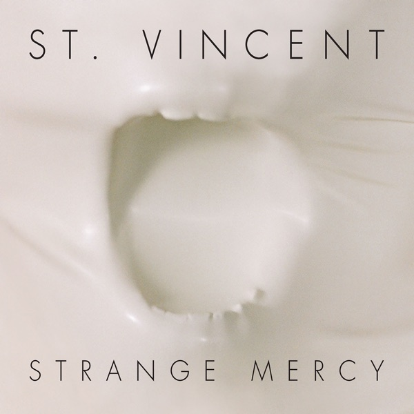

*High-Resolution Master Artwork Archive:* [Strange Mercy Cover Art](https://is1-ssl.mzstatic.com/image/thumb/Music126/v4/e6/87/65/e687653d-686c-5333-0596-17e9534c4a9e/652637312362.png/600x600bb.jpg)

### Curatorial Justification (Why It's on This List)
Annie Clark's breakthrough masterwork, 'Strange Mercy' stripped away the lush baroque orchestral layers of her early records to reveal an electro-shock rock landscape of startling emotional violence. Written in solitary isolation in Manhattan and tracked with John Congleton in Dallas, Clark contrasted pristine, angelic vocal melodies against gnashing, fuzz-laden guitar solos that sound like tearing sheet metal. It remains her most cohesive, emotionally raw front-to-back statement.

### Front-to-Back Architecture (Narrative & Pacing)
Opening with the ominous guitar crunch and soaring pop chorus of 'Chloe in the Afternoon', the album journeys through the biting indie-rock perfection of 'Cruel' and the haunting social satire of 'Cheerleader'. The emotional climax arrives on the title track 'Strange Mercy', a devastating ballad of familial imprisonment, before resolving on the hypnotic, synth-laced outro 'Year of the Tiger'.

### Audiophile & Production Breakdown
Produced by John Congleton, 'Strange Mercy' is renowned for its extreme dynamic contrasts and surgical transient clarity. Clark's custom guitar tones—running through fuzz boxes directly into mixing preamps—burst into the stereo field with instantaneous transient bite. Her vocals, in contrast, are captured with pristine warmth and intimate breathiness, floating over Bobby Sparks's vintage Minimoog basslines.

### Benchmark Demo Track: **"Cruel"**
A masterclass in dynamic juxtaposition. The delicate string-synth verse gives way to an explosive, snarling guitar riff that spans the stereo width. Resolving systems will convey the raw, ripping texture of Clark's guitar tone without midrange blur or treble glare.

### Tonal Anchor Bridge (Library Connection)
Bridges the adventurous, guitar-driven pop-rock brilliance of Paramore's self-titled album with the cinematic drama of Lorde's 'Melodrama'.

---

# Category IV: Cinematic Hip-Hop, Golden-Era Jazz & Conscious Narrative

> **Sonic Signature:** *Warm upright bass, crisp vinyl crackle, SP-1200/MPC60 quantization, cinematic horn arrangements, continuous three-act concept arcs.*

## The Sound of Category IV: The Narrative Cipher: 12-Bit Vintage Grit, Acoustic Upright Resonance & Laser-Focused Cadence

> *"The golden union of jazz acoustic virtuosity and hip-hop boom-bap architecture: crunchy vintage samplers, warm acoustic upright bass resonance, cinematic horn loops, and a dry, articulate vocal delivery commanding complete narrative focus."*

### Acoustic Archetype & Engineering Philosophy
Built upon the legendary tactile sound of vintage hardware samplers—the 12-bit, 26kHz grit and ring-modulator pitch shifts of the E-mu SP-1200 and the warm, unquantized swing of the Akai MPC60 and MPC3000. These gritty 12-bit textures are mixed through high-end analog desks by master engineers such as Bob Power, Young Guru, and Prince Paul. Upright basses are close-miked with Neumann U87s or Schoeps condensers, capturing the tactile scrape of fingers across wound strings. Lead vocals are tracked with world-class condenser microphones (Sony C-800G, Telefunken U47, Neumann U87) through Neve 1073 preamps and smoothed with optical Teletronix LA-2A compressors to maximize clarity, presence, and poetic authority.

### Frequency Architecture & Spectral Balance
Low frequencies (40Hz–150Hz) are masterfully segmented: acoustic upright basses provide woody, resonant low-mid warmth between 80Hz and 180Hz, leaving the subterranean realm (40Hz–65Hz) wide open for isolated 808 sub-kicks and filtered vinyl sample thumps. The midrange (400Hz–3kHz) is rich with vinyl crackle, dusty horn stabs, muted Miles Davis-style trumpets, and mellow Fender Rhodes electric piano chords. Turntable surface noise is treated not as interference, but as organic acoustic dither that glues the sonic collage together. Highs (7kHz–18kHz) feature razor-sharp hi-hat chops and crisp snare cracks that snap with crisp, unclipped velocity.

### Spatial Soundstaging & Holographic Imaging
The vocal sits squarely and commandingly in the phantom center, pushed slightly forward in the soundstage with minimal reverb to simulate a face-to-face cipher. Horn and string loops are spread wide across the stereo perimeter, enveloping the listener in a cinematic noir landscape. Sub-bass and kick drums remain anchored dead center, giving the music an unwavering rhythmic pulse that drives the narrative forward.

### The Tactile Listening Experience
A masterclass in lyrical and sonic articulation. Pay close attention to the micro-textures of the sampled vinyl loops—the subtle needle drag, the warmth of vintage horn harmonics, and the rhythmic precision of multisyllabic rhyme schemes. The music demands an active listener who tracks both the intellectual complexity of the lyricism and the audiophile warmth of the live-meets-sampled groove.

---

## 43. The Roots – *Things Fall Apart* (1999)

**Primary Label & Engineering:** `MCA Records / Richard Nichols & Questlove (Producers), Bob Power (Mixing Engineer)`

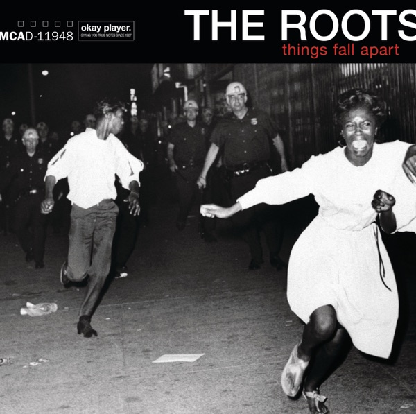

*High-Resolution Master Artwork Archive:* [Things Fall Apart Cover Art](https://is1-ssl.mzstatic.com/image/thumb/Music113/v4/93/71/d3/9371d36d-3498-2534-fc78-ea209f944c23/06UMGIM02261.rgb.jpg/600x600bb.jpg)

### Curatorial Justification (Why It's on This List)
Recorded at Electric Lady Studios during the golden zenith of the Soulquarians movement, 'Things Fall Apart' cemented The Roots as hip-hop's premier live band. Named after Chinua Achebe's classic novel, the album tackles urban despair, systemic racism, and artistic integrity at the turn of the millennium. Anchored by Questlove's unquantized live breakbeats, Hub's melodic basslines, and Black Thought's peerless lyrical precision, it is an essential front-to-back masterpiece that proves hip-hop and live organic musicianship are one and the same.

### Front-to-Back Architecture (Narrative & Pacing)
Beginning with audio from Spike Lee's 'Mo' Better Blues', the record establishes an urgent narrative arc. Songs flow continuously through seamless interludes and live jam transitions. Highlights include the blistering cadence of 'The Next Movement', the jazz-soaked 'Ain't Sayin' Nothin' New', and the immortal Grammy-winning anthem 'You Got Me' (featuring Erykah Badu and Eve), which climaxes in a furious live drum-and-bass workout by Questlove.

### Audiophile & Production Breakdown
Mixed by legendary audio purist Bob Power, the album possesses extraordinary acoustic weight and stereo headroom. Questlove's drum kit was tracked live to analog tape, capturing the distinct pop of the snare rim and the deep, wooden thud of the bass drum. Black Thought's vocals are tracked with laser-focused presence in the center channel, surrounded by Kamal Gray's warm Rhodes chords and Scratch's vocal turntablism.

### Benchmark Demo Track: **"You Got Me (feat. Erykah Badu & Eve)"**
The ultimate test for acoustic band dynamics and low-frequency transition. The gentle acoustic guitar and Badu's velvety chorus set a warm, intimate stage. At 3:45, Questlove accelerates into a ferocious, high-speed jungle/drum-and-bass breakdown that tests system transient response and recovery speed.

### Tonal Anchor Bridge (Library Connection)
Directly complements the listener's love for Lauryn Hill's 'Miseducation' and the intricate live instrumentation of Mac Miller's 'Circles'.

---

## 44. Common – *Like Water for Chocolate* (2000)

**Primary Label & Engineering:** `MCA Records / Soulquarians (J Dilla, Questlove, D'Angelo, James Poyser), Russell Elevado (Mixer)`

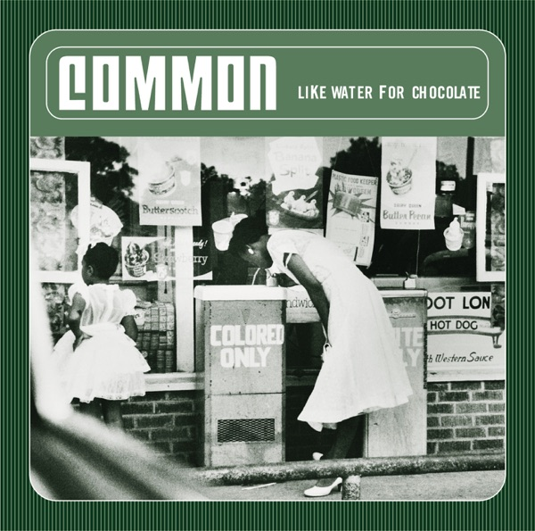

*High-Resolution Master Artwork Archive:* [Like Water for Chocolate Cover Art](https://is1-ssl.mzstatic.com/image/thumb/Music124/v4/a3/2d/1d/a32d1d4f-b47a-fa0c-12af-5e85c4f4905a/00008811238025.rgb.jpg/600x600bb.jpg)

### Curatorial Justification (Why It's on This List)
Another triumph from Electric Lady's Soulquarian collective, 'Like Water for Chocolate' stands as Common's magnum opus. Guided by J Dilla's pioneering, unquantized MPC-3000 swing, Questlove's live drums, and Pino Palladino's laid-back bass, Common delivers a deeply poetic, Afrocentric narrative of spiritual love, Black pride, and musical evolution. Featuring contributions from Femi Kuti, D'Angelo, Roy Hargrove, and Mos Def, it is an essential cultural touchstone.

### Front-to-Back Architecture (Narrative & Pacing)
Opening with Femi Kuti's fiery Afrobeat horn fanfare on 'Time Travelin'', the album moves effortlessly into the street poetry of 'Heat' and the immortal Bobby Caldwell-sampling love letter 'The Light'. The narrative reaches profound depth on 'Song for Assata' (recounting the life of Assata Shakur with CeeLo Green) before closing with the intimate family tribute 'Pop's Rap III... All My Children'.

### Audiophile & Production Breakdown
Russell Elevado mixed the record through an SSL console to half-inch tape, imbuing every track with thick, analog saturation. Dilla's drum chops and Palladino's basslines interlock in a miraculous, loose pocket that breathes with physical warmth. Roy Hargrove's muted trumpet and James Poyser's Rhodes piano shimmer with rich harmonic overtones across a deep soundstage.

### Benchmark Demo Track: **"The Light"**
A benchmark for sample warmth and unquantized human swing. The Bobby Caldwell piano sample glides over Dilla's kick and snare. Notice how the bass notes bloom without masking Common's centered, articulate vocal delivery.

### Tonal Anchor Bridge (Library Connection)
Shares the Soulquarian sonic DNA and romantic lyrical warmth celebrated on Erykah Badu's 'Mama's Gun' and Lauryn Hill's 'Miseducation'.

---

## 45. GZA – *Liquid Swords* (1995)

**Primary Label & Engineering:** `Geffen Records / RZA (Producer & Mixing Engineer), 36 Chambers Studio (Staten Island)`

*High-Resolution Master Artwork Archive:* [Liquid Swords Cover Art](https://is1-ssl.mzstatic.com/image/thumb/Music124/v4/13/f6/27/13f62737-00fa-e459-5306-961cbbdfe685/00602547742261.rgb.jpg/600x600bb.jpg)

### Curatorial Justification (Why It's on This List)
The dark cinematic peak of the Wu-Tang Clan's golden era, 'Liquid Swords' is hip-hop's definitive winter masterpiece. Set against dialogue samples from the 1980 samurai film 'Shogun Assassin', GZA's cerebral, chess-master lyricism navigates a frozen New York landscape of crime, corruption, and spiritual discipline. Producer RZA constructed a sinister, hypnotic soundscape of detuned soul samples, subterranean bass hums, and dusty vinyl crackle that feels like an uninterrupted film noir.

### Front-to-Back Architecture (Narrative & Pacing)
Beginning with the unforgettable samurai dialogue ('When I was little, my father was famous...'), the title track explodes into a lethal, four-minute lyrical masterclass. Tracks flow into one another like scenes in a psychological thriller: 'Duel of the Iron Mic', 'Living in the World Today', 'Cold World', and the apocalyptic masterpiece '4th Chamber'. The record concludes on 'B.I.B.L.E.', an introspective spiritual sermon delivered with stunning clarity by Killah Priest.

### Audiophile & Production Breakdown
Tracked in RZA's basement studio in Staten Island, the production embraces the dark warmth of 12-bit SP-1200 sampling and Ensoniq EPS-16 converters. The low-end on 'Duel of the Iron Mic' and 'Shadowboxin'' carries massive, foundational weight, while the vintage soul horns and vocal snippets cut through with eerie, nostalgic presence. GZA's voice is dry, razor-sharp, and uncomfortably close.

### Benchmark Demo Track: **"Duel of the Iron Mic"**
Test for low-frequency weight and dialogue sample separation. The vocal intro from 'Shogun Assassin' must sound clean and distinct. When the menacing bassline and drum break drop at 0:28, your system must articulate the heavy, resonant kick drum without smearing Ol' Dirty Bastard's chaotic background cries.

### Tonal Anchor Bridge (Library Connection)
The direct conceptual and lyrical forebear to Kendrick Lamar's gritty, three-act cinematic world-building on 'good kid, m.A.A.d city' and 'DAMN.'.

---

## 46. Raekwon – *Only Built 4 Cuban Linx...* (1995)

**Primary Label & Engineering:** `Loud / RCA / RZA (Producer & Mixing Engineer)`

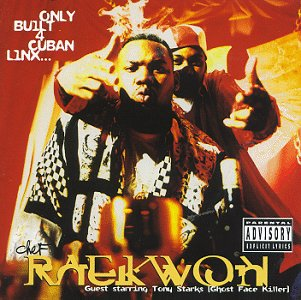

*High-Resolution Master Artwork Archive:* [Only Built 4 Cuban Linx... Cover Art](https://upload.wikimedia.org/wikipedia/en/1/17/Raekwon_only.jpg)

### Curatorial Justification (Why It's on This List)
Revered as 'The Purple Tape', Raekwon's debut—co-starring Ghostface Killah—is the cinematic godfather of Mafioso rap. RZA's production reached an operatic peak, sampling Stax soul, Ennio Morricone film scores, and synthesizer brass to create a sprawling, seventy-minute narrative of crime syndicates, designer champagne, and street survival. Raekwon and Ghostface's dense, slang-drenched cadences flow with cinematic velocity, creating a vivid sonic motion picture that demands front-to-back immersion.

### Front-to-Back Architecture (Narrative & Pacing)
Conceived explicitly as a feature film (with Raekwon as 'Lou Diamonds' and Ghostface as 'Tony Starks'), the album moves through cinematic acts: from the opening bank robbery dialogue of 'Striving for Perfection' into the thunderous adrenaline rush of 'Criminology' and 'Incarcerated Scarfaces'. It reaches emotional transcendence on 'Verbal Intercourse' (featuring Nas's legendary verse) and the summer street classic 'Ice Cream'.

### Audiophile & Production Breakdown
RZA's layered production on 'Cuban Linx' is dense and orchestral. Utilizing the E-mu SP-1200 and analog tape, RZA layered horn stabs, sweeping strings, and vocal samples across a wide stereo panorama. The low-frequency bass hits on 'Incarcerated Scarfaces' are tight and punchy, providing an unshakeable anchor for the intricate vocal trade-offs.

### Benchmark Demo Track: **"Criminology"**
A test for sample clarity and aggressive transient punch. The sweet soul sample of The Sweet Inspirations gives way to an explosive, crackling drum break and snarling horn blast. Resolving systems will preserve the grit of the vinyl sample without harshness.

### Tonal Anchor Bridge (Library Connection)
The direct conceptual blueprint for Kendrick Lamar's narrative sequencing on 'DAMN.' and Dr. Dre's cinematic hip-hop productions.

---

## 47. Saba – *CARE FOR ME* (2018)

**Primary Label & Engineering:** `Saba Pivot / Daoud & daedaePIVOT (Producers & Mixers)`

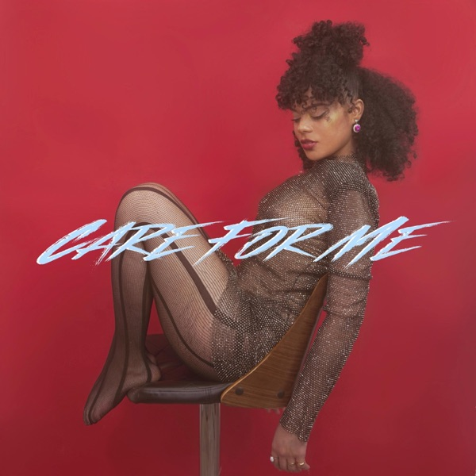

*High-Resolution Master Artwork Archive:* [CARE FOR ME Cover Art](https://upload.wikimedia.org/wikipedia/en/d/da/This_is_the_cover_art_for_CARE_FOR_ME_by_Saba._The_cover_art_copyright_is_believed_to_belong_to_the_label%2C_Saba_PIVOT%2C_or_the_graphic_artist%28s%29.jpg?utm_source=en.wikipedia.org&utm_campaign=api&utm_content=thumbnail_unscaled)

### Curatorial Justification (Why It's on This List)
Written in the devastating aftermath of the murder of his cousin and close collaborator John Walt, Chicago rapper Saba crafted 'CARE FOR ME' as an intimate, gut-wrenching meditation on grief, loneliness, and survival. Built upon somber acoustic piano chords, warm electric bass, and live jazz drumming, Saba's conversational, breathless flow delivers some of the most emotionally raw lyricism in hip-hop history. It is a modern classic that must be heard in its entirety to absorb its full psychological weight.

### Front-to-Back Architecture (Narrative & Pacing)
The album opens with the claustrophobic anxiety of 'BUSY / SIRENS' and the melancholy contemplation of 'BROKEN GIRLS' and 'LIFE'. The emotional peak arrives on 'PROM / KING', an extraordinary seven-minute narrative epic that chronicles his relationship with Walt from high school awkwardness to the tragic day of his death. The album resolves on 'HEAVEN ALL AROUND ME', a peaceful, heartbreaking post-mortem perspective that leaves the listener breathless.

### Audiophile & Production Breakdown
Co-produced with multi-instrumentalists Daoud and daedaePIVOT, the record avoids generic trap presets in favor of rich, organic instrumentation. The acoustic piano carries rich wooden body harmonics; the live basslines are warm and articulate; and the drums possess a dry, intimate acoustic feel that places Saba's voice right in the room.

### Benchmark Demo Track: **"PROM / KING"**
The ultimate test for narrative dynamics and drum acceleration. The first half is a gentle, Rhodes-backed storytelling stroll. At 3:40, the beat shifts into a frantic, accelerating live jazz drum assault. Resolving gear will track the increasing dynamic fury of the drums while keeping Saba's frantic vocals crystal clear.

### Tonal Anchor Bridge (Library Connection)
Shares the profound acoustic grief, intimate piano foundation, and emotional honesty of Mac Miller's 'Circles'.

---

## 48. De La Soul – *Buhloone Mindstate* (1993)

**Primary Label & Engineering:** `Tommy Boy / Prince Paul (Producer & Mixer)`

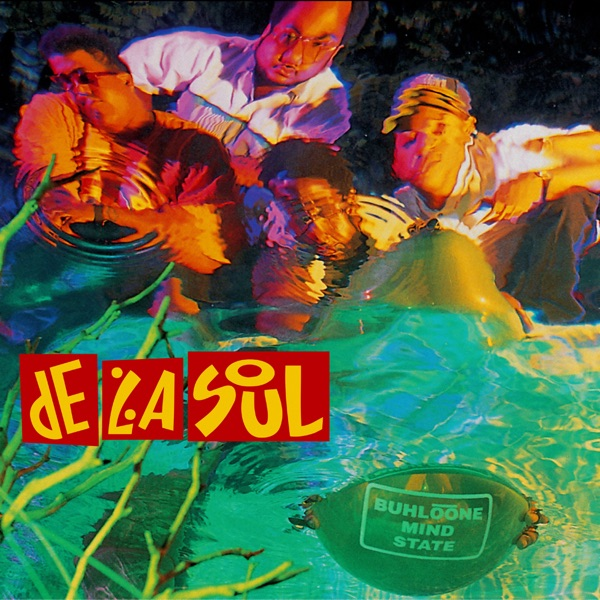

*High-Resolution Master Artwork Archive:* [Buhloone Mindstate Cover Art](https://is1-ssl.mzstatic.com/image/thumb/Music116/v4/85/a0/2c/85a02c4e-42ba-fee9-ca30-5d82ec882267/810098505987.png/600x600bb.jpg)

### Curatorial Justification (Why It's on This List)
Carrying the famous slogan 'It might blow up, but it won't go pop', De La Soul's third album is their most sophisticated, introspective, and musically cohesive work. Rejecting commercial pressures following the breakthrough of '3 Feet High and Rising', the Long Island trio partnered with Prince Paul and legendary jazz horns (Maceo Parker, Fred Wesley, Pee Wee Ellis) to craft a rich, mature jazz-rap statement that explored the burdens of fame, aging, and cultural integrity.

### Front-to-Back Architecture (Narrative & Pacing)
The album moves with breezy, unhurried brilliance across fifteen interconnected tracks. From the joyful, Smokey Robinson-sampling bounce of 'Breakadawn' into the Japanese rap collaboration 'Long Island Wildin'', the record maintains an effortless narrative swing. The emotional centerpiece, 'I Am I Be', is a profound six-minute meditation on personal identity that stands as one of the greatest tracks in hip-hop history.

### Audiophile & Production Breakdown
Prince Paul's production on 'Buhloone Mindstate' is renowned for its organic warmth and rich jazz textures. Live saxophone and trombone solos were recorded through vintage tube preamps, blending seamlessly with obscure jazz-funk vinyl samples. Posdnuos and Trugoy's vocals are tracked with exceptional clarity, sitting perfectly in the mix over round, bouncing basslines.

### Benchmark Demo Track: **"I Am I Be"**
Test for spatial acoustic horns and bass resonance. Listen for Maceo Parker's soulful alto sax solo and the gentle electric piano decay. Resolving systems will render the intricate horn overtones with lifelike brass warmth without harshness.

### Tonal Anchor Bridge (Library Connection)
Directly connects to the conscious jazz-rap lyricism and acoustic warmth of A Tribe Called Quest and Mac Miller's 'Circles'.

---

## 49. Noname – *Room 25* (2018)

**Primary Label & Engineering:** `Self-released / Phoelix (Producer & Multi-instrumentalist)`

*High-Resolution Master Artwork Archive:* [Room 25 Cover Art](https://upload.wikimedia.org/wikipedia/en/f/f8/Room_25_cover.jpg)

### Curatorial Justification (Why It's on This List)
Recorded in Los Angeles with producer Phoelix, Chicago poet Noname (Fatimah Warner) created 'Room 25' as an intimate, live-instrumented confession of womanhood, financial struggle, political awakening, and heartbreak. Noname's rapid-fire, conversational delivery dances over intricate neo-soul chords, upright bass, and live string quartets, creating a 35-minute acoustic jazz-rap triumph that proves whispered truths cut deeper than shouted bravado.

### Front-to-Back Architecture (Narrative & Pacing)
Beginning with the playful self-awareness of 'Self' ('Y'all really thought a bitch couldn't rap, huh?'), the album slides into the breathtaking political critique of 'Blaxploitation'. The record balances sultry romance ('Window') and biting humor ('Montego Bay') before arriving at the soaring, string-drenched emotional finale 'no name'.

### Audiophile & Production Breakdown
Engineered with extraordinary acoustic fidelity, 'Room 25' features completely live jazz instrumentation. The upright bass has woody, plucked definition; the drum kit sits in a tight, untreated room with authentic rimshot resonance; and the live string quartet swells with natural acoustic bloom. Noname's voice is tracked with startling proximity, revealing every subtle smirk and breath.

### Benchmark Demo Track: **"Blaxploitation"**
An incredible test for speed, rhythm, and midrange articulation. Noname's lightning-fast syncopated flow weaves between a rapid, walking jazz bassline and crisp drum brushes. Any transient blur in your audio system will smear her intricate vocal cadences.

### Tonal Anchor Bridge (Library Connection)
Directly echoes the conversational intimacy, live jazz warmth, and unapologetic feminine perspective of SZA's 'Ctrl' and Lauryn Hill.

---

## 50. Lupe Fiasco – *Lupe Fiasco's Food & Liquor* (2006)

**Primary Label & Engineering:** `1st & 15th / Atlantic / Soundtrakk, The Neptunes, Kanye West`

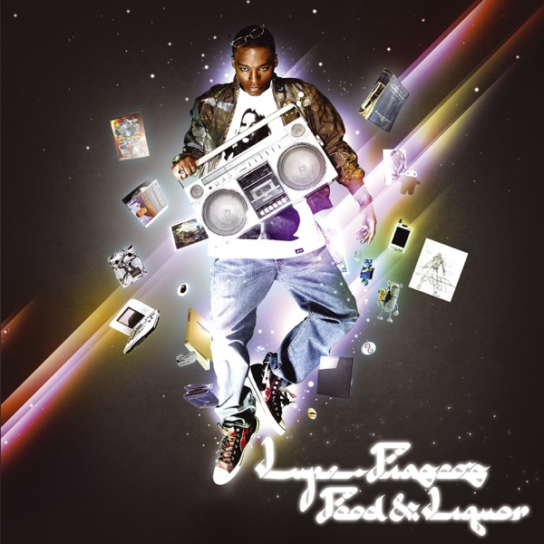

*High-Resolution Master Artwork Archive:* [Lupe Fiasco's Food & Liquor Cover Art](https://is1-ssl.mzstatic.com/image/thumb/Music/78/d5/26/mzi.qcmcushu.jpg/600x600bb.jpg)

### Curatorial Justification (Why It's on This List)
Arriving in 2006 when mainstream hip-hop was dominated by gangsta tropes, Lupe Fiasco's debut introduced a skateboarding, anime-loving, philosophically rigorous lyricist from Chicago's West Side. Executive produced by Jay-Z and Chill, 'Food & Liquor' used the metaphor of neighborhood convenience stores to examine the duality of good and evil. Lupe's multi-syllabic rhymes, complex narrative metaphors, and lush orchestral production make this an indispensable front-to-back listening classic.

### Front-to-Back Architecture (Narrative & Pacing)
From the infectious, string-sampling skateboarding anthem 'Kick, Push' into the devastating social allegory of 'The Cool' and the towering anti-war critique of 'American Terrorist', the album moves with narrative majesty. The Grammy-winning single 'Daydreamin'' (feat. Jill Scott) anchors the middle act with cinematic grandeur, resolving on the triumphant gratitude of 'The Emperor's Soundtrack'.

### Audiophile & Production Breakdown
Produced primarily by in-house architect Soundtrakk alongside Kanye West and The Neptunes, the record is rich in organic samples, live bass guitars, and cinematic string arrangements. Lupe's vocal delivery is crisp, clean, and perfectly centered, allowing his dense, multi-layered internal rhymes to be digested with total clarity.

### Benchmark Demo Track: **"Daydreamin' (feat. Jill Scott)"**
Test for orchestral grandeur and vocal contrast. The Günter Kallmann Choir sample provides a lush, airy acoustic stage, punctuated by punchy hip-hop drums. Jill Scott's warm, operatic hook contrasts gorgeously with Lupe's sharp, percussive delivery.

### Tonal Anchor Bridge (Library Connection)
Shares the conceptual ambition, sociopolitical insight, and vocal brilliance found on Kendrick Lamar's 'DAMN.' and J. Cole's '2014 Forest Hills Drive'.

---

## 51. Black Thought & Danger Mouse – *Cheat Codes* (2022)

**Primary Label & Engineering:** `BMG / Danger Mouse (Producer & Mixing Engineer)`

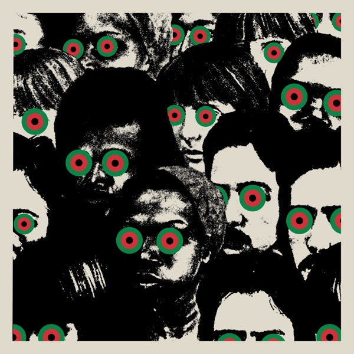

*High-Resolution Master Artwork Archive:* [Cheat Codes Cover Art](https://is1-ssl.mzstatic.com/image/thumb/Music211/v4/70/50/71/705071c5-8083-7bab-0cb9-b3d8d0536dce/4099964283877.jpg/600x600bb.jpg)

### Curatorial Justification (Why It's on This List)
Thirty years into his legendary career with The Roots, Tariq Trotter (Black Thought) teamed up with producer Danger Mouse to deliver 'Cheat Codes'—a masterclass in boom-bap perfection. Danger Mouse dug deep into his personal vaults of obscure soul, psych-rock, and funk 45s, creating gritty, tape-saturated loops that inspire Black Thought to deliver some of the most jaw-dropping, breath-defying verses of his life. Featuring guest verses from MF DOOM, Raekwon, and Joey Bada$$, it is a modern crate-digger's dream.

### Front-to-Back Architecture (Narrative & Pacing)
Clocking in at a razor-sharp thirty-eight minutes, the album never wastes a single second. Opening with the relentless soul horn punch of 'Sometimes', it flows into the dizzying lyrical assault of the title track. The emotional peak arrives on 'Aquamarine' (featuring Michael Kiwanuka's soaring vocal hook) and the posthumous MF DOOM collaboration 'Belize', concluding on the triumphant 'Violas and Lupitas'.

### Audiophile & Production Breakdown
Danger Mouse's production is an audiophile showcase for analog tape warmth and dynamic punch. The vinyl samples retain their natural crackle, flutter, and tape compression, while the live bass and drums punch with modern weight. Black Thought's vocals were tracked with zero artificial sheen, possessing commanding chest resonance and crystal-clear articulation.

### Benchmark Demo Track: **"Aquamarine (feat. Michael Kiwanuka)"**
A showcase for dynamic soul production. Michael Kiwanuka's reverberant, smoky vocal swells in the chorus over deep, rolling bass and live strings. Resolving systems will isolate Kiwanuka's soulful vibrato from Black Thought's crisp, focused verse delivery.

### Tonal Anchor Bridge (Library Connection)
Directly expands upon Black Thought's genius on The Roots' classics and the raw lyrical fire of Kendrick Lamar's 'DAMN.'.

---

## 52. Gang Starr – *Moment of Truth* (1998)

**Primary Label & Engineering:** `No Trybe / Virgin / DJ Premier & Guru (Producers), D&D Studios (NYC)`

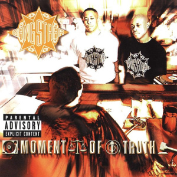

*High-Resolution Master Artwork Archive:* [Moment of Truth Cover Art](https://upload.wikimedia.org/wikipedia/en/e/eb/Gangstarrmomentoftruth.jpg)

### Curatorial Justification (Why It's on This List)
Recorded while Guru was facing a severe legal indictment that threatened his freedom, 'Moment of Truth' is Gang Starr's definitive double-album triumph. DJ Premier's signature production reached perfection: cutting-edge SP-1200 sample chops, punchy boom-bap drums, and virtuoso turntable scratching paired with Guru's wise, monotone street philosophy. Spanning twenty tracks without a single weak link, it is the gold standard of East Coast conscious hip-hop.

### Front-to-Back Architecture (Narrative & Pacing)
Opening with the cinematic string fanfare of 'You Know My Steez', the record moves through stone-cold street classics ('Work', 'Royalty', 'Above the Clouds' featuring Inspectah Deck). The emotional and philosophical heart is the title track 'Moment of Truth', where Guru reflects on mortality, justice, and spiritual perseverance, before closing on the uplifting jam 'The Militia'.

### Audiophile & Production Breakdown
Recorded at the legendary D&D Studios in Manhattan, Premier's drum mixes are an engineering benchmark: the kick drum has a tight, uncluttered low-end punch that never bleeds into the bassline, while the snare crack hits like a pistol shot. Premier's turntable scratches cut through the stereo field with razor-sharp transient precision.

### Benchmark Demo Track: **"Moment of Truth"**
Test for snare transient impact and piano sample decay. Notice the dry, physical slap of Premier's snare drum against the melancholic piano loop. Guru's voice sits centered with rich, authoritative baritone warmth.

### Tonal Anchor Bridge (Library Connection)
Connects the conscious street wisdom and golden-era boom-bap precision of Mos Def's 'Black on Both Sides' and Kendrick Lamar's 'DAMN.'.

---

## 53. Ghostface Killah – *Supreme Clientele* (2000)

**Primary Label & Engineering:** `Epic / Razor Sharp / RZA, Ghostface Killah, Carlos Broady`

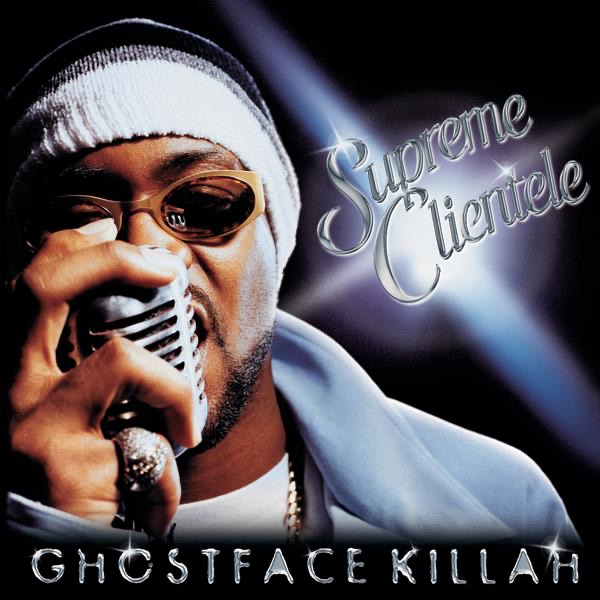

*High-Resolution Master Artwork Archive:* [Supreme Clientele Cover Art](https://is1-ssl.mzstatic.com/image/thumb/Music/1b/fa/2a/mzi.kylfgjuv.jpg/600x600bb.jpg)

### Curatorial Justification (Why It's on This List)
Widely credited with rescuing the Wu-Tang Clan's momentum at the turn of the millennium, 'Supreme Clientele' is a surrealist lyrical miracle. Ghostface Killah developed a dizzying, stream-of-consciousness slang that completely upended traditional hip-hop syntax. Guided by RZA's executive production—which chopped classic soul 45s with raw, unlooped emotional urgency—the album radiates pure, unadulterated adrenaline, technicolor imagery, and undeniable street charisma.

### Front-to-Back Architecture (Narrative & Pacing)
The album detonates with the iconic, blaring soul horns of 'Nutmeg' and the relentless funk drive of 'One'. Ghostface maintains an electrifying vocal intensity across 'Apollo Kids', 'Cherchez LaGhost', and 'Mighty Healthy', creating an uninterrupted fifty-five minute feast of vintage soul samples, cartoon dialogue, and verbal acrobatics.

### Audiophile & Production Breakdown
The production leans heavily into dusty 1970s soul vinyl samples tracked hot to tape. Ghostface's voice is mixed loud and upfront, capturing his breathless, high-strung emotional delivery in startling detail. The kick drums and snares hit with raw, uncompressed punch, cutting cleanly through the lush soul horn arrangements.

### Benchmark Demo Track: **"Nutmeg"**
A test for sample dynamics and vocal speed. The Eddie Holman soul sample drives the track with joyous horn bursts and lush strings. Verify that your system delivers Ghostface's rapid-fire slang without vocal smearing.

### Tonal Anchor Bridge (Library Connection)
The raw, soul-drenched sonic foundation that directly inspired Kanye West's early production style and Outkast's verbal acrobatics.

---

## 54. Slick Rick – *The Great Adventures of Slick Rick* (1988)

**Primary Label & Engineering:** `Def Jam / Columbia / Jam Master Jay, The Bomb Squad, Slick Rick`

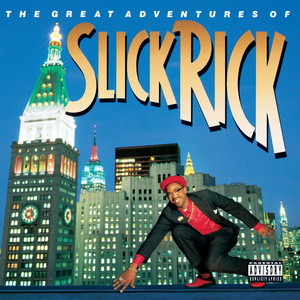

*High-Resolution Master Artwork Archive:* [The Great Adventures of Slick Rick Cover Art](https://upload.wikimedia.org/wikipedia/en/c/c9/SlickRickTheGreatAdventuresofSlickRick.jpg)

### Curatorial Justification (Why It's on This List)
The quintessential storytelling album in hip-hop history, 'The Great Adventures of Slick Rick' established the British-born rapper as the ultimate narrator of urban fables. Armed with an eyepatch, bespoke suits, and an iconic British-Brooklyn accent, Rick's vocal phrasing, comedic timing, and moral clarity set the standard for every narrative rapper that followed (from Snoop Dogg to Kendrick Lamar). Beyond its massive hits, it is a brilliantly paced, witty, and musically rich masterclass.

### Front-to-Back Architecture (Narrative & Pacing)
Paced like a collection of illustrated morality tales, the album opens with the tragic, Cautionary street anthem 'Children's Story' and the smooth romance of 'Mona Lisa'. The record balances humorous bedroom antics ('Indian Girl') with sincere youth mentorship ('Hey Young World'), concluding on the introspective, gospel-tinged 'Lick the Balls'.

### Audiophile & Production Breakdown
Co-produced with The Bomb Squad (Public Enemy) and Jam Master Jay (Run-D.M.C.), the album features classic 1980s Roland TR-808 drum programming and early digital sampling. The 808 sub-bass drops on 'Children's Story' carry remarkable extension, while Rick's conversational voice is recorded with pristine dryness in the phantom center.

### Benchmark Demo Track: **"Children's Story"**
Test for 808 sub-bass articulation and vocal character. The famous piano baseline (interpolated from Bob James's 'Nautilus') bounces over a deep 808 kick drum. Resolving systems will capture the subtle humor and vocal inflection changes in Rick's storytelling.

### Tonal Anchor Bridge (Library Connection)
The foundational storytelling masterclass that directly inspired Outkast's 'Aquemini' and Kendrick Lamar's narrative concept albums.

---

## 55. clipping. – *There Existed an Addiction to Blood* (2019)

**Primary Label & Engineering:** `Sub Pop / clipping. (Daveed Diggs, William Hutson, Jonathan Snipes)`

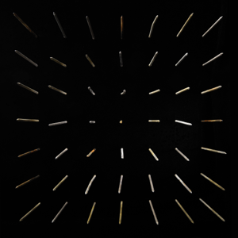

*High-Resolution Master Artwork Archive:* [There Existed an Addiction to Blood Cover Art](https://upload.wikimedia.org/wikipedia/en/0/00/Clipping._-_There_Existed_an_Addiction_to_Blood_cover.png)

### Curatorial Justification (Why It's on This List)
A terrifying, brilliant reimagining of 1990s horrorcore hip-hop through the lens of modern avant-garde sound design and socio-political critique. Frontman Daveed Diggs (Tony Award-winning star of 'Hamilton') unleashes superhuman lyrical cadences over industrial noise, tape manipulation, and concrete audio by producers William Hutson and Jonathan Snipes. It is an unrelenting, cinematic horror film for the ears that pushes the boundaries of how hip-hop can be engineered.

### Front-to-Back Architecture (Narrative & Pacing)
Opening with the bone-chilling, minimalist piano pulse of 'Nothing Is Safe' (structured like a John Carpenter film score), the album surges into the sociopolitical vampire tale 'Blood of the Fang' and the brutal industrial assault of 'La Mala Ordina'. The record concludes with 'Piano Burning'—an actual field recording of a piano being set on fire, letting the strings snap in real time.

### Audiophile & Production Breakdown
An extraordinary audiophile torture test for transient response, dynamic headroom, and spatial resolution. Hutson and Snipes use foley recordings (breaking glass, tearing metal, gun reloads) as percussion. Diggs's vocals were tracked through high-end preamps with zero vocal smearing, cutting through extreme noise bursts with crystalline clarity.

### Benchmark Demo Track: **"Nothing Is Safe"**
The ultimate test for dynamic tension and transient slam. The track begins with a quiet, repeating piano note and whispered vocals. At 1:12, a colossal industrial synthesizer bass pulse hits with catastrophic low-frequency power. Resolving amplifiers must deliver this sudden sub-bass surge without clipping.

### Tonal Anchor Bridge (Library Connection)
Connects the dark, cinematic intensity of Kendrick Lamar's 'DAMN.' with the experimental hip-hop aggression of Danny Brown.

---

## 56. Danny Brown – *Atrocity Exhibition* (2016)

**Primary Label & Engineering:** `Warp Records / Paul White (Producer & Mixing Engineer)`

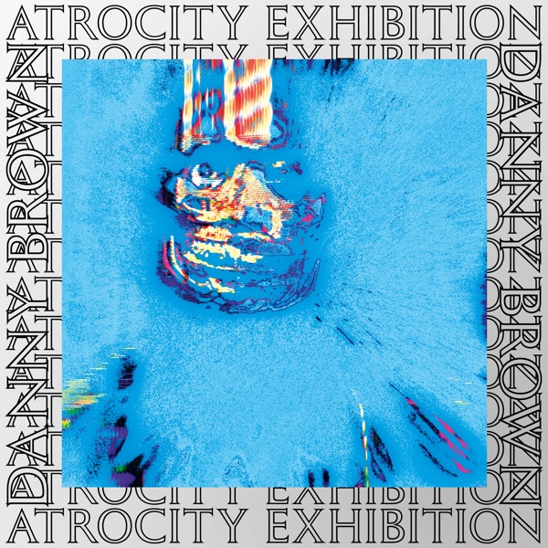

*High-Resolution Master Artwork Archive:* [Atrocity Exhibition Cover Art](https://is1-ssl.mzstatic.com/image/thumb/Music211/v4/c3/ac/b5/c3acb547-3654-12d0-ee40-05c7489bf75f/5056818811753.png/600x600bb.jpg)

### Curatorial Justification (Why It's on This List)
Named after J.G. Ballard's experimental novel and Joy Division's haunting song, Danny Brown's 'Atrocity Exhibition' is a terrifying, hallucinatory descent into drug addiction, psychosis, and paranoia. Backed by British producer Paul White's insane sample palette—drawing from 1970s krautrock, post-punk, and Nigerian funk—Brown unleashes his erratic, high-pitched squawk with staggering technical precision. Featuring an all-star posse cut with Kendrick Lamar, Earl Sweatshirt, and Ab-Soul on 'Really Doe', it is a harrowing modern masterpiece.

### Front-to-Back Architecture (Narrative & Pacing)
The album opens with the claustrophobic dread of 'Downward Spiral', setting a disorienting, manic tempo. Songs blur into one another with nightmarish velocity: the frenetic post-punk groove of 'Ain't It Funny', the thunderous lyrical clash of 'Really Doe', and the frantic Detroit techno pulse of 'When It Rain', concluding on the reflective, exhausted comedown of 'Hell for It'.

### Audiophile & Production Breakdown
Paul White's production was released on Warp Records and mastered with exceptional dynamic punch. The samples (guitars, organs, live drums) retain their raw analog bite and eccentric stereo panning. Brown's unique voice—shifting between a manic nasal squeal and a grounded baritone—sits razor-sharp in the mix with zero harshness in the upper presence region.

### Benchmark Demo Track: **"Really Doe (feat. Kendrick Lamar, Ab-Soul & Earl Sweatshirt)"**
A test for vocal timbre separation and percussive transient speed. Compare the vocal signatures of all four distinct MCs over a hypnotic, chiming bell loop and hard-hitting boom-bap drum break. High-resolving gear will delineate each artist's mic technique.

### Tonal Anchor Bridge (Library Connection)
Directly complements the frantic vocal fearlessness and boundary-pushing production found on Kendrick Lamar's 'DAMN.' and Outkast's 'Stankonia'.

---

# Category V: Acoustic Roots, Room Ambience & Confessional Songwriting

> **Sonic Signature:** *Stereo ribbon mic pairs, vintage acoustic woods, mechanical pedal squeaks, zero artificial pitch correction, raw vocal proximity.*

## The Sound of Category V: The Sacred Living Room: Ribbon-Mic Purity, Wooden Resonance & Unvarnished Proximity

> *"Stripped of all artificial studio sheen, pitch correction, and compression, this sound captures the sacred reality of wooden instruments vibrating in historic rooms, placing the listener inches away from the singer’s throat and guitar soundboard."*

### Acoustic Archetype & Engineering Philosophy
Engineered by acoustic purists like Gary Paczosa, T Bone Burnett, and Dave Rawlings. The signal chain is uncompromisingly minimalist: matched pairs of figure-8 ribbon microphones (Coles 4038, RCA 44-BX, Royer R-121) arranged in Blumlein configuration or spaced pairs in historic wooden rooms (such as RCA Studio B in Nashville or rustic mountain cabins). Acoustic instruments are pre-war or vintage custom flat-tops (Martin D-18/D-28, Gibson J-45, Collings) made of aged Adirondack spruce, mahogany, and Brazilian rosewood. Vocalists sing into single large-diaphragm tube condensers (Neumann M49, AKG C12) without pop filters, allowing their natural vocal dynamics to modulate the room air.

### Frequency Architecture & Spectral Balance
The low-end (70Hz–200Hz) is warm, woody, and entirely organic. You hear the internal acoustic chamber of the dreadnought guitar humming against the musician's chest, reinforced by the physical thump of a leather boot tapping on wooden floorboards. The vocal midrange (600Hz–4kHz) is startlingly lifelike: zero Auto-Tune or Melodyne pitch correction ensures every microtonal inflection, vocal break, and breath intake is preserved with documentary realism. High frequencies (6kHz–14kHz) roll off smoothly and naturally; ribbon mics tame steel string harshness, leaving only the delicate scrape of fingers across bronze windings and the soft flutter of room decay.

### Spatial Soundstaging & Holographic Imaging
Delivers three-dimensional holographic realism. Close your eyes, and the performance appears physically materialized in your listening space. The primary acoustic guitar sits at 11 o'clock, the upright bass or second guitar rests at 2 o'clock, and the lead vocalist stands dead center, their voice projecting with authentic height and chest resonance. The room itself acts as an acoustic partner, with natural wooden wall reflections decaying gracefully into total silence.

### The Tactile Listening Experience
An intimate, confessional encounter. On high-resolution DACs and open-back headphones, you can hear the mechanical squeak of the guitar bridge, the subtle scrape of a plectrum against the pickguard, and the singer's lips parting before the first syllable. It is a profound antidote to modern over-produced pop, demanding a quiet room and undivided attention.

---

## 57. Gillian Welch – *Time (The Revelator)* (2001)

**Primary Label & Engineering:** `Acony Records / David Rawlings (Producer & Mixer), Historic RCA Studio B (Nashville)`

.jpg)

*High-Resolution Master Artwork Archive:* [Time (The Revelator) Cover Art](https://is1-ssl.mzstatic.com/image/thumb/Features114/v4/e1/e3/fe/e1e3fe7a-2529-7693-875a-d2d5d6ae53a1/dj.chvgianr.tif/600x600bb.jpg)

### Curatorial Justification (Why It's on This List)
Recorded in the legendary RCA Studio B in Nashville—where Elvis Presley and Chet Atkins tracked their timeless classics—'Time (The Revelator)' is the supreme masterpiece of modern American acoustic roots music. Performing live to two-track analog tape with zero overdubs or digital edits, Gillian Welch and her musical partner David Rawlings constructed an epic, mythic meditation on American history, artistic struggle, the Titanic, and rock and roll. It is a work of staggering poetic purity and acoustic discipline that stands alongside the greatest folk recordings in human history.

### Front-to-Back Architecture (Narrative & Pacing)
The album opens with the brooding, historical expanse of 'Revelator', establishing the mythic scope. It flows through the bittersweet acoustic perfection of 'My First Lover' and 'Dear Someone' before arriving at the immortal anti-corporate anthem 'Everything Is Free'. The ten-minute epic 'I Dream a Highway' serves as the magnificent closing rite—an uninterrupted, hypnotic acoustic stream of consciousness that drifts like mist over the Cumberland River.

### Audiophile & Production Breakdown
An absolute reference standard in acoustic engineering. Rawlings recorded the pair standing opposite each other in Studio B, using a stereo pair of vintage Neumann condenser microphones. The spatial balance is miraculous: Welch's 1968 Gibson J-50 anchors the rhythm with deep, wooden warmth, while Rawlings's 1935 Epiphone Olympic archtop unleashes biting, bell-like lead runs. Their harmony vocals bloom naturally into the room with zero artificial reverberation.

### Benchmark Demo Track: **"Everything Is Free"**
The gold standard for acoustic string decay and vocal intimacy. On high-resolving headphones or speakers, you can hear the physical vibration of the acoustic guitar bodies against their clothing. Welch's vocal has a haunting, physical proximity that feels like she is singing across a quiet room.

### Tonal Anchor Bridge (Library Connection)
The direct acoustic foundation that informs the warm, confessional fingerpicking of Kacey Musgraves' 'Golden Hour' and Nirvana's 'MTV Unplugged in New York'.

---

## 58. Jason Isbell – *Southeastern* (2013)

**Primary Label & Engineering:** `Southeastern / Thirty Tigers / Dave Cobb (Producer & Mixing Engineer)`

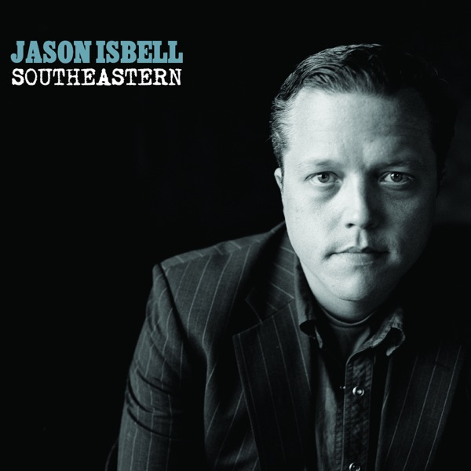

*High-Resolution Master Artwork Archive:* [Southeastern Cover Art](https://is1-ssl.mzstatic.com/image/thumb/Music125/v4/bf/91/d6/bf91d61c-303b-1e25-d82c-2cf671fc7e14/886443984929.jpg/600x600bb.jpg)

### Curatorial Justification (Why It's on This List)
Written and recorded immediately following his newfound sobriety, Jason Isbell's 'Southeastern' is a monumental, unflinching confession of redemption, mortality, and love. Produced by Dave Cobb in Nashville, the record stripped away all country-rock bombast to focus on Isbell's weathered, soulful Southern voice and literary songwriting. Featuring modern standards like 'Cover Me Up' and 'Elephant', it is widely recognized as one of the greatest songwriting achievements of the 21st century.

### Front-to-Back Architecture (Narrative & Pacing)
The album opens with the naked, gut-wrenching plea of 'Cover Me Up'—an acoustic confession of love and survival that sets a standard of absolute truth. It moves through the heartbreaking cancer narrative of 'Elephant' and the driving southern rock of 'Flying Over Water', maintaining an emotional intensity that never falters, concluding with the quiet hope of 'Relatively Easy'.

### Audiophile & Production Breakdown
Dave Cobb's production philosophy centers on capturing live performances in a single room with vintage tube microphones and preamps. Isbell's acoustic guitar has rich low-end body and percussive pick attack; Amanda Shires's fiddle tracks float with sweet, organic air; and Isbell's voice is captured with staggering dynamic range, rising from a hushed whisper to a chest-rattling roar without clipping.

### Benchmark Demo Track: **"Cover Me Up"**
A test of vocal dynamic headroom. When Isbell reaches the climactic roar ('I sobered up and I swore off that stuff / Forever this time'), resolving equipment will render the full, raw power of his voice with complete harmonic richness and zero digital harshness.

### Tonal Anchor Bridge (Library Connection)
Directly connects to the raw, unvarnished acoustic songwriting and vocal conviction of Zach Bryan and Ella Langley's 'Dandelion'.

---

## 59. Lucinda Williams – *Car Wheels on a Gravel Road* (1998)

**Primary Label & Engineering:** `Mercury Records / Roy Bittan, Steve Earle, Ray Kennedy (Producers)`

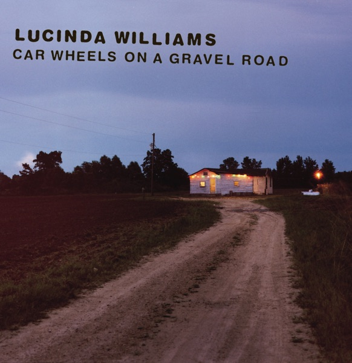

*High-Resolution Master Artwork Archive:* [Car Wheels on a Gravel Road Cover Art](https://is1-ssl.mzstatic.com/image/thumb/Music116/v4/7b/3a/55/7b3a5503-e015-2074-7aeb-c93c745b4cb7/06UMGIM05369.rgb.jpg/600x600bb.jpg)

### Curatorial Justification (Why It's on This List)
Six years in the making and re-recorded multiple times under Williams's perfectionist gaze, 'Car Wheels on a Gravel Road' is the definitive Americana masterpiece. Blending Delta blues, honky-tonk country, and Southern Gothic literature, Williams's drawling, whiskey-tinged voice charts a vivid map of small-town motels, gravel backroads, and broken hearts. It remains the gold standard of Southern narrative songwriting.

### Front-to-Back Architecture (Narrative & Pacing)
Opening with the breezy, infectious strum of 'Right in Time', the album moves across an unforgettable Southern travelogue: from the childhood memory of the title track into the fiery, overdriven blues of 'Can't Let Go' and the devastating eulogy 'Drunken Angel'. The album flows with impeccable pacing through to the swampy, melancholic finale 'Jackson'.

### Audiophile & Production Breakdown
Co-produced with Steve Earle and Ray Kennedy (the 'Twangtrust'), the album possesses a crystalline, punchy analog signature. Gurf Morlix and Bo Ramsey's slide and acoustic guitars ring with sweet, singing sustain; Donald Lindley's drum tracking is tight, punchy, and deeply grooved; and Williams's voice is captured with stunning presence, highlighting every throat catch and emotional fracture.

### Benchmark Demo Track: **"Car Wheels on a Gravel Road"**
Test for snare drum snap and acoustic guitar articulation. The rhythmic chug of the acoustic rhythm guitar and the biting slide fills require crisp transient separation. Williams's vocal drawl sits right up front with palpable emotional weight.

### Tonal Anchor Bridge (Library Connection)
The definitive ancestor to Ella Langley's authentic Southern storytelling on 'Dandelion' and Sheryl Crow's roots-rock classics.

---

## 60. Emmylou Harris – *Wrecking Ball* (1995)

**Primary Label & Engineering:** `Asylum / Daniel Lanois (Producer & Mixer), Kingsway Studios (New Orleans)`

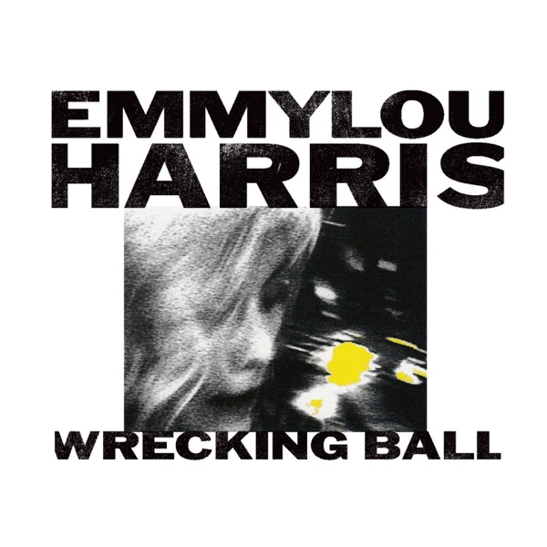

*High-Resolution Master Artwork Archive:* [Wrecking Ball Cover Art](https://is1-ssl.mzstatic.com/image/thumb/Music6/v4/bf/86/50/bf86508b-8390-fb23-eb78-eea999e32c07/075597955699.jpg/600x600bb.jpg)

### Curatorial Justification (Why It's on This List)
At age 48, country legend Emmylou Harris teamed up with producer Daniel Lanois (U2, Peter Gabriel, Bob Dylan) to reinvent American roots music. Setting aside traditional Nashville acoustic arrangements, Lanois immersed Harris's silver soprano in an atmospheric dreamscape of cavernous dub delays, distorted acoustic guitars, and primal hand drums. Covering songs by Neil Young, Jimi Hendrix, Bob Dylan, and Gillian Welch, 'Wrecking Ball' is an otherworldly, mystical masterpiece.

### Front-to-Back Architecture (Narrative & Pacing)
The album opens with the mysterious, echoing pulse of 'Where Will I Be', setting a nocturnal, spiritual tone. The title track (written by Neil Young, who provides backing vocals) is an aching waltz bathed in shimmering ambient treatments. The record weaves through the gothic folk of 'Deeper Well' and the heartbreaking beauty of 'Sweet Old World' before closing with 'Waltz Across Texas Tonight'.

### Audiophile & Production Breakdown
Recorded at Lanois's Kingsway mansion in New Orleans, the album is a benchmark for atmospheric soundstage depth and subterranean low-end rumble. Lanois tracked Harris's acoustic guitar through a distorted Fender Deluxe, blending it with Larry Mullen Jr.'s heavy, reverbed tom-toms. Harris's ethereal soprano voice floats with ghostlike purity in a vast, multi-layered acoustic cathedral.

### Benchmark Demo Track: **"Where Will I Be"**
The ultimate test for deep bass resonance and spatial atmospheric decay. The booming bass drum and reverberant shaker create an enormous soundstage, while Harris's voice and Lanois's electric guitar float across the stereo field with spellbinding clarity.

### Tonal Anchor Bridge (Library Connection)
Bridges the atmospheric, reverberant sacred stillness of Audrey Assad's 'Inheritance' and Hillsong UNITED's 'Empires' with classic country roots.

---

## 61. Brandi Carlile – *By the Way, I Forgive You* (2018)

**Primary Label & Engineering:** `Low Country Sound / Elektra / Dave Cobb & Shooter Jennings (Producers), RCA Studio A`

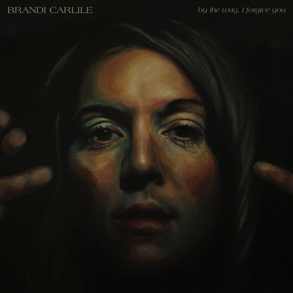

*High-Resolution Master Artwork Archive:* [By the Way, I Forgive You Cover Art](https://is1-ssl.mzstatic.com/image/thumb/Music124/v4/de/fb/dc/defbdc21-b070-7958-289f-13afa90186c2/075679885449.jpg/600x600bb.jpg)

### Curatorial Justification (Why It's on This List)
Recorded live off the floor at RCA Studio A in Nashville with producers Dave Cobb and Shooter Jennings, Brandi Carlile's sixth album catapulted her into the pantheon of great American vocalists. Exploring radical empathy, parenthood, addiction, and forgiveness, Carlile's performances—backed by the Hanseroth twins' acoustic guitars and Paul Buckmaster's final orchestral arrangements—are monumental in their emotional power and technical mastery.

### Front-to-Back Architecture (Narrative & Pacing)
Beginning with the slow-building, acoustic-to-orchestral triumph of 'Every Time I Hear That Song', the record reaches an early mountain peak with the civil rights anthem 'The Joke'. The narrative balances tender maternal lullabies ('The Mother') with devastating opioid elegies ('Sugartooth') before culminating in the soaring, acoustic resolution of 'Party of One'.

### Audiophile & Production Breakdown
Tracked live with minimal overdubs, the record preserves the magnificent acoustic volume of RCA Studio A. Cobb recorded Carlile's vocals using vintage tube microphones, allowing her to transition from a delicate falsetto whisper to a room-shaking vocal break with zero audible compression artifacts. The string quartet was recorded in the same room, bleeding into the vocal mics with organic warmth.

### Benchmark Demo Track: **"The Joke"**
The definitive test for vocal dynamic range and emotional headroom. When Carlile unleashes her full vocal power on the final chorus ('I have been to the movies / I've seen how it ends'), your audio system must handle the massive dynamic swell without clipping or thinning out in the upper midrange.

### Tonal Anchor Bridge (Library Connection)
Shares the soaring, heart-stopping vocal power and confessional vulnerability celebrated on Adele's '21' and Kacey Musgraves' 'Golden Hour'.

---

## 62. John Prine – *John Prine* (1971)

**Primary Label & Engineering:** `Atlantic Records / Arif Mardin (Producer), A&R Studios (NYC)`

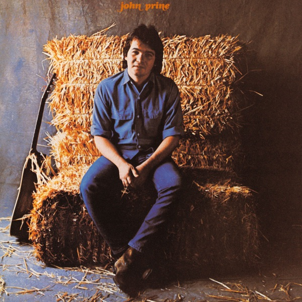

*High-Resolution Master Artwork Archive:* [John Prine Cover Art](https://is1-ssl.mzstatic.com/image/thumb/Music1/v4/70/1f/ec/701fec1e-e9c0-6f34-9d0e-43eca7ae1e6a/603497887583.jpg/600x600bb.jpg)

### Curatorial Justification (Why It's on This List)
Arriving as a 24-year-old former mail carrier from Maywood, Illinois, John Prine's debut album is one of the greatest songwriting introductions in musical history. Containing 'Sam Stone', 'Angel from Montgomery', 'Hello in There', and 'Paradise'—all on a single record—Prine displayed an empathy and poetic wisdom that seemed impossible for a young man. Produced by Arif Mardin, it is an essential, unbroken acoustic masterpiece of humor, heartbreak, and human dignity.

### Front-to-Back Architecture (Narrative & Pacing)
The album moves seamlessly between poignant character studies and witty, satirical bluegrass romps. From the tender empathy for the elderly in 'Hello in There' into the devastating tragedy of the addicted veteran in 'Sam Stone', Prine never misses an emotional mark. The record balances sadness with joy on 'Spanish Pipedream' and 'Illegal Smile', resolving in the gentle country-folk of 'Far from Me'.

### Audiophile & Production Breakdown
Recorded at A&R Studios in New York by legendary producer Arif Mardin, the production is wonderfully warm, unadorned, and direct. Prine's Martin acoustic guitar has crisp, percussive fingerpicking definition; Leo LeBlanc's pedal steel guitar weeps with authentic spring-reverb sweetness; and Prine's rough, conversational baritone sits right in front of the listener with startling intimacy.

### Benchmark Demo Track: **"Sam Stone"**
A masterclass in lyrical focus and acoustic guitar timbre. Notice the intimate scrape of Prine's thumb across the acoustic bass strings and the gentle swell of the organ in the chorus ('There's a hole in daddy's arm where all the money goes'). Resolving systems will highlight the subtle emotional tremble in his voice.

### Tonal Anchor Bridge (Library Connection)
The fundamental songwriting benchmark that inspired Kacey Musgraves' witty storytelling on 'Golden Hour' and Zach Bryan's raw poetry.

---

## 63. Townes Van Zandt – *Townes Van Zandt* (1969)

**Primary Label & Engineering:** `Poppy Records / Kevin Eggers & Jack Clement (Producers)`

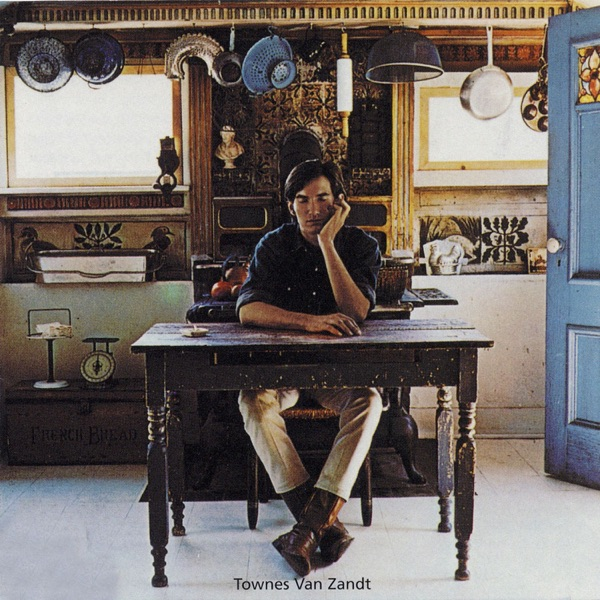

*High-Resolution Master Artwork Archive:* [Townes Van Zandt Cover Art](https://is1-ssl.mzstatic.com/image/thumb/Music124/v4/8c/0a/5f/8c0a5f2a-2cd5-df83-032d-7c25a9392f38/886446251875.jpg/600x600bb.jpg)

### Curatorial Justification (Why It's on This List)
Townes Van Zandt was Texas's greatest poet of sorrow, wandering, and existential twilight. His self-titled third album features definitive, stripped-down re-recordings of his greatest masterpieces ('For the Sake of the Song', 'Waiting Around to Die', 'I'll Be Here in the Morning'). Accompanied primarily by his intricate fingerpicked acoustic guitar and gentle bass, Van Zandt's haunted, resonant voice delivers songs that feel as timeless and elemental as the prairie wind.

### Front-to-Back Architecture (Narrative & Pacing)
Opening with the majestic acoustic sweep of 'For the Sake of the Song', the album descends into the bleak, terrifying depths of 'Waiting Around to Die'—one of the darkest country-blues narratives ever recorded. It shifts into tender romantic longing on 'Faretheewell, Miss Carousel' before concluding with the quiet, devastating acoustic prayer of 'None But the Rain'.

### Audiophile & Production Breakdown
Unlike his over-orchestrated debut, this self-titled release stripped away extraneous studio gloss. Van Zandt's acoustic guitar was recorded with close-mic fidelity, highlighting his rapid, alternating-bass Travis picking. The tape hiss of late-60s analog tracking adds a warm, nostalgic patina, while his deep baritone vocal occupies a dry, uncolored phantom center.

### Benchmark Demo Track: **"Waiting Around to Die"**
Test for vocal gravity and fingerpicking micro-dynamics. Listen to the steady, unhurried thumb thud on the lower acoustic guitar strings and the absolute stillness of the room. Townes's voice possesses a hollow, heartbreaking resonance that demands high-resolution playback.

### Tonal Anchor Bridge (Library Connection)
Directly connects to the raw, harrowing acoustic beauty of Nirvana's 'MTV Unplugged in New York' and Elliott Smith's 'Either/Or'.

---

## 64. Sturgill Simpson – *Metamodern Sounds in Country Music* (2014)

**Primary Label & Engineering:** `High Top Mountain / Dave Cobb (Producer & Mixing Engineer)`

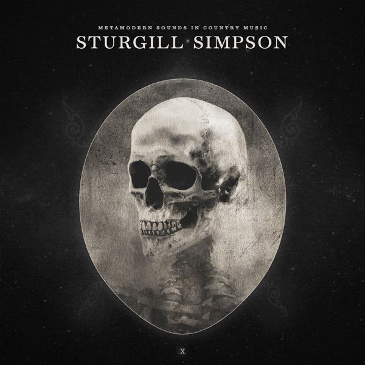

*High-Resolution Master Artwork Archive:* [Metamodern Sounds in Country Music Cover Art](https://is1-ssl.mzstatic.com/image/thumb/Music221/v4/24/5c/b1/245cb120-748e-982d-2bb9-4c21523e1b67/886444551298.jpg/600x600bb.jpg)

### Curatorial Justification (Why It's on This List)
Tracked in just four days on a shoestring budget with Dave Cobb, 'Metamodern Sounds in Country Music' revolutionized modern country. Simpson fused the traditional outlaw baritone of Waylon Jennings with Tibetan Buddhist philosophy, psychedelic DMT trips, and cosmic love. Anchored by Laur Joamets's astonishing, shimmering Telecaster and slide guitar virtuosity, the record proved that traditional roots music could expand consciousness while retaining pure honky-tonk grit.

### Front-to-Back Architecture (Narrative & Pacing)
From the iconic opening line of 'Turtles All the Way Down' ('There's a gateway in our mind that leads somewhere to the heart of the divine'), the album moves through blistering roadhouse shuffles ('Life of Sin'), the stunning, soulful reinvention of 80s synth-pop hit 'The Promise', and the nine-minute psychedelic reverse-tape freakout 'It Ain't All Flowers'.

### Audiophile & Production Breakdown
Dave Cobb's four-day session was tracked live off the floor to analog tape with zero click tracks or autotune. The low-end has genuine acoustic bounce; Joamets's slide guitar soars with natural tube-amplifier compression; and Simpson's commanding, chest-heavy voice occupies a wide, realistic room space with authentic tape slapback echo.

### Benchmark Demo Track: **"Turtles All the Way Down"**
Test for vocal body resonance and tape slapback delay. Listen for the warm, wooden acoustic guitar strumming and the sweet, crying slide guitar fills. Resolving systems will convey the live, eye-to-eye interplay between the four musicians in the studio.

### Tonal Anchor Bridge (Library Connection)
Shares the genre-expanding psychedelic country brilliance of Kacey Musgraves' 'Golden Hour' and the raw energy of The Black Keys.

---

## 65. Sierra Ferrell – *Trail of Flowers* (2024)

**Primary Label & Engineering:** `Rounder Records / Gary Paczosa & Eddie Spear (Producers)`

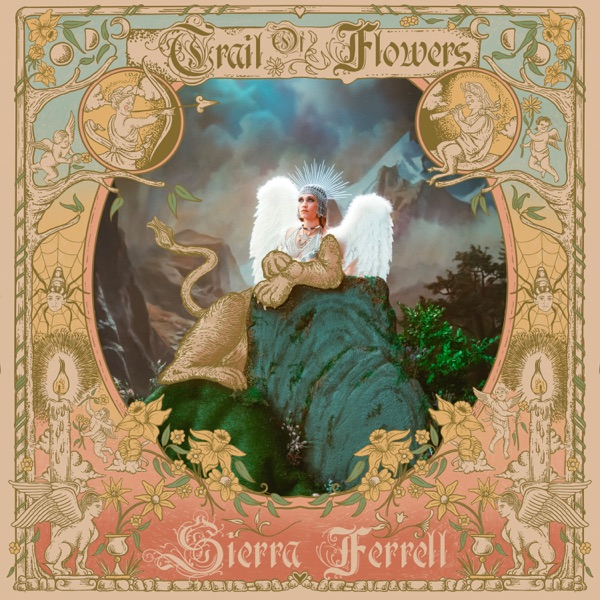

*High-Resolution Master Artwork Archive:* [Trail of Flowers Cover Art](https://is1-ssl.mzstatic.com/image/thumb/Music116/v4/01/ee/fa/01eefa4e-690e-828a-ff09-f063d885f45d/23CRGIM38477.rgb.jpg/600x600bb.jpg)

### Curatorial Justification (Why It's on This List)
West Virginia nomad Sierra Ferrell achieved acoustic perfection on 'Trail of Flowers'. Co-produced by bluegrass engineering legend Gary Paczosa (Alison Krauss, Dolly Parton) and Eddie Spear, the album weaves 1920s jazz, old-time stringband bluegrass, and classic country into a dazzling tapestry. Ferrell's elastic, bell-like vocal delivery—effortlessly yodeling, crying, and swinging—anchors an album that radiates infectious joy, historical reverence, and virtuoso acoustic picking.

### Front-to-Back Architecture (Narrative & Pacing)
Opening with the high-octane, banjo-and-fiddle bluegrass sprint of 'American Dreaming', the album flows into the irresistible honky-tonk groove of 'Dollar Bill Bar'. Ferrell effortlessly shifts into the haunting, ancient Appalachian murder-ballad intensity of 'Fox Hunt' before concluding with the tender, acoustic-and-accordion waltz 'No Saba'.

### Audiophile & Production Breakdown
Gary Paczosa is universally regarded as the greatest acoustic string engineer in Nashville history. Tracked through custom tube preamps and ribbon microphones, every acoustic instrument possesses lifelike transient definition: the banjo rings with metallic brilliance without ear fatigue, the upright bass has round, woody punch, and Ferrell's voice is captured with stunning, three-dimensional purity.

### Benchmark Demo Track: **"Fox Hunt"**
An incredible test for transient speed, fiddle overtones, and dynamic swing. The twin fiddles attack with lightning velocity in a wide stereo field, driven by a galloping acoustic rhythm. Resolving gear will keep Ferrell's soaring holler perfectly distinct from the furious picking.

### Tonal Anchor Bridge (Library Connection)
Directly complements the authentic country swagger of Ella Langley's 'Dandelion' and the acoustic bluegrass beauty of Kacey Musgraves.

---

## 66. Margo Price – *Midwest Farmer's Daughter* (2016)

**Primary Label & Engineering:** `Third Man Records / Alex Munoz & Matt Ross-Spang, Historic Sun Studio (Memphis)`

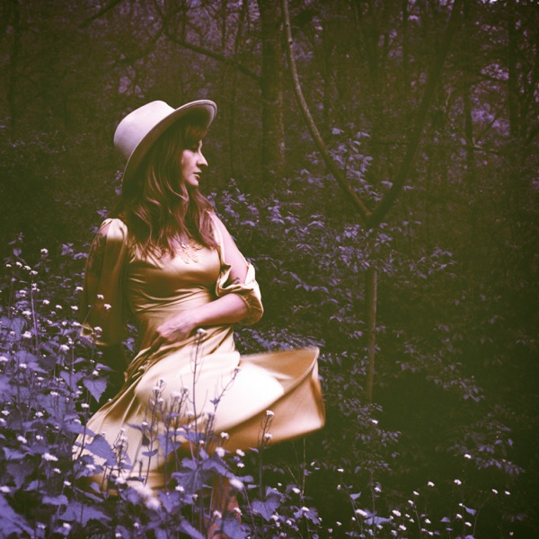

*High-Resolution Master Artwork Archive:* [Midwest Farmer's Daughter Cover Art](https://is1-ssl.mzstatic.com/image/thumb/Music221/v4/05/bc/85/05bc8515-a2b1-3a53-b266-151273eff771/60620.jpg/600x600bb.jpg)

### Curatorial Justification (Why It's on This List)
To fund the recording of her debut, Margo Price pawned her wedding ring and sold her car, decamping to legendary Sun Studio in Memphis to track live to two-inch tape. Jack White heard the finished tapes and immediately signed her to Third Man Records. 'Midwest Farmer's Daughter' is an uncompromising, autobiographical honky-tonk classic documenting family farm foreclosures, the tragic loss of a child, and industry sexism with the fiery conviction of Loretta Lynn and Dolly Parton.

### Front-to-Back Architecture (Narrative & Pacing)
The album opens with 'Hands of Time'—a sweeping, six-minute autobiographical tour de force backed by lush strings and pedal steel. It moves through the biting honky-tonk wit of 'Since You Put Me Down' and 'About to Find Out', concluding on the hard-won redemption and resilient groove of 'World's Greatest Loser'.

### Audiophile & Production Breakdown
Recorded at Sun Studio by Matt Ross-Spang using the historic room's natural slapback acoustics and vintage tape machines. The drums have authentic Sun Studio punch, the pedal steel glides with warm analog sustain, and Price's voice possesses a rich, uncompressed presence that cuts through the mix with razor-sharp emotional honesty.

### Benchmark Demo Track: **"Hands of Time"**
A test of analog tape warmth and string arrangement depth. Listen to the gentle chug of the acoustic rhythm guitar and the sweet, reverberant bloom of the pedal steel and string section. Price's vocal sits centered with palpable emotional weight.

### Tonal Anchor Bridge (Library Connection)
The direct musical sister to Ella Langley's 'Dandelion' and Sheryl Crow's roots-rock storytelling.

---

## 67. Tyler Childers – *Purgatory* (2017)

**Primary Label & Engineering:** `Hickman Holler / Sturgill Simpson & David Ferguson, The Butcher Shoppe (Nashville)`

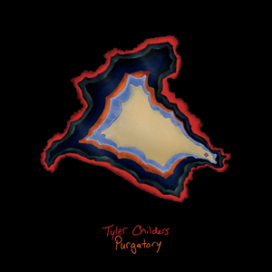

*High-Resolution Master Artwork Archive:* [Purgatory Cover Art](https://upload.wikimedia.org/wikipedia/en/1/14/Tyler_Childers_-_Purgatory.png)

### Curatorial Justification (Why It's on This List)
Co-produced by Sturgill Simpson and legendary Johnny Cash engineer David Ferguson at The Butcher Shoppe in Nashville, 'Purgatory' introduced the raspy, electrifying Kentucky voice of Tyler Childers. Chronicling the sins, romances, and redemptions of a young man growing up in Lawrence County, the record balances blistering bluegrass picking with deeply poetic, vulnerable songwriting. It stands as one of the defining roots albums of the modern era.

### Front-to-Back Architecture (Narrative & Pacing)
The record's ten tracks are sequenced as a spiritual journey from youthful reckless sin to marital redemption. From the high-energy, fiddle-driven rush of 'I Swear (To God)' into the anthemic Appalachian poetry of 'Feathered Indians' and the raw country-rock of 'Whitehouse Road', the album culminates in the sacred, fingerpicked acoustic devotion of 'Lady May'.

### Audiophile & Production Breakdown
David Ferguson and Sturgill Simpson tracked the album live with a world-class band including Stuart Duncan on fiddle and Russ Pahl on pedal steel. The acoustic instruments are rendered with sparkling transient clarity and natural stereo separation. Childers's voice was captured with zero vocal correction, highlighting his ragged, soaring upper register.

### Benchmark Demo Track: **"Feathered Indians"**
Test for acoustic guitar body resonance and vocal presence. The rhythmic strum of Childers's acoustic guitar drives the track, complemented by Stuart Duncan's sweet fiddle fills. His vocals ring out with incredible clarity and passionate dynamics.

### Tonal Anchor Bridge (Library Connection)
The direct artistic cousin to Zach Bryan's raw acoustic anthems and Ella Langley's authentic Southern roots.

---

## 68. Julia Jacklin – *Crushing* (2019)

**Primary Label & Engineering:** `Polyvinyl / Transgressive / Burke Reid (Producer & Mixing Engineer)`

*High-Resolution Master Artwork Archive:* [Crushing Cover Art](https://is1-ssl.mzstatic.com/image/thumb/Music211/v4/bd/13/4f/bd134f31-d494-a64b-43c7-84511f2e92ab/644110037893.png/600x600bb.jpg)

### Curatorial Justification (Why It's on This List)
Australian songwriter Julia Jacklin's sophomore album 'Crushing' is a masterclass in emotional vulnerability, physical autonomy, and room ambience. Written in the wake of an agonizing breakup, Jacklin's whisper-to-cry vocal dynamics examine the complexities of intimacy, consent, and heartbreak with devastating candor. Tracked live with minimal processing, the album has an unvarnished immediacy that makes the listener feel as though they are sitting inches from Jacklin in an empty room.

### Front-to-Back Architecture (Narrative & Pacing)
The album opens with the stark, slow-burning bass-and-drum pulse of 'Body', setting an unflinching tone. It builds through the searing emotional catharsis of 'Head Alone' ('I don't want to be touched all the time / I want to say no') and the swaying waltz of 'Don't Know How to Keep Loving You', concluding on the gentle, acoustic-and-vocal stillness of 'Comfort'.

### Audiophile & Production Breakdown
Produced by Burke Reid, 'Crushing' is celebrated for its warm, uncompressed drum sound and holographic vocal placement. The drum kit has an authentic, wooden room bounce; the electric guitars are lightly driven through vintage tube amps with subtle spring reverb; and Jacklin's voice is tracked with extraordinary proximity, capturing every subtle throat vibration and breath.

### Benchmark Demo Track: **"Don't Know How to Keep Loving You"**
A masterclass in dynamic buildup and room ambience. The track begins with delicate, swaying guitar chords and intimate vocals. At 2:40, the guitar solo and full rhythm section swell into an emotional crescendo that tests amplifier headroom and vocal clarity.

### Tonal Anchor Bridge (Library Connection)
Directly connects the intimate, unhurried vocal delivery of Faye Webster's 'I Know I'm Funny haha' with Norah Jones's 'Come Away With Me'.

---

## 69. Lucy Dacus – *Home Video* (2021)

**Primary Label & Engineering:** `Matador Records / Collin Pastore & Jake Finch, Trace Horse Studio (Nashville)`

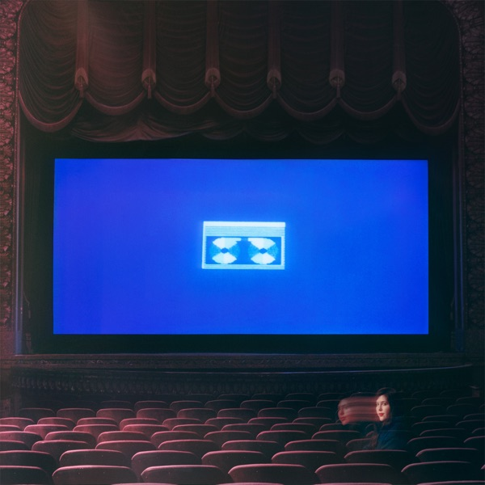

*High-Resolution Master Artwork Archive:* [Home Video Cover Art](https://is1-ssl.mzstatic.com/image/thumb/Music221/v4/cb/cb/24/cbcb2433-3345-dfcb-9357-949bcb1cf883/191401173674.png/600x600bb.jpg)

### Curatorial Justification (Why It's on This List)
A member of boygenius alongside Phoebe Bridgers and Julien Baker, Lucy Dacus reached a songwriting pinnacle on 'Home Video'. Revisiting her adolescent journals from her Christian youth in Richmond, Virginia, Dacus crafted a stunningly detailed, compassionate memoir of burgeoning sexuality, religious guilt, and fierce adolescent friendships. Her rich, warm contralto voice anchors an album that balances intimate acoustic folk with soaring alternative rock.

### Front-to-Back Architecture (Narrative & Pacing)
Opening with the gentle, organ-backed reflection of 'Hot & Heavy', the record moves through the infectious, chiming indie-pop of 'Brando' and 'First Time'. The devastating emotional centerpiece is 'Thumbs'—a chilling, synth-and-vocal narrative of protecting a best friend from an abusive father—before closing with the bittersweet nostalgia of 'Triple Dog Dare'.

### Audiophile & Production Breakdown
Recorded at Trace Horse Studio in Nashville by Collin Pastore and Jake Finch, the production emphasizes acoustic clarity and warm analog midrange. Dacus's contralto is rich, resonant, and centered, with backing harmonies from Phoebe Bridgers and Julien Baker providing a delicate stereo halo. The guitars range from clean acoustic fingerpicking to textured, chorused electric leads.

### Benchmark Demo Track: **"Thumbs"**
The ultimate test for vocal isolation and low-frequency synthesizer drone. Dacus's voice is accompanied only by an analog synthesizer and Mellotron. Resolving systems will convey the eerie, suspended stillness of the room and the chilling intimacy of her vocal phrasing.

### Tonal Anchor Bridge (Library Connection)
Shares the detailed autobiographical lyricism and warm acoustic textures of Taylor Swift's 'folklore' and Phoebe Bridgers.

---

## 70. Madi Diaz – *History of a Feeling* (2021)

**Primary Label & Engineering:** `ANTI- Records / Andrew Sarlo (Producer & Mixing Engineer)`

*High-Resolution Master Artwork Archive:* [History of a Feeling Cover Art](https://is1-ssl.mzstatic.com/image/thumb/Music125/v4/71/30/6e/71306e2f-62d5-db79-3ef6-c42ffbdfd5f8/0045778782062.png/600x600bb.jpg)

### Curatorial Justification (Why It's on This List)
Written during the profound dissolution of a multi-year partnership as her partner transitioned gender, Madi Diaz's 'History of a Feeling' is one of the most raw, unflinching heartbreak records of the decade. Produced by Andrew Sarlo (Big Thief, Adrianne Lenker), the album avoids all pop gloss in favor of jagged acoustic guitars, heavy drums, and Diaz's soaring, cracked vocal delivery. It is an unsparing, deeply compassionate portrait of grief, anger, and hard-won self-reclamation.

### Front-to-Back Architecture (Narrative & Pacing)
Opening with the delicate, fingerpicked vulnerability of 'Rag Doll', the album detonates into the searing acoustic fury of 'Resentment' and 'Woman in Everyone'. The narrative balances quiet acoustic stillness ('Man in Me') with explosive catharsis ('Crying in Public'), culminating in the healing, transcendent title track.

### Audiophile & Production Breakdown
Andrew Sarlo's production emphasizes visceral acoustic dynamics and unvarnished vocal proximity. Diaz's voice was tracked with zero audible pitch correction, capturing the full emotional weight of her cracks, breaths, and belts. The acoustic guitars have rich percussive snap, while the live bass and kick drum provide a heavy, grounded foundation.

### Benchmark Demo Track: **"Resentment"**
Test for acoustic guitar attack and vocal dynamic transition. The song begins with a quiet, dry acoustic strum before Diaz's voice swells into a heartbreaking, full-throated chorus. Resolving gear will preserve her vocal texture without harshness.

### Tonal Anchor Bridge (Library Connection)
Connects the confessional vocal fury and acoustic intimacy of Adele's '21' with the lyrical honesty of Kacey Musgraves.

---

# Category VI: Avant-Pop, Baroque Grandeur & High-Art Synthesis

> **Sonic Signature:** *Architectural pacing, Fairlight CMI / analog synths, orchestral counterpoint, dynamic vocal gymnastics, bold thematic world-building.*

## The Sound of Category VI: The Architectural Hall: Orchestral Counterpoint, Digital Samplers & Dynamic Drama

> *"A breathtaking collision of classical orchestral grandeur, experimental synthesis, and theatrical vocal acrobatics. Pushes modern audio reproduction to its absolute limits through massive dynamic range, intricate layering, and panoramic spatial design."*

### Acoustic Archetype & Engineering Philosophy
Unites the high-fidelity rigor of classical symphonic recording (Decca Tree mic arrays in concert halls) with groundbreaking electronic synthesis. Features early digital samplers (Fairlight CMI, Synclavier) alongside analog synthesizers (Prophet-5, Minimoog, Yamaha CS-80) and 40-piece chamber orchestras. Vocals are captured with ultra-wide-bandwidth microphones (Telefunken ELA M 251, Sony C-800G, Neumann U47) to effortlessly track extreme dynamic leaps—from delicate, whispered multi-part harmonies to operatic, multi-octave fortissimo climaxes.

### Frequency Architecture & Spectral Balance
Boasts an enormous frequency spectrum spanning 20Hz to 25kHz. Sub-bass frequencies (25Hz–55Hz) feature synthetic pulses and floor-shaking timpani rolls that deliver immense physical weight beneath delicate acoustic arrangements. The midrange (500Hz–3kHz) is a complex, densely woven tapestry of harps, cellos, oboes, and vocal choirs that requires clean transient separation to avoid acoustic congestion. The top end (8kHz–20kHz) is sparkling, crystalline, and airy: pizzicato violins, glass marimbas, and shimmering vocal overtones hover in the upper atmosphere with pin-point clarity.

### Spatial Soundstaging & Holographic Imaging
Cinematic, theatrical, and panoramic. The soundstage is designed as a three-dimensional acoustic proscenium. Woodwinds and chamber strings occupy the mid-depth, electronic percussion and synth arpeggios sweep across the extreme left and right wings, while the lead vocal operates with shape-shifting spatiality—sometimes towering fifty feet high in a cavernous hall, sometimes whispering directly into the listener's ear canal.

### The Tactile Listening Experience
An exhilarating sonic rollercoaster. The music rewards high-transient-speed transducers capable of resolving dozens of simultaneous acoustic and electronic layers without intermodulation distortion. Listen for the daring arrangement transitions—where an intimate harp solo suddenly erupts into a tectonic barrage of synthesizers and brass—and savor the sheer audacity of the compositional vision.

---

## 71. Kate Bush – *Hounds of Love* (1985)

**Primary Label & Engineering:** `EMI Records / Kate Bush (Producer & Engineer), Fairlight CMI, 48-Track Studio`

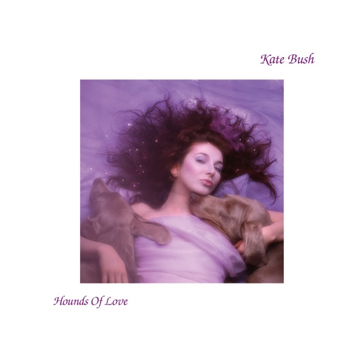

*High-Resolution Master Artwork Archive:* [Hounds of Love Cover Art](https://is1-ssl.mzstatic.com/image/thumb/Music116/v4/62/97/32/62973286-5bb3-0de7-c051-8b2de8d95472/cover.jpg/600x600bb.jpg)

### Curatorial Justification (Why It's on This List)
The towering masterpiece that defined avant-garde art-pop, 'Hounds of Love' was written, produced, and engineered by Kate Bush in her custom-built 48-track home studio in Kent. Escaping record label interference, Bush harnessed the Fairlight CMI sampling synthesizer, Irish traditional instruments (uilleann pipes, bouzouki), and thunderous LinnDrum programming to create an album of two distinct halves: a collection of flawless, cinematic pop hits (Side A) and an uninterrupted, conceptual suite about surviving drowning at sea (Side B: 'The Ninth Wave'). It is one of the greatest artistic achievements in modern music history.

### Front-to-Back Architecture (Narrative & Pacing)
Side A delivers an unbroken run of pop perfection: the galloping primal percussion of 'Running Up That Hill', the soaring string fanfare of 'Cloudbusting', and the dramatic passion of the title track. Side B ('The Ninth Wave') shifts into an immersive, seven-track conceptual suite: beginning with the claustrophobic piano dread of 'And Dream of Sheep', moving through the terrifying fever-dream dissonance of 'Waking the Witch', and culminating in the ecstatic, sunrise resurrection of 'The Morning Fog'.

### Audiophile & Production Breakdown
Engineered primarily by Bush with Haydn Bendall, the album possesses vast dynamic range and startling spatial separation. Bush's multi-layered vocal tracks—ranging from whispered confessional prayers to full-throated Celtic keening—are tracked with pristine presence. The live strings (The Medici Sextet) and Irish folk instruments are captured with rich acoustic resonance, contrasting gorgeously against the punchy digital crunch of the Fairlight CMI.

### Benchmark Demo Track: **"Running Up That Hill (A Deal with God)"**
The ultimate test for rhythmic propulsion and vocal layering. The thunderous LinnDrum groove provides a heavy, rolling foundation, while Bush's Fairlight string riff sweeps across the stereo channels. Notice the razor-sharp articulation of her double-tracked vocal harmonies in the upper midrange.

### Tonal Anchor Bridge (Library Connection)
The foundational high-art pop blueprint that directly inspired Lorde's 'Melodrama', Chappell Roan's theatrical brilliance, and Florence + The Machine's dramatic grandeur.

---

## 72. Björk – *Homogenic* (1997)

**Primary Label & Engineering:** `One Little Indian / Elektra / Björk & Mark Bell (LFO), El Cortijo Studios (Málaga)`

*High-Resolution Master Artwork Archive:* [Homogenic Cover Art](https://is1-ssl.mzstatic.com/image/thumb/Music126/v4/7f/bd/d0/7fbdd0e0-c588-ef4b-a6dd-4dca21f8b41f/081227607364.jpg/600x600bb.jpg)

### Curatorial Justification (Why It's on This List)
Seeking a sound that reflected the elemental, volcanic geography of her native Iceland, Björk created 'Homogenic' as an uncompromising fusion of classical acoustic strings and harsh, distorted electronic beats. Partnering with British techno pioneer Mark Bell (LFO) and the Icelandic String Octet, the record rejected conventional pop tropes in favor of soaring operatic melodies, tectonic sub-bass rumbles, and emotional rebirth. It remains a timeless, visionary monument of high-art electronic pop.

### Front-to-Back Architecture (Narrative & Pacing)
The album opens with the distorted, crunching volcanic beats of 'Hunter' and the cinematic national hymn 'Jóga'. The emotional narrative traverses the dramatic, orchestral tango of 'Bachelorette' and the glitching digital pulse of '5 Years', reaching transcendent peace on 'Pluto' (a furious rave catharsis) before resolving into the serene, weightless embrace of 'All Is Full of Love'.

### Audiophile & Production Breakdown
A supreme reference standard for acoustic string dynamics versus industrial electronic distortion. The Icelandic String Octet was recorded in a live stone room, providing magnificent acoustic bloom and rosin-on-bow texture. In stark contrast, Mark Bell's electronic beats were pushed through guitar pedals and analog distortion units, creating deep sub-bass frequencies and sharp transient spikes that test amplifier current reserves.

### Benchmark Demo Track: **"Jóga"**
The definitive test for dynamic contrast and frequency extremes. The track begins with warm, sweeping acoustic strings and Björk's crystalline soprano. At 1:15, a ferocious, distorted volcanic bass beat erupts underneath. High-resolving gear will keep the lush strings completely clear and uncompromised above the massive electronic assault.

### Tonal Anchor Bridge (Library Connection)
Directly informs the dramatic acoustic-electronic synthesis and vocal fearlessness found in Billie Eilish's 'HIT ME HARD AND SOFT' and Lorde's 'Melodrama'.

---

## 73. Weyes Blood – *Titanic Rising* (2019)

**Primary Label & Engineering:** `Sub Pop / Jonathan Rado & Natalie Mering (Producers), Sonora Recorders (LA)`

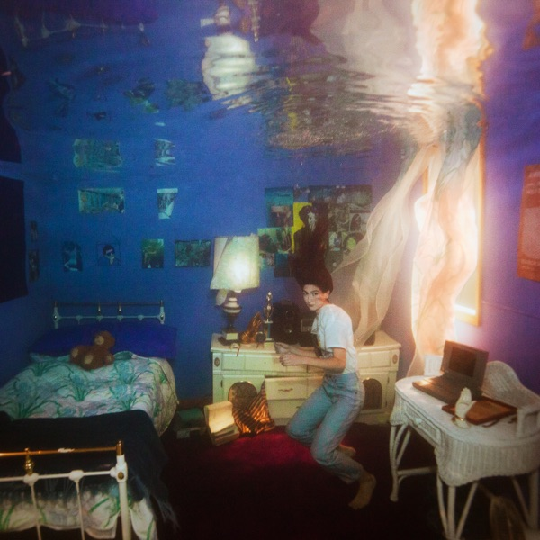

*High-Resolution Master Artwork Archive:* [Titanic Rising Cover Art](https://is1-ssl.mzstatic.com/image/thumb/Music115/v4/54/f6/fc/54f6fc73-6a18-d97a-a634-a4630ec35593/WeyesBlood_TitanicRising_3600.jpg/600x600bb.jpg)

### Curatorial Justification (Why It's on This List)
Natalie Mering's masterpiece as Weyes Blood, 'Titanic Rising' is a widescreen, baroque-pop symphony for the climate crisis era. Co-produced with Jonathan Rado (Foxygen), the album fuses the warm, majestic 1970s acoustic architecture of Karen Carpenter, Brian Wilson, and Joni Mitchell with eerie synthesizer drones and cinematic orchestration. Featuring an iconic, real underwater photograph for its cover, the record is an intoxicating, unbroken masterwork of romantic yearning and existential hope.

### Front-to-Back Architecture (Narrative & Pacing)
From the majestic, piano-led overture of 'A Lot's Gonna Change' into the shimmering cosmic glide of 'Andromeda' and the dramatic waltz of 'Everyday', the first half is an unmatched run of melodic grandeur. The centerpiece, 'Movies', begins as a delicate synth pulse before erupting into a dizzying Philip Glass-style orchestral arpeggio storm, concluding on the quiet acoustic reflection of 'Picture Me Better'.

### Audiophile & Production Breakdown
Recorded at Sonora Recorders in Los Angeles, the album is revered for its warm, tape-saturated analog soundstage. Mering's rich, resonant contralto is captured with stunning body and velvet smoothness in the center channel. The live chamber strings and Mellotron pads spread across the stereo panorama with authentic vintage room bloom and zero digital harshness.

### Benchmark Demo Track: **"Movies"**
An extraordinary test for orchestral dynamic expansion. The song begins with a hypnotic, pulsing analog synthesizer and Mering's intimate vocal. At 3:15, a massive, swirling string section sweeps into the room like a tidal wave. High-resolving systems will render the rapid string arpeggios with pinpoint separation without smearing.

### Tonal Anchor Bridge (Library Connection)
Directly mirrors the cinematic California melancholy, lush 70s piano chords, and vocal elegance of Lana Del Rey's 'Norman Fucking Rockwell!'.

---

## 74. FKA twigs – *MAGDALENE* (2019)

**Primary Label & Engineering:** `Young Turks / Nicolas Jaar, Jack Antonoff, Skrillex, FKA twigs`

*High-Resolution Master Artwork Archive:* [MAGDALENE Cover Art](https://upload.wikimedia.org/wikipedia/en/9/91/FKATwigs_Magdalene.png?utm_source=en.wikipedia.org&utm_campaign=api&utm_content=thumbnail_unscaled)

### Curatorial Justification (Why It's on This List)
Written and recorded following painful public heartbreak and laparoscopic surgery to remove six uterine fibroids, FKA twigs's 'MAGDALENE' is an operatic, avant-garde testament to female resilience. Drawing upon the archetypal myth of Mary Magdalene, twigs collaborated with Nicolas Jaar, Jack Antonoff, and Skrillex to deconstruct contemporary electronic pop. Her quivering, multi-octave soprano cuts through fractured trap beats, sacred choral harmonies, and cello arrangements with devastating vulnerability.

### Front-to-Back Architecture (Narrative & Pacing)
Opening with the sacred, multi-tracked choral invocation of 'thousand eyes', the album moves through the kinetic Kate Bush-inspired pop of 'sad day' and the industrial trap of 'holy terrain'. The emotional core arrives on 'mary magdalene' and 'fallen alien', before closing on the naked, heart-shattering acoustic piano ballad 'cellophane'.

### Audiophile & Production Breakdown
A masterclass in extreme frequency separation and vocal dynamic headroom. Twigs's operatic soprano extends with bell-like clarity into the highest acoustic registers without sibilance, while subterranean sub-bass frequencies plunge down to 25Hz. The sound design features razor-sharp transient Foley sounds (sword swings, breathing, clicking) panned dynamically across a three-dimensional field.

### Benchmark Demo Track: **"cellophane"**
The ultimate test for vocal purity and emotional acoustic decay. Twigs's voice is accompanied only by delicate piano chords and subtle percussive clicks. Notice the trembling fragility of her vibrato and the natural room decay when she belts the final, desperate plea ('Didn't I do it for you?').

### Tonal Anchor Bridge (Library Connection)
Combines the intimate, whispering vocal vulnerability of Billie Eilish with the raw confessional heartbreak of SZA's 'Ctrl'.

---

## 75. Caroline Polachek – *Desire, I Want to Turn Into You* (2023)

**Primary Label & Engineering:** `Perpetual Novice / Danny L Harle & Caroline Polachek (Producers)`

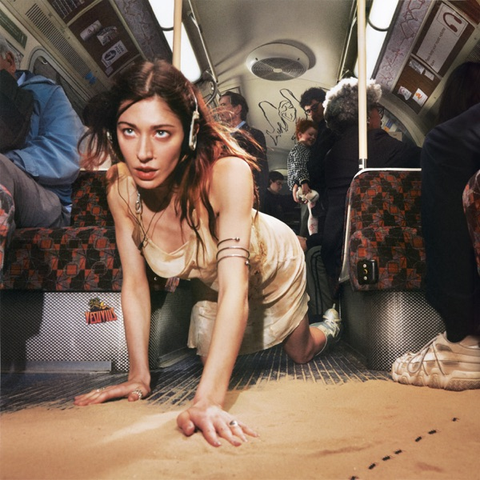

*High-Resolution Master Artwork Archive:* [Desire, I Want to Turn Into You Cover Art](https://is1-ssl.mzstatic.com/image/thumb/Music116/v4/10/51/f2/1051f2cc-195f-ddb6-2d9e-26c74f0387fd/197187988518.jpg/600x600bb.jpg)

### Curatorial Justification (Why It's on This List)
Co-produced with hyperpop architect Danny L Harle, 'Desire, I Want to Turn Into You' is an ecstatic, Mediterranean-infused triumph of vocal virtuosity and avant-pop world-building. Polachek deploys her astonishing classical soprano—complete with jaw-dropping melismatic vocal gymnastics, operatic glissandos, and zero pitch correction—over flamenco claps, acoustic guitars, Scottish Highland bagpipes, and UK garage breakbeats. It is an unbridled, joyous masterpiece of pop surrealism.

### Front-to-Back Architecture (Narrative & Pacing)
The album detonates with the euphoric, howling pop hook of 'Welcome to My Island' before transitioning into the sultry trip-hop of 'Pretty in Possible' and the acoustic flamenco-infused ecstasy of 'Sunset'. Tracks weave seamlessly into one another, culminating in the astonishing choir-backed epic 'Billions', where children's voices and bagpipes swell into a transcendent pop sunset.

### Audiophile & Production Breakdown
Danny L Harle's production is celebrated for its crystalline clarity, punchy transients, and expansive stereo imaging. Polachek's voice is recorded with immaculate high-frequency air, highlighting her rapid register shifts from resonant chest voice to whistle tones. Acoustic instruments (flamenco guitar, bagpipes, children's choir) are tracked with natural room presence against punchy modern bass.

### Benchmark Demo Track: **"Welcome to My Island"**
Test for vocal transient speed and high-register clarity. The opening vocal run requires instantaneous transient response and flawless midrange resolution. The kick drum punches with authoritative chest-thumping impact beneath the shimmering synths.

### Tonal Anchor Bridge (Library Connection)
Directly connects to the bold, theatrical pop brilliance and vocal acrobatics of Chappell Roan's 'Midwest Princess' and Marina's 'Electra Heart'.

---

## 76. Janelle Monáe – *The ArchAndroid* (2010)

**Primary Label & Engineering:** `Wondaland Arts Society / Bad Boy / Nate Wonder, Chuck Lightning, Janelle Monáe`

*High-Resolution Master Artwork Archive:* [The ArchAndroid Cover Art](https://is1-ssl.mzstatic.com/image/thumb/Music124/v4/9f/12/48/9f124811-b7e8-3312-a27f-b54a553cc644/mzi.rndulspu.jpg/600x600bb.jpg)

### Curatorial Justification (Why It's on This List)
An astonishing, kaleidoscopic sci-fi rock-opera inspired by Fritz Lang's 'Metropolis', 'The ArchAndroid' introduced Janelle Monáe's time-traveling android alter-ego Cindi Mayweather. Produced by the Wondaland collective in Atlanta, the seventy-minute double-suite effortlessly synthesizes James Brown funk, Bernard Herrmann film scores, Simon & Garfunkel folk, psychedelic glam rock, and hip-hop. Featuring appearances from Big Boi, Saul Williams, and of Montreal, it is one of the most audacious, brilliant concept albums ever made.

### Front-to-Back Architecture (Narrative & Pacing)
Comprising Suites II and III of Monáe's Metropolis concept, the record opens with a sweeping orchestral overture recorded by a live symphony. It blasts into the relentless, high-speed funk-rock sprint of 'Faster' and the immortal hit 'Tightrope', transitions through the raw punk fury of 'Cold War', and journeys through the psychedelic suite 'Mushrooms & Roses' before closing on 'BabopbyeYa'.

### Audiophile & Production Breakdown
Engineered and mixed by Nate Wonder at Wondaland Studios, the record is an audiophile tour de force. The dynamic range is immense: full orchestral movements swell and dissipate into quiet acoustic guitar fingerpicking. The live rhythm section punches with vintage analog warmth, while Monáe's vocals—moving from rapid-fire rapping to soaring Broadway belts—possess crystalline presence.

### Benchmark Demo Track: **"Tightrope (feat. Big Boi)"**
A masterclass in funk rhythm and stereo brass staging. The sharp, syncopated guitar strumming and punchy live horn section test transient attack, while Monáe's percussive vocal delivery demands pinpoint center-channel clarity.

### Tonal Anchor Bridge (Library Connection)
Expands the genre-bending conceptual ambition and theatrical brilliance of Outkast's 'Stankonia' and Janelle's later masterpiece 'Dirty Computer'.

---

## 77. Jessie Ware – *What's Your Pleasure?* (2020)

**Primary Label & Engineering:** `Virgin EMI / James Ford (Producer & Mixing Engineer)`

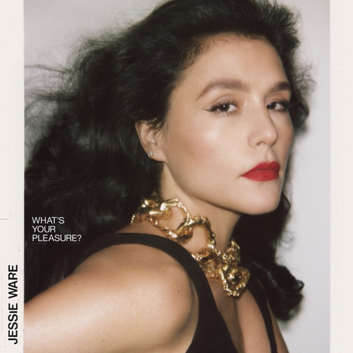

*High-Resolution Master Artwork Archive:* [What's Your Pleasure? Cover Art](https://is1-ssl.mzstatic.com/image/thumb/Music124/v4/47/03/39/47033970-a97a-e001-c84f-05365bd02f18/20UMGIM08956.rgb.jpg/600x600bb.jpg)

### Curatorial Justification (Why It's on This List)
Recorded with producer James Ford (Arctic Monkeys, Depeche Mode), 'What's Your Pleasure?' is an impeccable, velvet-draped celebration of late-1970s post-disco, New York club culture, and sophisti-pop. Stepping away from melancholic mid-tempo ballads, Jessie Ware reinvented herself as a disco diva of peerless sophistication. Bathed in lush orchestral strings, pulsing slap bass, and whispered vocal sensuality, the album flows with continuous, intoxicating momentum.

### Front-to-Back Architecture (Narrative & Pacing)
The album opens with the breathtaking orchestral string sweep of 'Spotlight' before locking into the hypnotic four-on-the-floor groove of the title track. The record maintains a seamless nocturnal pulse through the Hi-NRG rush of 'Soul Control', the seductive funk of 'Ooh La La', and the euphoric house strings of 'Save a Kiss', resolving in the majestic, slow-burning finale 'Remember Where You Are'.

### Audiophile & Production Breakdown
James Ford's production is an audiophile benchmark for modern disco engineering. The live string sections (arranged by Jules Buckley) swell with opulent, three-dimensional warmth across the stereo field. The basslines are fat, round, and articulate, locking in tightly with punchy acoustic kick drums. Ware's vocals are captured with sultry, close-mic intimacy, completely free of harsh sibilance.

### Benchmark Demo Track: **"Spotlight"**
A test of orchestral staging and bass groove transitions. The one-minute string intro showcases natural acoustic room decay before dropping into an irresistible disco bassline and crisp hi-hat groove. Resolving systems will preserve the lush string countermelodies swelling behind Ware's whisper-soft vocal.

### Tonal Anchor Bridge (Library Connection)
Shares the sophisticated dancefloor elegance, live bass groove, and vocal romance of Dua Lipa's 'Future Nostalgia' and Sade's 'Love Deluxe'.

---

## 78. Robyn – *Body Talk* (2010)

**Primary Label & Engineering:** `Konichiwa Records / Klas Åhlund (Producer & Mixing Engineer)`

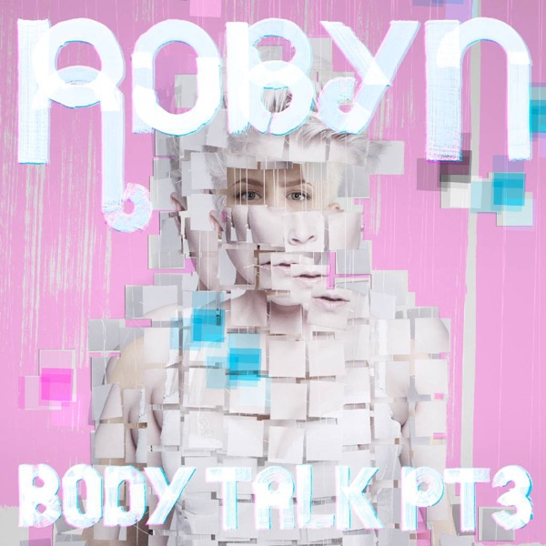

*High-Resolution Master Artwork Archive:* [Body Talk Cover Art](https://upload.wikimedia.org/wikipedia/en/c/cd/Body_Talk_by_Robyn.png?utm_source=en.wikipedia.org&utm_campaign=api&utm_content=thumbnail_unscaled)

### Curatorial Justification (Why It's on This List)
Swedish pop visionary Robyn invented the modern 'crying-in-the-club' pop paradigm with 'Body Talk'. Released across three revolutionary EPs in 2010 before being compiled into this definitive fifteen-track album, Robyn fused cold Scandinavian synthesizer minimalism with deep emotional devastation. Anchored by the immortal anthems 'Dancing On My Own' and 'Call Your Girlfriend', the record transformed mainstream pop, proving that club music could serve as a vessel for profound loneliness and self-reclamation.

### Front-to-Back Architecture (Narrative & Pacing)
The album balances propulsive, laser-guided electronic bangers ('Fembot', 'Dancing On My Own') with quirky dancehall ('Dancehall Queen') and acoustic vulnerability ('Indestructible' acoustic). The record flows with relentless, cathartic velocity, culminating in the bittersweet electro-house perfection of 'Call Your Girlfriend' and the ambient pulse of 'Stars 4-Ever'.

### Audiophile & Production Breakdown
Produced by Klas Åhlund, 'Body Talk' is celebrated for its surgical low-end punch and razor-sharp synthesizer transients. The electronic basslines hit with authoritative, tactile weight without clouding the mix. Robyn's vocals are tracked with dry, crystalline clarity, cutting through the dense analog synthesizer arpeggios with emotional urgency.

### Benchmark Demo Track: **"Dancing On My Own"**
The gold standard for electronic transient attack and bassline drive. The opening stuttering synthesizer pulse tests system speed and timing. When the heavy four-on-the-floor kick drops, high-resolving equipment will articulate the distinct layers of pulsing synths behind Robyn's centered, heartbreaking vocal delivery.

### Tonal Anchor Bridge (Library Connection)
The monumental pop blueprint that directly inspired Lorde's 'Melodrama' and Taylor Swift's '1989'.

---

## 79. Rina Sawayama – *SAWAYAMA* (2020)

**Primary Label & Engineering:** `Dirty Hit / Clarence Clarity (Producer & Mixing Engineer)`

*High-Resolution Master Artwork Archive:* [SAWAYAMA Cover Art](https://upload.wikimedia.org/wikipedia/en/8/83/Sawayama_by_Rina_Sawayama_album_cover_%28digital%29.png?utm_source=en.wikipedia.org&utm_campaign=api&utm_content=thumbnail_unscaled)

### Curatorial Justification (Why It's on This List)
Japanese-British artist Rina Sawayama detonated pop expectations on her breathtaking debut 'SAWAYAMA'. Produced alongside experimental pop architect Clarence Clarity, the album audaciously fused early-2000s Max Martin R&B pop hooks, Destiny's Child vocal harmonies, and blistering Deftones/Evanescence nu-metal guitar riffs. Exploring immigrant identity, familial trauma, capitalism, and queer joy, it is a fearless, impeccably sequenced sonic explosion.

### Front-to-Back Architecture (Narrative & Pacing)
The record opens with the operatic rock melodrama of 'Dynasty' before shifting into the biting anti-capitalist pop satire of 'XS' (which pairs sweet 2000s acoustic R&B strumming with crushing heavy-metal guitar stabs). The album races through the nu-metal rage of 'STFU!' and the euphoric house-pop of 'Comme Des Garçons', culminating in the stadium-sized pop-punk anthem 'Chosen Family'.

### Audiophile & Production Breakdown
Clarence Clarity's production is an extraordinary showcase of maximalist dynamic layering. Distorted heavy metal guitars, 808 sub-bass drops, and multi-tracked vocal harmonies collide across a wide stereo soundstage. Sawayama's vocals are tracked with immaculate precision, retaining razor-sharp high-frequency air even amidst ferocious instrumental density.

### Benchmark Demo Track: **"XS"**
Test for sudden dynamic shifts and tonal contrast. The song alternates between smooth, delicate acoustic R&B verses and crushing, distorted metal guitar stabs in the chorus. Resolving systems will deliver the sudden dynamic shock with explosive transient impact while keeping Sawayama's silky vocal runs perfectly intact.

### Tonal Anchor Bridge (Library Connection)
Directly connects the fierce, genre-blending pop-rock energy of Olivia Rodrigo's 'SOUR' and Lady Gaga's 'The Fame'.

---

## 80. Madonna – *Ray of Light* (1998)

**Primary Label & Engineering:** `Maverick / Warner Bros. / William Orbit & Madonna (Producers), Larrabee North`

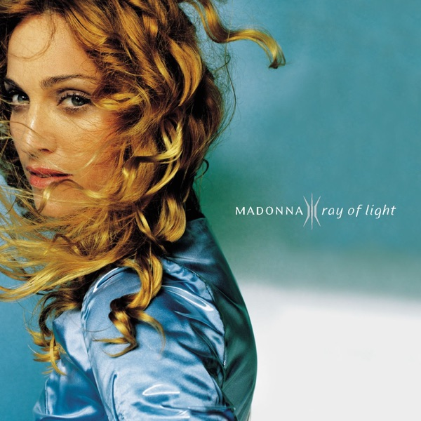

*High-Resolution Master Artwork Archive:* [Ray of Light Cover Art](https://is1-ssl.mzstatic.com/image/thumb/Music115/v4/dd/2b/8d/dd2b8d84-e032-94d2-473a-3f8efd18fe36/dj.rwfgroxa.jpg/600x600bb.jpg)

### Curatorial Justification (Why It's on This List)
Following the birth of her daughter Lourdes and intensive vocal training for 'Evita', Madonna partnered with British ambient-techno producer William Orbit to create 'Ray of Light'—her defining artistic masterpiece. Fusing electronic dance music, ambient soundscapes, Eastern mysticism (Kabbalah, Hinduism), and confessional songwriting, the album completely revitalized Madonna's career and transformed mainstream pop, proving that electronic music could possess spiritual depth and organic soul.

### Front-to-Back Architecture (Narrative & Pacing)
The album flows like an epic spiritual pilgrimage across sixty-seven minutes. Opening with the oceanic, ambient awakening of 'Drowned World / Substitute for Love', it surges through the shimmering, high-speed electronica of the title track and the dark, orchestral trip-hop majesty of 'Frozen'. The record weaves through Sanskrit chants ('Shanti/Ashtangi') before concluding with the bittersweet, acoustic-electronic lullaby 'Little Star' and 'Mer Girl'.

### Audiophile & Production Breakdown
William Orbit's production is celebrated for its warm analog synthesizers (Korg MS-20, Roland Juno), vintage tape delays, and cavernous reverbs. Madonna's vocals—vastly improved in breath control, chest power, and pitch—are captured with crystalline clarity. The low-end features deep, subterranean bass extension, while Orbit's acoustic and electric guitar loops shimmer across an expansive stereo panorama.

### Benchmark Demo Track: **"Frozen"**
The ultimate test for soundstage depth, orchestral strings, and deep electronic bass. The Middle Eastern string arrangement (arranged by Craig Armstrong) expands outward in an immense semi-circle, while the slow-burning electronic drum pulse drops with thunderous low-end authority. Madonna's voice floats like a solemn ice queen in the center.

### Tonal Anchor Bridge (Library Connection)
The landmark electronic pop foundation that inspired modern masterpieces by Lorde, Lana Del Rey, and Charli xcx.

---

## 81. Imogen Heap – *Speak for Yourself* (2005)

**Primary Label & Engineering:** `Megaphonic Records / Imogen Heap (Self-Produced, Engineered & Mixed)`

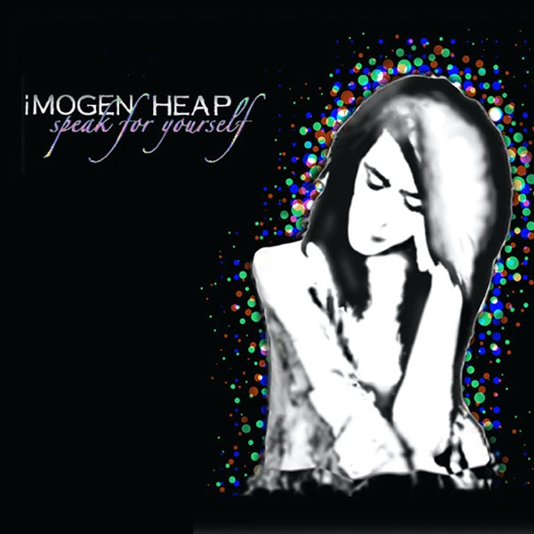

*High-Resolution Master Artwork Archive:* [Speak for Yourself Cover Art](https://is1-ssl.mzstatic.com/image/thumb/Music211/v4/e3/ac/ac/e3acac09-d933-bd4c-e6e1-3d66dc66bac2/886445364729_cover.jpg/600x600bb.jpg)

### Curatorial Justification (Why It's on This List)
Mortgaging her home to finance the recording and working in solitary isolation in her London home studio, Imogen Heap wrote, produced, arranged, and engineered 'Speak for Yourself' as an avant-pop triumph. Pioneering the use of the Digitech Vocalist Workstation harmonizer, micro-sampled foley percussion, and lush classical orchestration, Heap created an album of breathtaking emotional intimacy and technical innovation that influenced everyone from Taylor Swift to Billie Eilish.

### Front-to-Back Architecture (Narrative & Pacing)
The album opens with the cinematic, trip-hop-infused rush of 'Headlock' and the irresistible jangle of 'Goodnight and Go'. The emotional pinnacle is 'Hide and Seek'—an entirely a cappella masterpiece performed through a four-voice vocal harmonizer that became an indelible cultural touchstone. The album maintains its inventive beauty through to the soaring orchestral resolution of 'The Walk'.

### Audiophile & Production Breakdown
Heap's engineering is a masterclass in spatial micro-detail and vocal processing. She recorded unique foley sounds (lighting a stove, tapping glassware, clicking locks) to construct intricate percussive tracks. Her multi-layered vocals are panned with microscopic precision, while her acoustic piano and cello recordings possess rich, warm body resonance.

### Benchmark Demo Track: **"Hide and Seek"**
A legendary test for vocal harmonizer fidelity and pitch-perfect imaging. Tracked with only Heap's voice and the harmonizer keyboard, resolving systems will reveal the complex chordal overtones, subtle throat breaths, and total pitch-black background silence.

### Tonal Anchor Bridge (Library Connection)
The pioneering vocal production and harmonic blueprint that directly inspired Taylor Swift's '1989' and Billie Eilish's vocal stacking.

---

## 82. Rosalía – *MOTOMAMI* (2022)

**Primary Label & Engineering:** `Columbia Records / Pharrell Williams, El Guincho, Noah Goldstein, Rosalía`

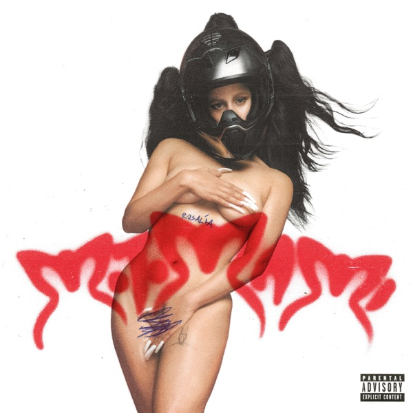

*High-Resolution Master Artwork Archive:* [MOTOMAMI Cover Art](https://is1-ssl.mzstatic.com/image/thumb/Music126/v4/5b/da/8d/5bda8d04-7f2f-4417-12a0-e039dd011152/886449800193.jpg/600x600bb.jpg)

### Curatorial Justification (Why It's on This List)
Spanish polymath Rosalía shattered global pop conventions with 'MOTOMAMI'—a collage of avant-garde minimalism, traditional flamenco cantaora vocals, industrial reggaeton, and confessional balladeering. Executive produced alongside Noah Goldstein (Kanye West) and El Guincho, the album is a radical exploration of duality: 'Moto' (the fierce, aggressive, hyperkinetic machine) and 'Mami' (the vulnerable, sacred, acoustic mother). It stands as one of the most sonically daring and critically acclaimed pop albums of the century.

### Front-to-Back Architecture (Narrative & Pacing)
The album moves with whiplash velocity across sixteen concise tracks. From the explosive industrial breakbeats of 'SAOKO' into the sultry bachata of 'LA FAMA' (feat. The Weeknd) and the naked, Auto-Tuned vocal minimalism of 'HENTAI'. The record culminates in 'SAKURA'—a live acoustic arena recording capturing Rosalía's astonishing, unvarnished flamenco melismas against cheering crowds.

### Audiophile & Production Breakdown
Engineered with extreme dynamic contrast, 'MOTOMAMI' alternates between completely dry, untreated vocals and deafening sub-bass explosions. The low-frequency extension on 'CUUUUuuuuuute' and 'SAOKO' will push subwoofers to their limits, while the acoustic ballads ('G3 N15', 'HENTAI') showcase Rosalía's breath control and chest resonance in startling proximity.

### Benchmark Demo Track: **"SAKURA"**
A benchmark for live vocal dynamics and stadium acoustics. Rosalía's voice transitions from a delicate whisper to an earth-shattering flamenco belt. Notice how the natural arena reverb decays into the crowd's ambient cheers without digital gating.

### Tonal Anchor Bridge (Library Connection)
Bridges the adventurous, bilingual vocal brilliance of Kali Uchis's 'Sin Miedo' with the boundary-pushing production of Billie Eilish.

---

## 83. Christine and the Queens – *Chris* (2018)

**Primary Label & Engineering:** `Because Music / Héloïse Letissier & Cole M.G.N. (Producers)`

*High-Resolution Master Artwork Archive:* [Chris Cover Art](https://is1-ssl.mzstatic.com/image/thumb/Music115/v4/9e/33/bb/9e33bbbe-a2f3-556a-8324-4d616437ea63/5060525436871_cover.jpg/600x600bb.jpg)

### Curatorial Justification (Why It's on This List)
Héloïse Letissier adopted the androgynous, muscular persona 'Chris' for their brilliant sophomore album. Fusing early-1980s Minneapolis funk (Prince, The Time), G-funk synths, and French chanson, 'Chris' deconstructs gender, desire, and bodily autonomy with infectious dancefloor swagger. Co-produced with Cole M.G.N. (Beck, Ariel Pink), it is an impeccably engineered pop triumph of physical movement and emotional liberation.

### Front-to-Back Architecture (Narrative & Pacing)
The album opens with the slinky, G-funk bass bounce of 'Comme si' and the irresistible groove of 'Girlfriend' (featuring Dâm-Funk). The narrative balances triumphant synth-pop anthems ('5 dollars', 'Feel so good') with devastating, atmospheric ballads ('The walker', 'Make some sense'), concluding on the soaring, strings-and-synths catharsis of 'The stranger'.

### Audiophile & Production Breakdown
Recorded with classic analog synthesizers (Yamaha DX7, Oberheim) and punchy live bass, 'Chris' is an audiophile showcase for dry, tactile funk production. The kick drum and slap bass are locked in a tight, punchy center channel, while the synthesizer arpeggios and vocal harmonies bloom outward across a wide stereo soundstage.

### Benchmark Demo Track: **"5 dollars"**
Test for 80s analog synth warmth and rhythmic precision. The pulsing synthesizer bassline drives the track with punchy, articulate weight, while Letissier's clear, passionate vocals soar above the crystalline electronic percussion.

### Tonal Anchor Bridge (Library Connection)
Shares the infectious synth-pop hooks and theatrical gender play found in Chappell Roan's 'Midwest Princess' and Lorde's 'Melodrama'.

---

## 84. Charli xcx – *BRAT* (2024)

**Primary Label & Engineering:** `Atlantic Records / A. G. Cook, Gesaffelstein, Cirkut, Hudson Mohawke`

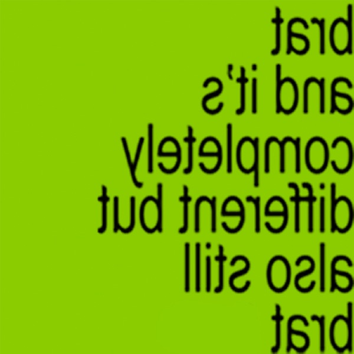

*High-Resolution Master Artwork Archive:* [BRAT Cover Art](https://is1-ssl.mzstatic.com/image/thumb/Music211/v4/e2/21/3b/e2213b51-6d62-8ef0-b19a-d78ec0f873d8/075679626998.jpg/600x600bb.jpg)

### Curatorial Justification (Why It's on This List)
A cultural phenomenon and critical triumph, 'BRAT' represents the ultimate synthesis of Charli xcx's decade-long hyperpop innovation and raw confessional songwriting. Rejecting commercial polish in favor of abrasive, distorted French electro and 2000s electroclash club beats, Charli paired dancefloor ferocity with devastatingly honest lyrics about female rivalry, grief (honoring late collaborator SOPHIE), and imposter syndrome. It is a modern masterpiece of club music as confessional therapy.

### Front-to-Back Architecture (Narrative & Pacing)
The album detonates with the razor-sharp synth hook of '360' and the blistering electro-punk sprint of 'Club classics' and 'Von dutch'. The pacing pivots brilliantly on 'Sympathy is a knife' and the tragic, heartbreaking tribute 'So I', balancing sweaty club euphoria with tear-stained vulnerability, concluding with the soaring rave catharsis of '365'.

### Audiophile & Production Breakdown
Produced by A. G. Cook, Gesaffelstein, and Hudson Mohawke, 'BRAT' is an extreme test for low-frequency transient control and dynamic slam. The sub-bass sine waves plunge beneath 30Hz with ferocious physical impact, while the distorted saw-wave synthesizers bite with aggressive presence. Charli's vocals are tracked dry and direct, cutting through the club noise with total clarity.

### Benchmark Demo Track: **"Von dutch"**
An intense torture test for synthesizer speed, transient slam, and amplifier damping. The distorted synth bassline rips through the soundstage at breakneck tempo. High-resolving audio setups will maintain clean instrumental separation without harsh digital distortion.

### Tonal Anchor Bridge (Library Connection)
Expands upon the unapologetic dancefloor energy and sharp lyrical honesty of Lorde's 'Melodrama' and Marina's 'Electra Heart'.

---

# Category VII: Nocturnal Electronics, Sub-Bass & Trip-Hop Spatiality

> **Sonic Signature:** *Dub echo decays, pitch-shifted vinyl lacquers, subterranean sub-bass extension, tape flutter, dark room staging.*

## The Sound of Category VII: The Midnight Void: Subterranean Pressure, Pitch-Shifted Vinyl & Infinite Decay

> *"An immersive, brooding nocturnal journey built upon subterranean sub-bass frequencies, crackling vinyl lacquers, tape-distorted Rhodes chords, and hypnotic dub delay tails that decay into pitch-black acoustic silence."*

### Acoustic Archetype & Engineering Philosophy
Pioneered in the underground sound-system culture of Bristol, South London, and West Coast beat ciphers. Relies heavily on analog dub mixing desks, Roland RE-201 Space Echoes, and spring reverb tanks. Beats are built from pitch-lowered vinyl breakbeats tracked hot to tape to induce gooey magnetic saturation. Sub-bass is generated with pure analog sine waves (Roland TB-303, Moog Taurus, SH-101) filtered down to produce pure, chest-rattling low-end fundamentals without distortion. Vocal samples and guest features are treated through telephone filters, pitch-shifting harmonizers (Eventide H3000), and cavernous plate reverbs, evoking ghosts drifting through rain-soaked city alleys at 3:00 AM.

### Frequency Architecture & Spectral Balance
The low end (20Hz–60Hz) is the defining physical foundation. Demands an audiophile subwoofer or planar magnetic headphone with ruler-flat sub-bass extension down to 25Hz. When the sub drops, it displaces physical air without masking the delicate midrange details. The midrange (400Hz–2.5kHz) is warm, dark, and tactile: intentional vinyl crackle, tape hiss, and turntable stylus drag provide a living, breathing background ambience. Highs (6kHz–16kHz) are subdued and atmospheric; hi-hats and snares are darkened with tape flutter and filtered echoes, ensuring long listening sessions remain free from listener fatigue.

### Spatial Soundstaging & Holographic Imaging
Features pitch-black soundstage silence and cavernous spatial depth. Audio elements do not simply sit in the stereo field; they emerge from the shadows, echo across wide stereo horizons, and disappear into an infinitely deep virtual void. The spatial placement creates a visceral sense of nocturnal claustrophobia punctuated by expansive, cinematic release.

### The Tactile Listening Experience
Best experienced in total darkness or low ambient lighting. Calibrate your subwoofer phase carefully to ensure the deep bass pulses hit with instantaneous, punchy control rather than sluggish boominess. The tactile sensation of sub-bass waves washing over your body while haunted vocal whispers float around your head makes this one of the most hypnotic listening experiences in modern recorded music.

---

## 85. Massive Attack – *Mezzanine* (1998)

**Primary Label & Engineering:** `Circa / Virgin Records / Neil Davidge & Massive Attack, Spike Stent (Mixing Engineer)`

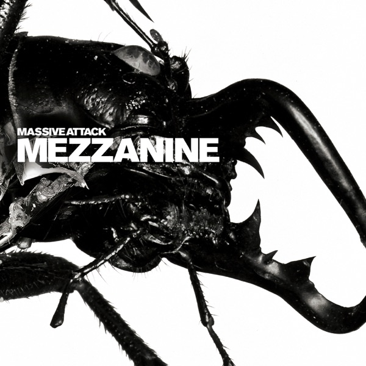

*High-Resolution Master Artwork Archive:* [Mezzanine Cover Art](https://is1-ssl.mzstatic.com/image/thumb/Music115/v4/8a/c1/04/8ac104fb-d37e-1433-5d2e-805710d7a7c4/00602567930983.rgb.jpg/600x600bb.jpg)

### Curatorial Justification (Why It's on This List)
The monumental dark-matter apex of trip-hop, 'Mezzanine' saw Bristol's Massive Attack mutate their warm jazz-soul roots into a claustrophobic, menacing wall of distorted guitars, dub basslines, and subterranean paranoia. Featuring haunting vocal performances from Cocteau Twins' Elizabeth Fraser and reggae icon Horace Andy, the record is an unyielding nocturnal masterpiece that redefined audiophile bass response and cinematic sound design.

### Front-to-Back Architecture (Narrative & Pacing)
From the ominous, subterranean bass growl of 'Angel' into the bittersweet, harpsichord-and-heartbeat pulse of 'Teardrop', the album establishes an intoxicating, claustrophobic atmosphere. It weaves through the sweltering Turkish rhythms of 'Inertia Creeps' and the narcotic dub of 'Exchange', concluding with the sprawling, feedback-drenched rock climax of 'Group Four'.

### Audiophile & Production Breakdown
Mixed by Spike Stent, 'Mezzanine' is legendary in audiophile testing for its subterranean bass weight and immense dynamic headroom. The low-end contains clean, undistorted energy that plunges effortlessly below 30Hz, while Angelo Bruschini's guitars snarl with industrial bite across a vast, pitch-black soundstage. Elizabeth Fraser's vocals on 'Teardrop' are captured with eerie, tactile intimacy.

### Benchmark Demo Track: **"Angel"**
The ultimate reference test for low-frequency extension and system damping. The opening bass guitar riff drops with tectonic weight, joined by a thunderous, heavily compressed kick drum. At 3:15, a screaming wall of distorted guitars enters at full volume; high-resolving amplifiers must deliver this sudden dynamic assault without compression or power-supply sag.

### Tonal Anchor Bridge (Library Connection)
The dark, sub-bass heavy sonic universe that directly informed Billie Eilish's 'WHEN WE ALL FALL ASLEEP...' and Lana Del Rey's 'Ultraviolence'.

---

## 86. Portishead – *Dummy* (1994)

**Primary Label & Engineering:** `Go! Beat / Adrian Utley, Geoff Barrow, Beth Gibbons, State of Art Studios (Bristol)`

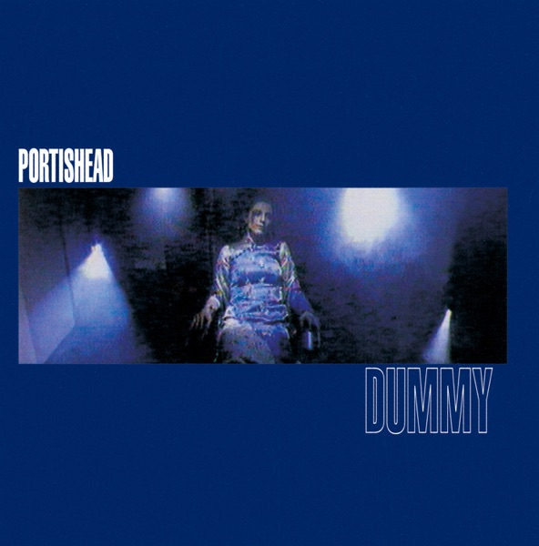

*High-Resolution Master Artwork Archive:* [Dummy Cover Art](https://is1-ssl.mzstatic.com/image/thumb/Music115/v4/c1/71/93/c1719342-df7d-e9c5-c87c-53dae5afb289/00042282855329.rgb.jpg/600x600bb.jpg)

### Curatorial Justification (Why It's on This List)
Winner of the 1995 Mercury Music Prize, 'Dummy' established the melancholic gold standard of trip-hop. Geoff Barrow and Adrian Utley recorded original instrumental tracks, pressed them onto custom vinyl dubplates, walked on them to add authentic crackle and dust, and then sampled them back into their samplers. Centered around Beth Gibbons's agonizing, Billie Holiday-like torch songs, the album is an intoxicating, noir-drenched cinematic triumph of heartbreak, vinyl warmth, and espionage paranoia.

### Front-to-Back Architecture (Narrative & Pacing)
The album opens with the eerie theremin wail and dusty drum break of 'Mysterons', flowing into the espionage noir of 'Sour Times'. The emotional peak arrives on 'Roads'—a devastating, Rhodes-and-string lament that captures the deepest depths of human grief—before culminating in the sultry, Isaac Hayes-sampling triumph of 'Glory Box'.

### Audiophile & Production Breakdown
An extraordinary demonstration of analog vinyl texture and acoustic restraint. The rhythm tracks possess rich, punchy lo-fi hip-hop warmth, contrasting against Adrian Utley's pristine vintage electric guitar and Rhodes piano lines. Beth Gibbons's vocals are tracked with startling emotional presence, capturing her quivering vibrato, cracked high notes, and breath control in intimate relief.

### Benchmark Demo Track: **"Glory Box"**
Test for vinyl sample crackle, string warmth, and guitar overdrive. The Isaac Hayes 'Ike's Rap II' sample provides a hypnotic bass and string foundation. Notice the raw, sudden distortion bite of Utley's guitar solo at 2:25, and verify that Gibbons's voice remains holographic in the center.

### Tonal Anchor Bridge (Library Connection)
The foundational noir-soul blueprint that directly inspired Amy Winehouse's 'Back to Black' and Lana Del Rey's 'Born to Die'.

---

## 87. Burial – *Untrue* (2007)

**Primary Label & Engineering:** `Hyperdub / Burial (William Bevan), Sound Forge Audio Editor`

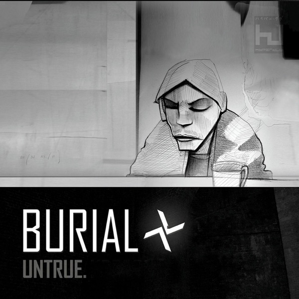

*High-Resolution Master Artwork Archive:* [Untrue Cover Art](https://is1-ssl.mzstatic.com/image/thumb/Music116/v4/9d/0f/1c/9d0f1c2b-2fae-d8ac-3920-ce9ec5bc85b5/7982.jpg/600x600bb.jpg)

### Curatorial Justification (Why It's on This List)
Assembled entirely without a musical sequencer in a rudimentary audio editing program (Sound Forge), South London producer Burial's 'Untrue' is the defining electronic masterpiece of the 21st century. Evoking empty night buses, rainy London street corners, and the haunting ghosts of UK garage raves, Burial pitched and time-stretched 1990s R&B vocal samples (Ernie Johnston, Ray J) into sorrowful, androgynous spirits. It is a profoundly moving, uninterrupted nocturnal requiem.

### Front-to-Back Architecture (Narrative & Pacing)
Opening with the cinematic ambient drift of 'Untitled', the album surges into the syncopated, skittering 2-step garage swing and achingly beautiful vocal chops of 'Archangel'. The narrative moves through rainy, sub-bass corridors ('Near Dark', 'Ghost Hardware') before arriving at the ambient street meditation 'Endorphin' and the bittersweet closure of 'Raver'.

### Audiophile & Production Breakdown
Because Burial eschewed a sequencer grid, every drum hit is manually placed, creating a loose, unquantized human swing that breathes naturally. Foley sounds of rain falling on pavement, vinyl surface noise, and Zippo lighter clicks populate the stereo margins. The sub-bass is smooth, deep, and subterranean, requiring articulate low-end reproduction to convey its gentle warmth.

### Benchmark Demo Track: **"Archangel"**
Test for micro-spatial detail and sub-bass extension. Listen for the sound of rain and vinyl crackle layered over the syncopated, wooden rimshot groove. The pitched-down vocal chops float across the soundstage while the 35Hz sub-bass wraps around the listener.

### Tonal Anchor Bridge (Library Connection)
Directly informs the nocturnal, pitch-shifted vocal processing and atmospheric intimacy of Frank Ocean's 'Blonde' and Billie Eilish.

---

## 88. The xx – *xx* (2009)

**Primary Label & Engineering:** `Young Turks / Jamie xx (Producer & Mixing Engineer)`

*High-Resolution Master Artwork Archive:* [xx Cover Art](https://is1-ssl.mzstatic.com/image/thumb/Music211/v4/59/df/6b/59df6bec-17f5-b578-aee2-b1a772d2ab9b/889030044761.png/600x600bb.jpg)

### Curatorial Justification (Why It's on This List)
Recorded in the dead of night in an uninsulated garage in south London, The xx's debut album 'xx' redefined spatial minimalism for the 21st century. Romy Madley Croft and Oliver Sim's hushed, conversational dual-vocal dialogue floats over Baria Qureshi's clean guitar lines, underpinned by Jamie xx's subterranean 808 sub-bass pulses and minimalist steel drum samples. It is an extraordinary testament to negative space, where silence carries as much emotional weight as sound.

### Front-to-Back Architecture (Narrative & Pacing)
The album opens with the iconic, instrumental sunrise fanfare of 'Intro', establishing a vast, hypnotic soundstage. It moves seamlessly through intimate post-punk duets ('VCR', 'Crystalised', 'Islands'), maintaining an unhurried, late-night intimacy across thirty-eight mesmerizing minutes, resolving in the gentle, drifting embers of 'Stars'.

### Audiophile & Production Breakdown
Jamie xx's production is an audiophile showcase for pitch-black background silence and transient precision. The electric guitars are tracked with clean Fender Twin Reverb spring reverb; Oliver Sim's bass guitar has round, articulate definition; and the electronic sub-bass drops with authoritative, deep physical weight. The dual lead vocals are captured dry and centered with uncanny physical intimacy.

### Benchmark Demo Track: **"Intro"**
The definitive test for spatial soundstage expansion and sub-bass impact. The opening chiming guitar chords ring out into black space, followed by the entrance of a colossal, room-filling 808 bass pulse. Resolving systems will preserve the delicate decay of the handclaps against the heavy low-end swell.

### Tonal Anchor Bridge (Library Connection)
Shares the delicate spatial minimalism and late-night vocal romance celebrated on Cannons' 'Fever Dream' and Cigarettes After Sex.

---

## 89. Boards of Canada – *Music Has the Right to Children* (1998)

**Primary Label & Engineering:** `Warp / Skam / Marcus Eoin & Michael Sandison (Producers), Hexagon Sun (Scotland)`

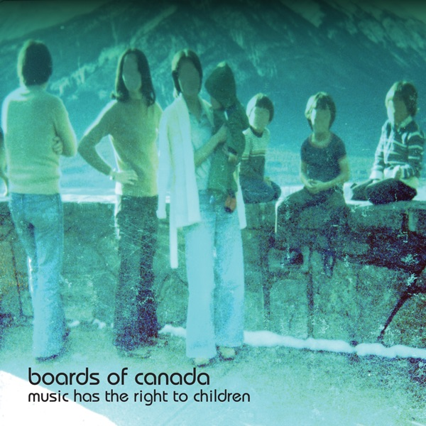

*High-Resolution Master Artwork Archive:* [Music Has the Right to Children Cover Art](https://is1-ssl.mzstatic.com/image/thumb/Features125/v4/b5/4c/c2/b54cc20d-03f5-f2c4-4a0d-9b51ad65af89/dj.txuslqgv.jpg/600x600bb.jpg)

### Curatorial Justification (Why It's on This List)
Scottish brothers Marcus Eoin and Michael Sandison crafted 'Music Has the Right to Children' as a haunting, nostalgic exploration of childhood memory, public broadcasting documentaries, and natural phenomena. Utilizing degraded magnetic tape loops, vintage analog synthesizers, and crisp hip-hop breakbeats, the album evokes the eerie, bittersweet feeling of remembering a forgotten dream. It stands as one of the most emotionally profound and sonically distinct electronic albums ever created.

### Front-to-Back Architecture (Narrative & Pacing)
Flowing across eighteen interconnected tracks, the album weaves between full-length downtempo epics ('Telephasic Workshop', 'Turquoise Hexagon Sun') and brief, ghostly audio vignettes ('The Color of the Fire', 'Rue the Whirl'). Highlights include the buoyant, iconic bassline of 'Roygbiv' and the hypnotic math-vocal dreamscape of 'Aquarius', concluding on the tranquil, ambient twilight of 'One Very Important Thought'.

### Audiophile & Production Breakdown
Recorded at their secluded studio Hexagon Sun in the Scottish Pentland Hills, the brothers mastered the art of intentional tape degradation. Synthesizer tracks were recorded to cassette and reel-to-reel tape, baked in ovens, and played on misaligned tape heads to induce subtle wow and flutter. The low-end has extraordinary analog warmth, while the hip-hop drum breaks punch with crisp, uncompressed vitality.

### Benchmark Demo Track: **"Roygbiv"**
A benchmark for analog synthesizer warmth and tape flutter. The thick, juicy Minimoog bassline drives the track with rich harmonic body, while the shimmering lead synthesizer warbles gently in the stereo field. Listen for the crisp, punchy snare crack.

### Tonal Anchor Bridge (Library Connection)
Directly connects to the warm, nostalgic tape-saturated textures and unquantized grooves celebrated in Mac Miller's 'Circles'.

---

## 90. James Blake – *James Blake* (2011)

**Primary Label & Engineering:** `ATLAS / A&M / James Blake (Self-Produced, Recorded & Mixed)`

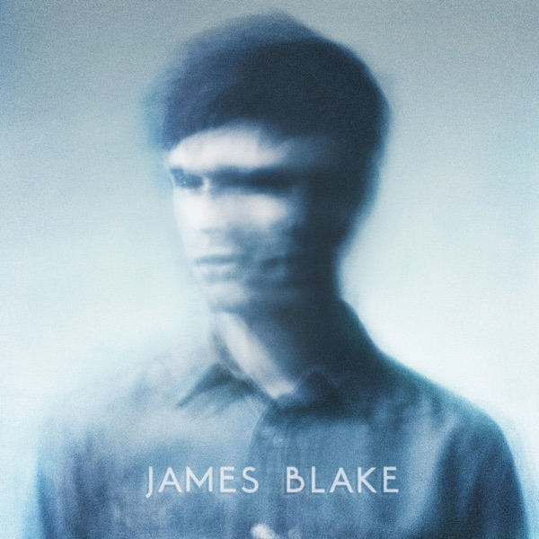

*High-Resolution Master Artwork Archive:* [James Blake Cover Art](https://is1-ssl.mzstatic.com/image/thumb/Music114/v4/c4/6b/7c/c46b7cd6-8514-2098-7efa-83790c3d4879/00602527614854.rgb.jpg/600x600bb.jpg)

### Curatorial Justification (Why It's on This List)
Emerging from the South London post-dubstep club underground, 22-year-old James Blake stunned the music world with his eponymous debut. Blake boldly merged the physical weight of UK bass culture with the vulnerable, acoustic intimacy of singer-songwriter piano ballads and gospel vocoder harmonizers. Stripped of all commercial clutter, the album is a radical exercise in negative space, subterranean frequencies, and emotional exposure.

### Front-to-Back Architecture (Narrative & Pacing)
Opening with the ghostly, vocoder-treated confession of 'Unluck', the album moves into the triumphant, slow-burning electronic crescendo of 'The Wilhelm Scream'. The centerpiece is a stunning, dub-infused cover of Feist's 'Limit to Your Love', where quiet piano chords alternate with deafening sub-bass tremors. The record resolves into the serene acoustic gospel meditation 'Measurements'.

### Audiophile & Production Breakdown
An infamous audiophile benchmark and subwoofer torture test. Blake utilized pure, uncompressed sub-bass sine waves oscillating between 20Hz and 40Hz with rapid tremolo modulation. In contrast, his upright piano was recorded with minimal mic placement, capturing every pedal creak and hammer strike. His soul-baring vocal delivery floats in cavernous, pristine stereo reverberation.

### Benchmark Demo Track: **"Limit to Your Love"**
The ultimate subwoofer and amplifier torture test. The delicate piano verse gives way to a rapid-fire, subterranean 25Hz-35Hz sub-bass tremolo that will shake your room and push speaker excursion to its mechanical limits. High-resolving setups will reproduce this low-end tremor with total control while preserving Blake's dry vocal placement above.

### Tonal Anchor Bridge (Library Connection)
Shares the radical spatial minimalism, vocoder choral arrangements, and emotional vulnerability of Frank Ocean's 'Blonde'.

---

## 91. Four Tet – *Rounds* (2003)

**Primary Label & Engineering:** `Domino Records / Kieran Hebden (Producer & Mixing Engineer)`

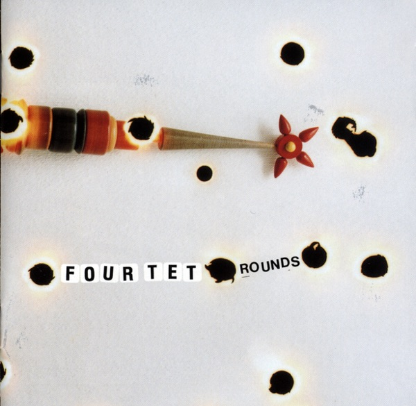

*High-Resolution Master Artwork Archive:* [Rounds Cover Art](https://is1-ssl.mzstatic.com/image/thumb/Music/4a/82/02/mzi.wggtbdbs.jpg/600x600bb.jpg)

### Curatorial Justification (Why It's on This List)
Kieran Hebden's breakthrough as Four Tet, 'Rounds' created the genre known as 'folktronica'. Assembling intricate collages of acoustic folk instruments (nylon-string guitars, mandolins, music boxes, harp glissandos) and splicing them into crisp, swinging hip-hop breakbeats, Hebden proved that electronic music could possess the warmth, nostalgia, and organic touch of a pastoral countryside. It is a timeless masterpiece of digital craftsmanship and emotional resonance.

### Front-to-Back Architecture (Narrative & Pacing)
Opening with the gentle heartbeat pulse and rubber-duck toy sample of 'Hands', the album surges into the infectious jazz-breakbeat groove of 'She Moves She'. The emotional peak arrives on 'As Serious as Your Life' and the heartbreaking guitar collage 'My Angel Rocks 4th Revolver', concluding with the quiet, acoustic lullaby of 'Slow Jam'.

### Audiophile & Production Breakdown
Hebden's micro-sampling technique is an incredible test for spatial resolution and micro-transient decay. Hundreds of tiny acoustic fragments—a plucked guitar string, a chiming bell, a child's laugh—are panned intricately across a wide stereo field. The low frequencies feature punchy, uncompressed acoustic kick drums and warm upright bass tones that anchor the glittering collage.

### Benchmark Demo Track: **"As Serious as Your Life"**
Test for rhythmic swing and micro-detail resolution. The track combines a crisp, tumbling jazz hip-hop drum break with fluttering harp arpeggios and shimmering bells. Resolving systems will cleanly separate each tiny sample layer across the stereo soundstage.

### Tonal Anchor Bridge (Library Connection)
Connects the organic acoustic warmth and experimental layering of Big Thief with the electronic brilliance of Radiohead.

---

## 92. Kelly Lee Owens – *Inner Song* (2020)

**Primary Label & Engineering:** `Smalltown Supersound / Kelly Lee Owens (Producer & Mixing Engineer)`

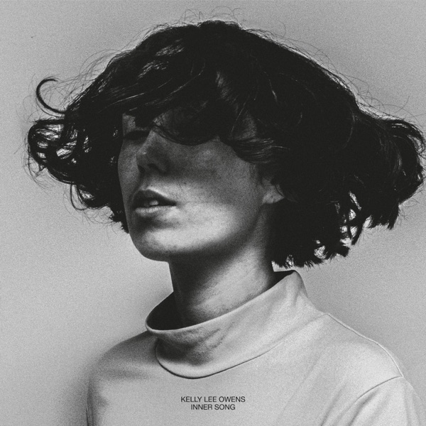

*High-Resolution Master Artwork Archive:* [Inner Song Cover Art](https://is1-ssl.mzstatic.com/image/thumb/Music221/v4/b4/6a/bc/b46abc53-1632-7310-78af-57d753afd06e/35595.jpg/600x600bb.jpg)

### Curatorial Justification (Why It's on This List)
Welsh producer and composer Kelly Lee Owens achieved a breathtaking synthesis of deep techno, ambient dream-pop, and Celtic soul on 'Inner Song'. Written in the aftermath of personal loss, Owens channeled her grief through pulsating modular synthesizer arpeggios, tectonic sub-bass frequencies, and her own breathy, angelic vocal delivery. Featuring a hypnotic collaboration with John Cale of The Velvet Underground, it is a restorative, immersive electronic journey of physical release and emotional healing.

### Front-to-Back Architecture (Narrative & Pacing)
The album opens with a stunning, ambient instrumental reimagining of Radiohead's 'Weird Fishes/Arpeggi', setting an oceanic mood. It moves through the euphoric, driving techno pulse of 'Melt!' (sampling the sound of melting glaciers) and the cathartic pop of 'On'. The pacing balances heavy club rhythms with ambient stillness ('Corner of My Sky' with John Cale), closing on the soaring 'Night'.

### Audiophile & Production Breakdown
Produced by Owens, 'Inner Song' features immense dynamic range, deep subterranean bass extension, and sparkling high-frequency air. The modular synthesizer arpeggios ripple across the stereo panorama with razor-sharp transient precision, while Owens's multi-layered vocal harmonies float in a warm, enveloping ambient halo.

### Benchmark Demo Track: **"Melt!"**
A showcase for transient punch and sub-bass authority. The track uses the sound of cracking ice and melting water as percussive transients over a driving, four-on-the-floor techno kick. Resolving systems will reproduce the crystalline high-frequency ice clicks without ear fatigue while delivering physical low-end club weight.

### Tonal Anchor Bridge (Library Connection)
Combines the ethereal dream-pop vocal beauty of Cannons and Cocteau Twins with the deep nocturnal sub-bass of Massive Attack.

---

# Category VIII: Transcendental Sacred, Chamber Hymns & Spiritual Contemplation

> **Sonic Signature:** *Pipe organ overtones, liturgical acoustic staging, reverent quietude, close acoustic guitars, multi-part vocal hymns.*

## The Sound of Category VIII: The Liturgical Cathedral: Sacred Acoustic Geometry, Reverent Stillness & Pipe Organ Majesty

> *"Dedicated to the acoustic capture of the transcendent. Engineered in historic stone cathedrals, European wooden chapels, and soaring sanctuaries where natural architectural reverberation, pipe organs, and choral harmonies bloom out of profound quietude."*

### Acoustic Archetype & Engineering Philosophy
Pioneered by purist classical and sacred recording engineers such as Manfred Eicher (ECM Records) and master church acousticians. Recorded on-location using Blumlein ribbon pairs and spaced omnidirectional condenser microphones (DPA 4006, Neumann KM130) positioned deep within church naves to capture the authentic multi-second natural decay of the space. Instrumentation is entirely unamplified: historic pipe organs, handcrafted Steinway concert grand pianos, cello ensembles, hammer dulcimers, and natural choral voices. Zero dynamic compression is applied; dynamic levels are governed exclusively by the musicians' physical touch and breathing.

### Frequency Architecture & Spectral Balance
Sub-bass frequencies (16Hz–40Hz) are generated by massive church organ pipes, producing true subsonic fundamentals that vibrate the floor and walls with holy gravity. The lower-midrange (100Hz–400Hz) is rich with the woody resonance of cello bodies and grand piano soundboards. The midrange and treble (1kHz–12kHz) belong to the human voice: solo sopranos and multi-part choral hymns bloom into the room, their natural harmonic overtones hanging in the high vaulted ceilings for four to six seconds before decaying into silence.

### Spatial Soundstaging & Holographic Imaging
The physical room is not an effect; it is the lead instrument. The soundstage possesses majestic vertical height and vast acoustic depth. Instruments are heard interacting with the stone walls, wooden pews, and arched ceilings, creating an authentic three-dimensional halo around every musical gesture. The silence between notes is pregnant with emotional and spiritual tension.

### The Tactile Listening Experience
Demands a listening environment with an ultra-low ambient noise floor. The listener must be able to hear the quietest acoustic details: the intake of air before a vocal phrase, the mechanical clatter of pipe organ stops, the damper pedal lifting from piano strings, and the slow, transcendent dissipation of sound into sacred stillness. An extraordinary, restorative listening journey.

---

## 93. Sufjan Stevens – *Carrie & Lowell* (2015)

**Primary Label & Engineering:** `Asthmatic Kitty / Sufjan Stevens & Thomas Bartlett, April Base (Wisconsin)`

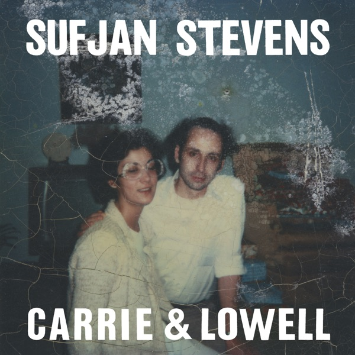

*High-Resolution Master Artwork Archive:* [Carrie & Lowell Cover Art](https://is1-ssl.mzstatic.com/image/thumb/Music115/v4/ba/61/bc/ba61bcaf-2034-f13e-6f66-fdb578d618dc/656605609966.jpg/600x600bb.jpg)

### Curatorial Justification (Why It's on This List)
Recorded in the devastating wake of the death of his estranged mother Carrie (who suffered from schizophrenia and substance abuse), Sufjan Stevens set aside the maximalist orchestral electronic grandeur of 'The Age of Adz' to create 'Carrie & Lowell'. Recorded largely in his Brooklyn home and Justin Vernon's April Base studio with quiet acoustic guitars, a muted upright piano, and subtle Prophet-08 synthesizer drones, the album is a sacred, heartbreaking masterpiece of grief, Christian forgiveness, and maternal memory that stands as one of the greatest confessional folk records of all time.

### Front-to-Back Architecture (Narrative & Pacing)
The album opens with the gentle acoustic fingerpicking and celestial choir of 'Death with Dignity', establishing an atmosphere of reverent stillness. The emotional devastation deepens across 'Should Have Known Better' and the chilling, hospital-room dialogue of 'Fourth of July' ('Did you get enough love, my little dove? / Why do you cry?'). The record achieves quiet spiritual resolution on 'No Shade in the Shadow of the Cross' and the hushed acoustic benediction 'Blue Bucket of Gold'.

### Audiophile & Production Breakdown
An extraordinary demonstration of micro-dynamics, mechanical acoustic artifacts, and room air. Stevens's voice was tracked with extreme proximity, capturing every breath, vocal tremble, and throat catch. The acoustic guitars and upright piano were recorded with ambient room mics that pick up air conditioner hums, floorboard creaks, and sustain-pedal thuds, imbuing the soundstage with profound physical reality. Subtle analog synthesizer drones extend into the sub-bass, providing a gentle harmonic floor.

### Benchmark Demo Track: **"Death with Dignity"**
A masterclass in acoustic fingerpicking timbre and room quietude. Listen for the subtle acoustic resonance of the guitar body and Stevens's gentle, double-tracked vocal whispering inches from your ear. The subtle piano notes and ambient synthesizer bloom wrap around the stereo field with heartbreaking tenderness.

### Tonal Anchor Bridge (Library Connection)
Directly connects the sacred quietude, hymnic reverence, and acoustic beauty of Audrey Assad's 'Inheritance' with the confessional grief of Mac Miller's 'Circles'.

---

## 94. The Brilliance – *Brother* (2015)

**Primary Label & Engineering:** `Integrity Music / David Gungor & John Arndt (Producers & Mixers)`

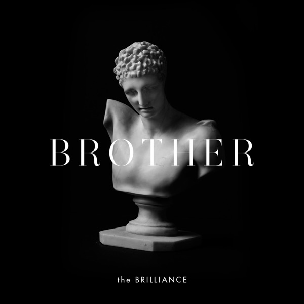

*High-Resolution Master Artwork Archive:* [Brother Cover Art](https://is1-ssl.mzstatic.com/image/thumb/Music114/v4/40/27/52/402752e0-3376-9b6c-2651-dbc785349542/859724647226_cover.jpg/600x600bb.jpg)

### Curatorial Justification (Why It's on This List)
Composed by classical pianist John Arndt and singer David Gungor, The Brilliance created 'Brother' as an antidote to commercialized, stadium-style modern worship. Grounded in liturgical prayer, chamber strings, and acoustic grand piano, the album is a profound plea for reconciliation, peace, and universal brotherhood across political and cultural divides. It is an unhurried, neoclassical hymn suite of extraordinary spiritual gravity and melodic grace.

### Front-to-Back Architecture (Narrative & Pacing)
The album opens with the breathtaking title track 'Brother' ('When I look into the face of my enemy, I see my brother'), establishing a radical ethical and theological foundation. It flows through classical string interludes, the quiet liturgical plea of 'Praying for Peace', and the sweeping orchestral elevation of 'Does Your Heart Break', culminating in the serene, sacred benediction 'Now and at the Hour'.

### Audiophile & Production Breakdown
Tracked in a resonant stone church and concert hall, 'Brother' features magnificent acoustic staging. John Arndt's Steinway grand piano possesses deep, full-bodied resonance and mechanical damper pedal realism. The chamber string section (violins, viola, cello) was recorded with stereo ribbon microphone pairs, capturing the rich, warm friction of bow on string without digital glare.

### Benchmark Demo Track: **"Brother"**
The definitive test for acoustic piano decay and chamber string bloom. Notice the pristine dynamic swell as the cello and violins enter behind the centered piano chords. Gungor's voice has a warm, natural presence, free of artificial compression.

### Tonal Anchor Bridge (Library Connection)
Directly reflects the sacred chamber intimacy, liturgical reverent quietude, and acoustic piano majesty of Audrey Assad's 'Inheritance' and Hillsong UNITED's 'Empires'.

---

## 95. John Mark McMillan – *Mercury & Lightning* (2017)

**Primary Label & Engineering:** `Lionhawk Records / Gabriel Wilson & John Mark McMillan`

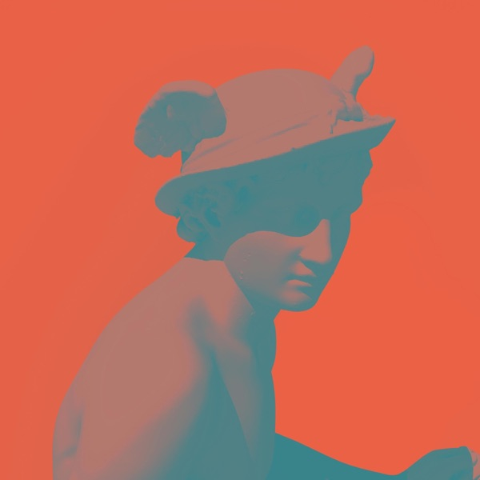

*High-Resolution Master Artwork Archive:* [Mercury & Lightning Cover Art](https://is1-ssl.mzstatic.com/image/thumb/Music115/v4/72/bd/ca/72bdca8b-0cff-c893-e8fb-430efebf13c2/752830894327.jpg/600x600bb.jpg)

### Curatorial Justification (Why It's on This List)
Written during a period of intense theological deconstruction and personal crisis, John Mark McMillan's 'Mercury & Lightning' is an extraordinary fusion of indie rock, existential poetry, and sacred roots music. Moving beyond his famous anthem 'How He Loves', McMillan and producer Gabriel Wilson crafted an expansive, 1980s-influenced sonic landscape of vintage analog synthesizers, cavernous percussion, and raw telecaster riffs that tackles commerce, doubt, and divine mystery with unflinching artistic integrity.

### Front-to-Back Architecture (Narrative & Pacing)
The album opens with the driving, synth-laced title track 'Mercury & Lightning', setting an urgent pace. The record moves through haunting existential laments ('Wilderlove', 'Gods of Hindsight') and anthemic rock crescendos ('Enemy, love.'), culminating in the transcendent, sunset acoustic resolution of 'Nothing Stands Between Us'.

### Audiophile & Production Breakdown
Engineered with massive dynamic headroom and punchy transient snap, the album features rich analog synths (Prophet, Juno) blended with live drums and acoustic guitars. McMillan's weathered, raspy baritone voice was tracked through vintage tube preamps, cutting through the dense instrumental walls with visceral, room-shaking authority.

### Benchmark Demo Track: **"Mercury & Lightning"**
Test for drum transient attack and wide synth stereo panning. The heavy kick drum and gated snare drive the track with immense authority, while the shimmering 80s synthesizers pulse in the margins. McMillan's powerful, gritty vocal commands the center stage.

### Tonal Anchor Bridge (Library Connection)
Shares the theological depth, anthemic passion, and dynamic rock textures found in Red Rocks Worship's 'Things of Heaven' and Jesus Culture's 'Unstoppable Love'.

---

## 96. Liz Vice – *There's a Light* (2015)

**Primary Label & Engineering:** `Ramseur Records / Josh White (Producer & Songwriter), Door of Hope (Portland)`

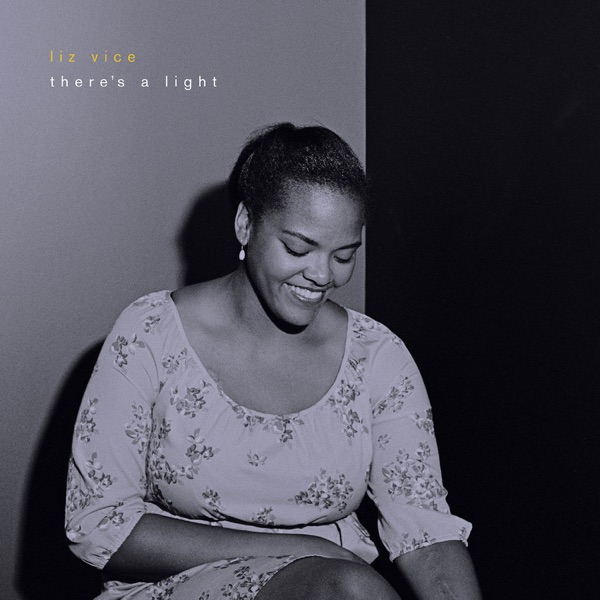

*High-Resolution Master Artwork Archive:* [There's a Light Cover Art](https://is1-ssl.mzstatic.com/image/thumb/Music125/v4/30/51/fb/3051fbb3-59fd-77a8-e678-05f74365ddbd/886445438543.jpg/600x600bb.jpg)

### Curatorial Justification (Why It's on This List)
Following a miraculous kidney transplant that saved her life, Portland vocalist Liz Vice partnered with pastor and musician Josh White to record 'There's a Light'. Grounded in authentic 1960s gospel-soul, Stax rhythm sections, and civil rights spirituals, Vice's voice possesses the volcanic power of Mavis Staples and Mahalia Jackson. Recorded live off the floor, it is a joyous, electrifying front-to-back masterpiece of redemption, grace, and spiritual perseverance.

### Front-to-Back Architecture (Narrative & Pacing)
The album opens with the driving, horn-drenched soul stomp of 'Abide', moving into the infectious rhythm of 'Empty Me Out' and the joyous civil-rights-infused title track. The record balances high-energy gospel funk ('Pure Religion') with intimate, candlelit acoustic prayers ('All Must Be Well'), concluding on the soaring, celebratory communion of 'En Route'.

### Audiophile & Production Breakdown
Tracked live with vintage tube gear and analog preamps, 'There's a Light' is an audiophile showcase for organic band chemistry. The live horn section (trumpet, tenor sax) punches with brassy warmth without digital harshness; the bass guitar is round, woody, and deeply grooved; and Vice's lead vocal cuts through the room with breathtaking, unadulterated chest resonance.

### Benchmark Demo Track: **"There's a Light"**
A test for live horn dynamics and gospel choir separation. The rhythm section lays down a deep, Motown-style groove while the brass section stabs with crisp transient impact. Resolving equipment will highlight the joyful room acoustics and Vice's soaring vocal runs.

### Tonal Anchor Bridge (Library Connection)
Combines the infectious spiritual joy and organic gospel warmth of Forrest Frank's 'CHILD OF GOD' with the soul conviction of Lauryn Hill.

---

## 97. Citizens – *A Thousand Shores* (2019)

**Primary Label & Engineering:** `Tooth & Nail / Gospel Song Records / Zach Bolen & Citizens`

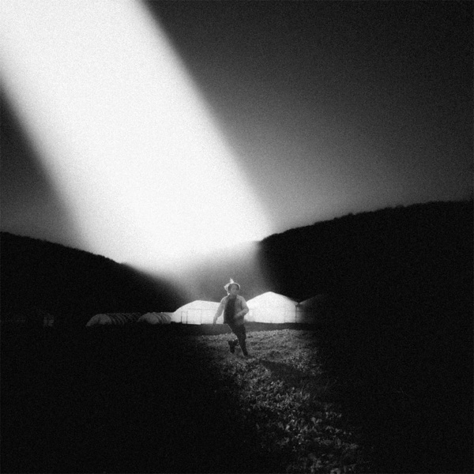

*High-Resolution Master Artwork Archive:* [A Thousand Shores Cover Art](https://is1-ssl.mzstatic.com/image/thumb/Music221/v4/10/58/91/1058913d-a3ac-4b9e-a8ea-4a3842bb5ed1/0000768759288.png/600x600bb.jpg)

### Curatorial Justification (Why It's on This List)
Seattle indie-rock worship band Citizens reached a creative peak on 'A Thousand Shores'. Moving beyond conventional church arrangements, frontman Zach Bolen embraced expansive, shimmering dream-pop synthesizers, soaring alternative-rock guitars, and deeply contemplative, theological lyricism. Exploring the ocean of divine grace and human unworthiness, the record is an immersive, emotionally resonant front-to-back listening experience that bridges modern indie-pop with sacred devotion.

### Front-to-Back Architecture (Narrative & Pacing)
Paced with cinematic grandeur, the album opens with the atmospheric, pulsing synthesizer overture of 'The Roar'. It flows through the soaring indie-rock anthems 'A Thousand Shores' and 'Doubter's Song', balancing high-energy rock dynamics with intimate ambient prayers, concluding on the majestic, sunset-lit reflection of 'Only Jesus Christ'.

### Audiophile & Production Breakdown
Engineered with expansive stereo width and pristine transient definition, the production features rich analog synth pads that wrap around the listener. The live drums are tracked with natural room ambience, providing muscular punch without artificial compression. Bolen's passionate lead vocals are centered with clarity, surrounded by lush, shimmering guitar arpeggios.

### Benchmark Demo Track: **"A Thousand Shores"**
Test for soundstage width and dynamic crescendo. The track begins with gentle acoustic guitar and shimmering synth pads before building into a colossal, anthemic wave of drums and guitars. Resolving systems will preserve the delicate acoustic texture even as the full band reaches peak volume.

### Tonal Anchor Bridge (Library Connection)
Directly expands the soaring, atmospheric stadium worship soundstage of Hillsong UNITED's 'Empires' and Jesus Culture's 'Unstoppable Love'.

---

## 98. Rivers & Robots – *The Eternal Son* (2016)

**Primary Label & Engineering:** `Running Club Records / Jonathan Ogden & Rivers & Robots`

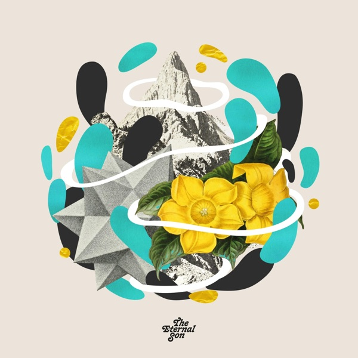

*High-Resolution Master Artwork Archive:* [The Eternal Son Cover Art](https://is1-ssl.mzstatic.com/image/thumb/Music60/v4/31/e1/36/31e13614-0801-a57e-3f6b-2b96fc9313ac/859717197905_cover.jpg/600x600bb.jpg)

### Curatorial Justification (Why It's on This List)
Manchester indie collective Rivers & Robots, led by graphic artist and multi-instrumentalist Jonathan Ogden, crafted 'The Eternal Son' as a unique fusion of folktronica, indie dream-pop, and sacred devotional prayer. Blending delicate nylon-string acoustic fingerpicking, glitchy analog drum machines, warm Rhodes keyboards, and soaring vocal melodies, the album is a tranquil, deeply restorative masterpiece of creative worship.

### Front-to-Back Architecture (Narrative & Pacing)
The album flows like a continuous morning meditation across ten tracks. Beginning with the sparkling acoustic arpeggios of 'Who Is Like Our God', it transitions into the infectious, syncopated rhythm of 'Shepherd of My Soul'. The emotional core arrives on 'We Will Overcome' and the ambient, shimmering psalm 'High Priest', resolving in the peaceful benediction 'To the End'.

### Audiophile & Production Breakdown
Recorded in their home studio in northern England, the album balances delicate acoustic micro-details with lush stereo synthesis. The acoustic guitars possess pristine, bell-like clarity; the analog synthesizers warble with gentle tape warmth; and Ogden's intimate, conversational tenor sits right up front with soothing, breathy presence.

### Benchmark Demo Track: **"Shepherd of My Soul"**
A test for acoustic transient speed and spatial layering. The interlocking fingerpicked acoustic guitars and syncopated electronic percussion require rapid transient articulation. Notice the sweet decay of the Rhodes piano and warm bassline.

### Tonal Anchor Bridge (Library Connection)
Bridges the intimate acoustic stillness of Audrey Assad's 'Inheritance' with the breezy, joyful production of Forrest Frank's 'CHILD OF GOD'.

---

## 99. Josh Garrels – *Love & War & The Sea In Between* (2011)

**Primary Label & Engineering:** `Small Voice Records / Josh Garrels (Self-Produced, Recorded & Mixed)`

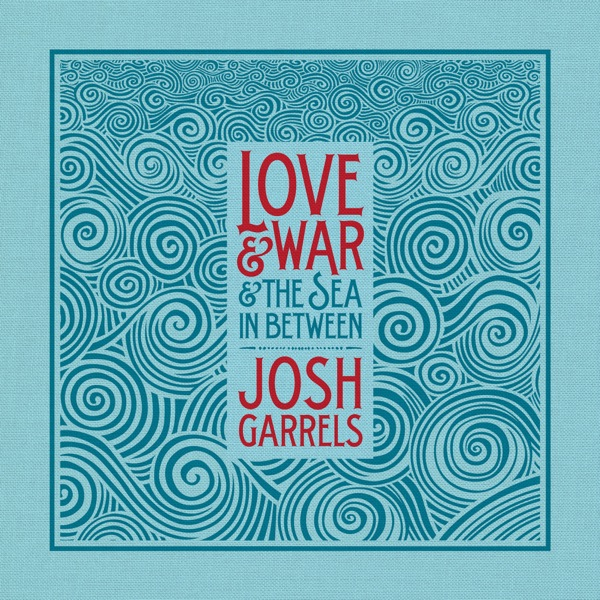

*High-Resolution Master Artwork Archive:* [Love & War & The Sea In Between Cover Art](https://is1-ssl.mzstatic.com/image/thumb/Music211/v4/eb/38/6e/eb386ea3-b158-cc9b-d4c8-3ce24adb6a1b/884502404937.jpg/600x600bb.jpg)

### Curatorial Justification (Why It's on This List)
Recorded over an intense year of solitary work in a home studio on the rugged coast of Oregon, Josh Garrels's self-produced magnum opus is a monumental, eighteen-track epic of spiritual pilgrimage, romantic devotion, and nautical myth. Fusing Appalachian folk, classical chamber strings, hip-hop breakbeats, and African rhythms, Garrels's astonishing multi-octave voice moves from a guttural hip-hop cadence to a soaring, spine-chilling falsetto. It stands as one of the greatest independent spiritual albums ever released.

### Front-to-Back Architecture (Narrative & Pacing)
Spanning over seventy minutes, the album is structured as a three-act oceanic odyssey: Part I explores spiritual war and alienation ('White Owl', 'The Resistance'); Part II dives into the ocean of romantic grace ('Jacaranda', 'Slip Rise'); and Part III achieves transcendent resurrection on the epic hymn 'Farther Along' and the soaring nautical climax 'Ulysses'.

### Audiophile & Production Breakdown
Garrels tracked dozens of instruments himself—acoustic guitars, banjo, horns, timpani, Mellotron, and cellos. The soundstage is vast and cinematic, with profound dynamic swings between hushed, fingerpicked acoustic moments and thunderous, timpani-driven orchestral explosions. Garrels's voice was tracked with pristine warmth, capturing his breathtaking falsetto register without compression choke.

### Benchmark Demo Track: **"Farther Along"**
The definitive test for vocal emotional dynamic range and orchestral climax. The track begins with delicate acoustic guitar and Garrels's whispered vocal, before building over five minutes into a colossal wave of horns, strings, and thunderous drums. Resolving systems will deliver the immense emotional surge with total composure.

### Tonal Anchor Bridge (Library Connection)
The majestic indie-folk equivalent to the epic spiritual scope of Hillsong UNITED's 'Empires' and Audrey Assad's 'Inheritance'.

---

## 100. All Sons & Daughters – *Poets & Saints* (2016)

**Primary Label & Engineering:** `Integrity Music / Leslie Jordan & David Leonard, Paul Mabury (Producer)`

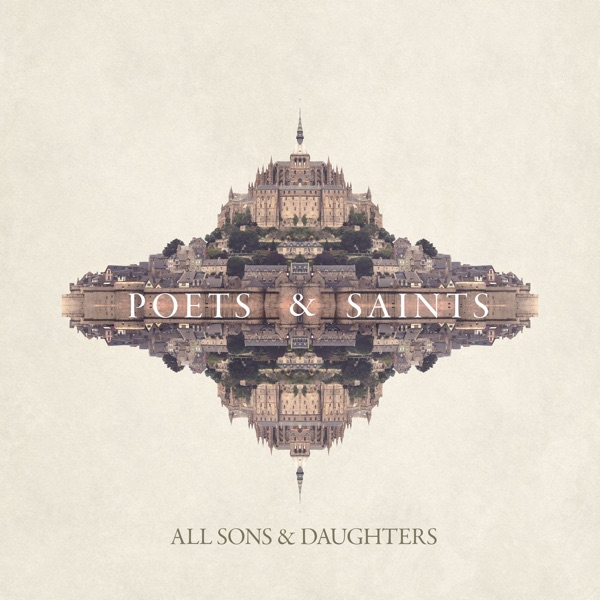

*High-Resolution Master Artwork Archive:* [Poets & Saints Cover Art](https://is1-ssl.mzstatic.com/image/thumb/Music211/v4/c0/d4/84/c0d48469-41aa-1aec-f3d9-c9d121d5fdb9/0000768655740.png/600x600bb.jpg)

### Curatorial Justification (Why It's on This List)
Inspired by a pilgrimage across Europe tracing the lives of historic Christian writers and saints (C.S. Lewis, Saint Francis of Assisi, John Newton, Teresa of Ávila), Franklin, Tennessee duo Leslie Jordan and David Leonard crafted 'Poets & Saints'. Recorded in intimate acoustic spaces with historic pipe organs, acoustic guitars, and chamber strings, the album is a masterpiece of quiet reverence, poetic depth, and vocal harmony that completely transcends standard worship formulas.

### Front-to-Back Architecture (Narrative & Pacing)
The album opens with the serene, organ-backed contemplation of 'Heaven Meets Earth', moving through the soaring acoustic devotion of 'I Surrender' and the folk hymn 'Path of Sorrow'. The emotional pinnacle is 'God of But How Much More' (inspired by George MacDonald), concluding on the restorative, candlelit acoustic benediction of 'Creation Sings'.

### Audiophile & Production Breakdown
Produced by Paul Mabury, 'Poets & Saints' possesses a breathtaking acoustic intimacy. The dual lead vocals of Leslie Jordan and David Leonard are tracked with extraordinary clarity and natural phase coherence in the stereo center. The acoustic guitars, hammered dulcimers, and vintage church organs resonate within a warm, authentic room acoustic with zero artificial harshness.

### Benchmark Demo Track: **"God of But How Much More"**
Test for dual vocal harmony separation and acoustic instrument decay. Listen for the delicate plucking of the acoustic guitar and the gentle swell of the cello. When Jordan and Leonard's voices harmonize in the chorus, high-resolving gear will delineate both voices with lifelike warmth and emotional depth.

### Tonal Anchor Bridge (Library Connection)
The direct sister-work to Audrey Assad's 'Inheritance' and the reverent acoustic moments of Red Rocks Worship's 'Things of Heaven'.

---

# Appendices & Reference Materials

## Appendix A: Audiophile Calibration & Listening Room Optimization Guide

To experience these 100 masterpieces with maximum fidelity, adhere to the following acoustic guidelines:

1. **The Equilateral Listening Triangle:** For loudspeaker setups, position your primary listening chair at the apex of an exact equilateral triangle formed with the acoustic centers of your left and right monitor tweeters. Angle (toe-in) each speaker so the tweeters aim directly at your ears, minimizing early sidewall reflections.
2. **Subwoofer Crossover & Phase Integration:** Set your active subwoofer low-pass filter between 60Hz and 80Hz, matching the natural bass roll-off of your main drivers. Adjust continuous phase control while playing Category I (e.g., D'Angelo's *Black Messiah*) or Category VII (Massive Attack's *Mezzanine*) until the low-end reaches peak tactile impact without boomy frequency cancelation.
3. **Planar Magnetic & Headphone Headroom:** When listening via open-back planar magnetic headphones, utilize a dedicated high-current discrete headphone amplifier. Planar drivers demand pure electrical current to control transient attack on explosive percussion tracks (e.g., Radiohead's 'Reckoner' or The Breeders' 'Cannonball') without transient compression or distortion.
4. **Room Damping & First Reflection Treatment:** Treat early lateral reflection points on side walls with 2-inch to 4-inch rigid fiberglass or rockwool acoustic panels. This preserves the holographic soundstage imaging and pin-point instrument localization crucial for chamber folk (Category V: Gillian Welch) and liturgical hymns (Category VIII: The Brilliance).

## Appendix B: Cross-Reference Matrix (Library Loved Records -> Uncharted 100)

| Loved Library Record | Uncharted 100 Bridge Album | Primary Shared Audiophile & Tonal Dimension |
| :--- | :--- | :--- |
| **The Sundays** – *Reading, Writing and Arithmetic* | **Cocteau Twins** – *Heaven or Las Vegas* (#016) | Chorus-drenched shimmering guitar chime & ethereal melodic vocals |
| **The Sundays** – *Static & Silence* | **Real Estate** – *Days* (#026) | Fender clean tone warmth, Twin Reverb spring decay, pastoral jangle |
| **Mac Miller** – *Circles* | **Adrianne Lenker** – *songs* (#023) | Unfiltered whisper-track vocal intimacy, close-mic acoustic wood resonance |
| **Mac Miller** – *Circles* | **Saba** – *CARE FOR ME* (#047) | Intimate acoustic piano chords, live jazz pocket, vulnerable confessional grief |
| **Nirvana** – *MTV Unplugged in New York* | **Gillian Welch** – *Time (The Revelator)* (#057) | Raw live room acoustic tracking, zero pitch correction, physical dynamic presence |
| **Nirvana** – *MTV Unplugged in New York* | **Jeff Buckley** – *Grace* (#032) | Catastrophic vocal dynamic range, transcendent emotional release, raw telecaster chime |
| **Norah Jones** – *Come Away With Me* | **Cleo Sol** – *Mother* (#004) | Sacred living-room intimacy, warm upright bass, gentle nylon-string picking |
| **Norah Jones** – *Come Away With Me* | **Julia Jacklin** – *Crushing* (#068) | Unhurried vocal phrasing, authentic wooden room decay, heartbreak clarity |
| **Lauryn Hill** – *The Miseducation of Lauryn Hill* | **Erykah Badu** – *Mama's Gun* (#002) | Electric Lady 2-inch tape tracking, Soulquarian live groove, brass warmth |
| **Lauryn Hill** – *The Miseducation of Lauryn Hill* | **The Roots** – *Things Fall Apart* (#043) | Unquantized live hip-hop breakbeats, conscious street poetry, Bob Power mixing |
| **Amy Winehouse** – *Back to Black* | **Snoh Aalegra** – *Ugh, those feels again* (#012) | Velvet smoky alto vocals, sweeping orchestral strings, Motown/Stax nostalgia |
| **Amy Winehouse** – *Back to Black* | **Portishead** – *Dummy* (#086) | Dusty vinyl crackle, mournful Rhodes keys, torch-song heartbreak |
| **Cannons** – *Fever Dream* | **Sade** – *Love Deluxe* (#003) | Sultry, spacious basslines, nocturnal minimalism, silky vocal delivery |
| **Cannons** – *Fever Dream* | **The xx** – *xx* (#088) | Pitch-black soundstage silence, clean guitar delay, subterranean 808 sub-bass |
| **Kacey Musgraves** – *Golden Hour* | **Big Thief** – *Dragon New Warm Mountain...* (#019) | Modern organic folk warmth, inventive acoustic textures, cosmic love poetry |
| **Kacey Musgraves** – *Golden Hour* | **Sierra Ferrell** – *Trail of Flowers* (#065) | Gary Paczosa acoustic string staging, bell-like mountain vocal brilliance |
| **Audrey Assad** – *Inheritance* | **The Brilliance** – *Brother* (#094) | Sacred liturgical chamber strings, Steinway grand piano, reverent quietude |
| **Audrey Assad** – *Inheritance* | **All Sons & Daughters** – *Poets & Saints* (#100) | Historic European church acoustics, pipe organ overtones, intimate dual vocal harmony |
| **Hillsong UNITED** – *Empires* | **Citizens** – *A Thousand Shores* (#097) | Sweeping dream-pop synth pads, soaring alternative rock guitars, expansive soundstage |
| **Hillsong UNITED** – *Empires* | **Josh Garrels** – *Love & War & The Sea In Between* (#099) | Epic cinematic orchestral folk, multi-octave falsetto hymns, spiritual pilgrimage |
| **Kendrick Lamar** – *DAMN.* | **GZA** – *Liquid Swords* (#045) | Dark, cinematic narrative sequencing, 12-bit sample grit, philosophical discipline |
| **Kendrick Lamar** – *DAMN.* | **D'Angelo and The Vanguard** – *Black Messiah* (#001) | Uncompromising analog tape tracking, visceral sociopolitical fervor, virtuoso pocket |
| **SZA** – *Ctrl* | **Jazmine Sullivan** – *Heaux Tales* (#021) | Conversational vocal vulnerability, spoken-word interludes, virtuosic vocal runs |
| **SZA** – *Ctrl* | **Noname** – *Room 25* (#049) | Intimate live jazz trio, rapid conversational cadence, unapologetic feminine honesty |
| **Billie Eilish** – *HIT ME HARD AND SOFT* | **Elliott Smith** – *Either/Or* (#033) | Double-tracked whispered vocal proximity, unadorned acoustic fingerpicking |
| **Billie Eilish** – *HIT ME HARD AND SOFT* | **Björk** – *Homogenic* (#072) | Sudden tectonic electronic sub-bass eruptions colliding with acoustic strings |
| **Lorde** – *Melodrama* | **Kate Bush** – *Hounds of Love* (#071) | Theatrical avant-pop ambition, conceptual two-act architecture, soaring vocal art |
| **Lorde** – *Melodrama* | **Robyn** – *Body Talk* (#078) | Crying-in-the-club synthesizer pop perfection, cathartic electronic beats |
| **Chappell Roan** – *The Rise and Fall of a Midwest Princess* | **Caroline Polachek** – *Desire, I Want to Turn Into You* (#075) | Operatic vocal gymnastics, exuberant pop surrealism, Mediterranean acoustic flair |
| **Chappell Roan** – *The Rise and Fall of a Midwest Princess* | **Camera Obscura** – *Let's Get Out of This Country* (#028) | Baroque orchestral melodrama, witty romantic lyricism, chiming 60s pop hooks |
| **Paramore** – *After Laughter* | **Alvvays** – *Blue Rev* (#018) | Kinetic 12-string guitar jangle, sardonic lyrical wit, uncompressed dynamic punch |
| **No Doubt** – *Tragic Kingdom* | **The Breeders** – *Last Splash* (#041) | Playful irreverence, thunderous quiet-loud bass riffs, infectious pop-rock hooks |
| **Adele** – *21* | **Brandi Carlile** – *By the Way, I Forgive You* (#061) | Room-shaking chest voice power, raw acoustic heartbreak, string quartet warmth |
| **Ella Langley** – *Dandelion* | **Lucinda Williams** – *Car Wheels on a Gravel Road* (#059) | Southern backroad poetry, biting telecaster slide guitars, whiskey-tinged grit |
| **Forrest Frank** – *CHILD OF GOD* | **Liz Vice** – *There's a Light* (#096) | Joyous, organic gospel-soul brass, infectious rhythm, redemptive spiritual light |